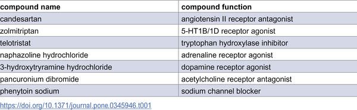
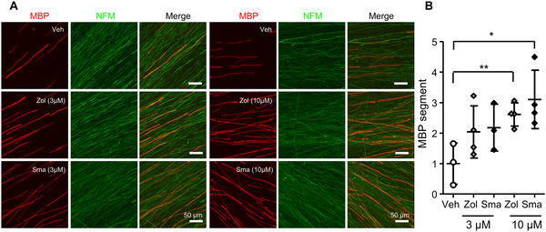
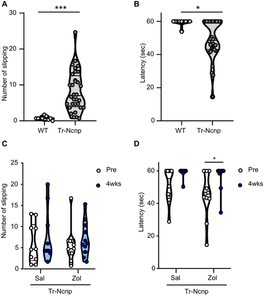
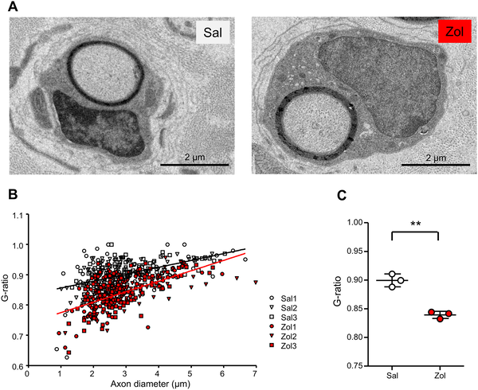

Peripheral neuropathy, a condition marked by damage to the nerves outside the brain and spinal cord, often leads to debilitating sensorimotor problems such as numbness, weakness, and impaired movement. While many causes exist, a common thread is the loss or impairment of myelin—the insulating sheath around nerve fibers that ensures fast and efficient electrical signaling. What if a drug originally developed for migraines could help repair this insulation and improve nerve function? Recent research suggests that activating a specific serotonin receptor, the 5-HT1B receptor, might boost the ability of Schwann cells to rebuild myelin, offering new hope for peripheral nerve repair.

> **TL;DR**
> - Zolmitriptan, a 5-HT1B/1D receptor agonist commonly used to treat migraines, was found to promote myelination by Schwann cells in laboratory nerve cultures.
> - Chronic treatment with zolmitriptan improved sensorimotor function and increased myelin thickness in a mouse model of congenital peripheral neuropathy.

Myelin is a fatty, insulating layer formed by Schwann cells around peripheral nerve fibers, crucial for rapid nerve signal transmission. Genetic mutations affecting myelin proteins like PMP22 cause demyelinating diseases such as Charcot-Marie-Tooth disease (CMT), which currently lack effective therapies. Mouse models carrying mutations in PMP22, like the Trembler (Tr-Ncnp) mice, exhibit reduced myelination and sensorimotor deficits that mimic human peripheral neuropathy. Researchers have been searching for compounds that can stimulate Schwann cells to enhance myelin repair and restore nerve function.

To find potential therapeutic compounds, scientists screened a library of about 400 annotated drugs using dorsal root ganglia (DRG) explant cultures derived from Tr-Ncnp mice. These cultures model the impaired myelination seen in peripheral neuropathy. The number of myelin basic protein (MBP)-positive segments, indicating myelin formation, was measured after drug treatment. Zolmitriptan, a known 5-HT1B/1D receptor agonist, emerged as a promising candidate. The team then tested zolmitriptan and related drugs in both wild-type and Tr-Ncnp mouse cultures, examined gene expression changes in primary Schwann cells, and assessed the effects of chronic zolmitriptan administration on nerve function and myelin structure in living Tr-Ncnp mice using behavioral tests and electron microscopy.

The study revealed that zolmitriptan dose-dependently increased myelin formation in cultured nerve explants, accompanied by upregulation of myelin-related genes in Schwann cells. It also promoted Schwann cell proliferation along axons. In vivo, Tr-Ncnp mice treated with zolmitriptan for four weeks showed improved sensorimotor performance on a beam-walking test, with fewer slips and longer balance times. Electron microscopy of their sciatic nerves demonstrated thicker myelin sheaths and better myelin coverage compared to untreated controls. These results suggest that activating 5-HT1B receptors enhances Schwann cell participation in myelination and can partially reverse myelin deficits in a model of peripheral neuropathy.

This research highlights a novel mechanism by which serotonin receptor agonists, drugs traditionally used for migraine relief, could be repurposed to promote nerve repair in peripheral neuropathies. Given the limited treatment options for conditions like CMT and other demyelinating neuropathies, targeting the 5-HT1B receptor to stimulate Schwann cell myelination offers a promising therapeutic strategy. The findings bridge neuroscience, pharmacology, and clinical potential, suggesting that existing drugs might be leveraged to improve nerve function and patient quality of life.

While the results are encouraging, the findings are primarily based on mouse models and in vitro cultures. Human peripheral neuropathies are diverse and complex, and further studies are needed to confirm safety, efficacy, and optimal dosing of 5-HT1B receptor agonists in humans. Additionally, long-term effects and potential side effects of chronic treatment require careful evaluation. The precise molecular pathways linking 5-HT1B receptor activation to Schwann cell proliferation and myelination also warrant deeper investigation to fully understand and optimize this therapeutic approach.

## Figures

*Table 1 shows the list of compounds found in the initial screening process.*

*5-HT1B receptor drugs boost nerve insulation in mouse cells, with stronger effects at higher doses over two weeks.*

*Zolmitriptan improved nerve function and reduced tremors in mice, shown by fewer slips and longer balance times on a narrow beam test.*

*Zolmitriptan treatment boosts nerve fiber insulation in mice, shown by detailed nerve images and measurements of nerve thickness ratios.*

## Sources

- [5-HT1B receptor agonists promote Schwann cell myelination](https://journals.plos.org/plosone/article?id=10.1371/journal.pone.0345946)
- DOI: [10.1371/journal.pone.0345946](https://doi.org/10.1371/journal.pone.0345946)
