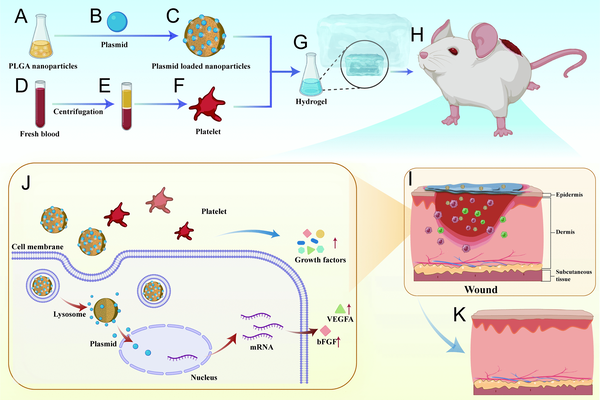
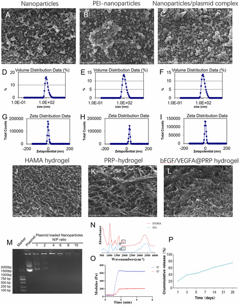
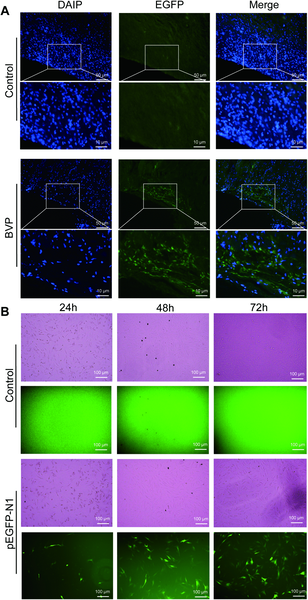

What if a special gel could help deep skin wounds heal faster and more effectively? Scientists have developed a new bioactive hydrogel that combines gene therapy with natural components from blood to promote quicker and better skin repair. This innovative approach could transform treatments for complex skin injuries that are otherwise difficult to heal.

> **TL;DR**
> - The hydrogel delivers genes encoding growth factors bFGF and VEGFA via nanoparticles, providing sustained stimulation for blood vessel growth and tissue regeneration.
> - Combined with platelet-rich plasma, which offers immediate bioactive molecules, the hydrogel accelerates wound closure, enhances blood flow, and improves collagen formation in rat skin wounds.

Full-thickness skin wounds, which damage all layers of the skin including the dermis and its appendages like hair follicles and sweat glands, present a major clinical challenge. These injuries often heal slowly and can lead to scarring and loss of skin function. Growth factors such as basic fibroblast growth factor (bFGF) and vascular endothelial growth factor A (VEGFA) play crucial roles in wound healing by promoting new blood vessel formation (angiogenesis) and collagen deposition. Platelet-rich plasma (PRP), derived from blood, is also known to accelerate healing by releasing a mix of growth factors and bioactive molecules. However, both growth factors and PRP alone have limitations: growth factors degrade quickly in the body, and PRP releases factors in a burst that doesn’t last through all healing stages. This study explores a combined approach to overcome these hurdles.

Researchers designed a composite hydrogel by integrating nanoparticles loaded with genes for bFGF and VEGFA into a hyaluronic acid-based hydrogel along with platelet-rich plasma. The nanoparticles protect the DNA plasmids and enable controlled, sustained gene delivery to the wound site. PRP provides an immediate supply of growth factors during the early healing phase. In a rat model, full-thickness skin wounds were created and treated with this hydrogel. The team monitored wound closure rates, blood flow using laser Doppler imaging, tissue regeneration markers, cell proliferation, apoptosis, and collagen deposition. They also confirmed successful gene delivery by detecting fluorescent protein expression in skin cells.

The bFGF/VEGFA@PRP hydrogel significantly accelerated wound closure compared to controls. Blood perfusion at the wound site increased, indicating enhanced angiogenesis. Histological analysis showed higher densities of skin appendages and collagen fibers, particularly type III collagen important for tissue remodeling. Molecular markers related to blood vessel formation (bFGF, VEGFA, CD31), cell survival (BCL2), and proliferation (Ki67) were upregulated in treated wounds. These results demonstrate that the hydrogel promotes healing by synergistically enhancing growth factor expression and supporting new tissue formation more effectively than either gene therapy or PRP alone.

This study presents a promising therapeutic strategy for managing complex full-thickness skin injuries by combining gene therapy and platelet-rich plasma within a single hydrogel. The dual-phase delivery system addresses the limitations of each treatment alone—providing immediate bioactivity from PRP and sustained growth factor expression from gene-loaded nanoparticles. Such an approach could improve healing outcomes for patients with severe wounds, burns, or chronic ulcers, potentially reducing scarring and restoring skin function more effectively. The hydrogel’s design also offers a versatile platform for delivering other therapeutic genes or bioactive molecules in regenerative medicine.

While the results in the rat model are encouraging, further studies are needed to evaluate the safety, efficacy, and optimal dosing of this hydrogel in larger animals and humans. The complexity of gene delivery and immune responses in clinical settings requires careful consideration. Additionally, long-term effects on scar quality and functional skin regeneration remain to be assessed. Nonetheless, this research lays important groundwork for future development of advanced biomaterials that integrate gene therapy with natural healing components.

## Figures

*This diagram shows how a special gel with healing proteins helps rat wounds heal faster by slowly releasing growth factors.*

*Images and measurements show sizes, charges, and structures of nanoparticles, hydrogels, and their complexes, plus DNA release and chemical features.*

*Nanoparticles carrying genes showed strong fluorescence in rat skin and increased green signals in cells over 72 hours, proving successful gene delivery.*

## Sources

- [A bioactive hydrogel integrating bFGF/VEGFA gene-loaded nanoparticles and platelet-rich plasma for accelerated full-thickness skin wound healing](https://journals.plos.org/plosone/article?id=10.1371/journal.pone.0350087)
- DOI: [10.1371/journal.pone.0350087](https://doi.org/10.1371/journal.pone.0350087)
