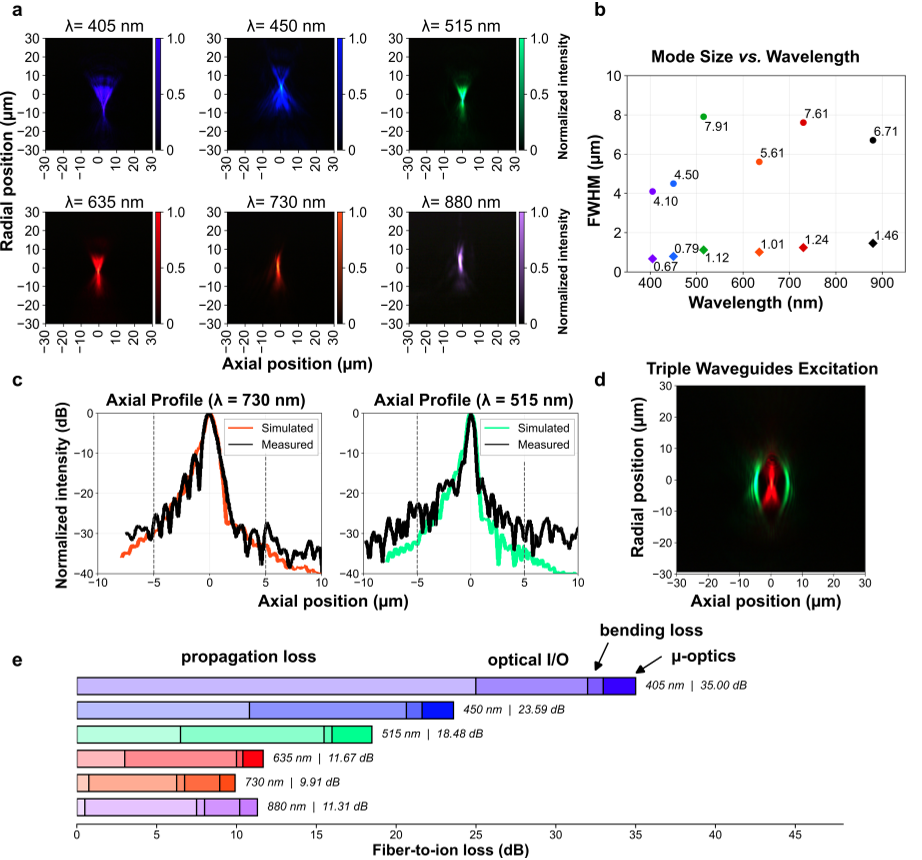
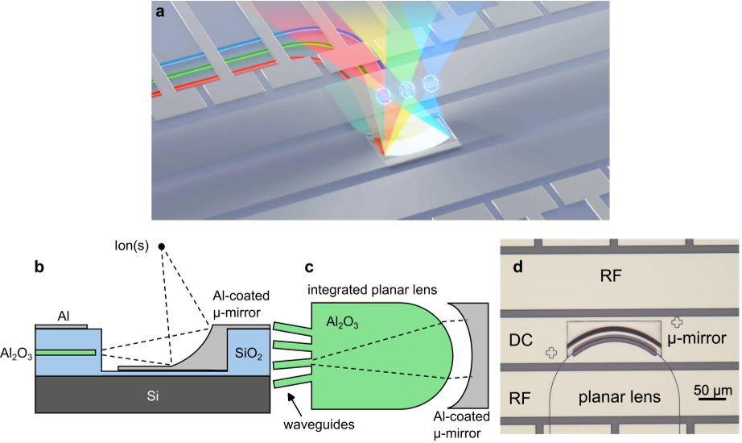
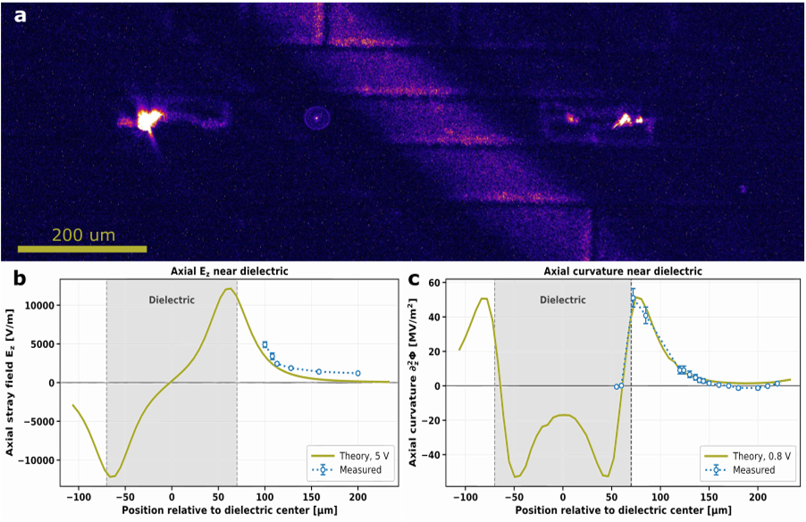
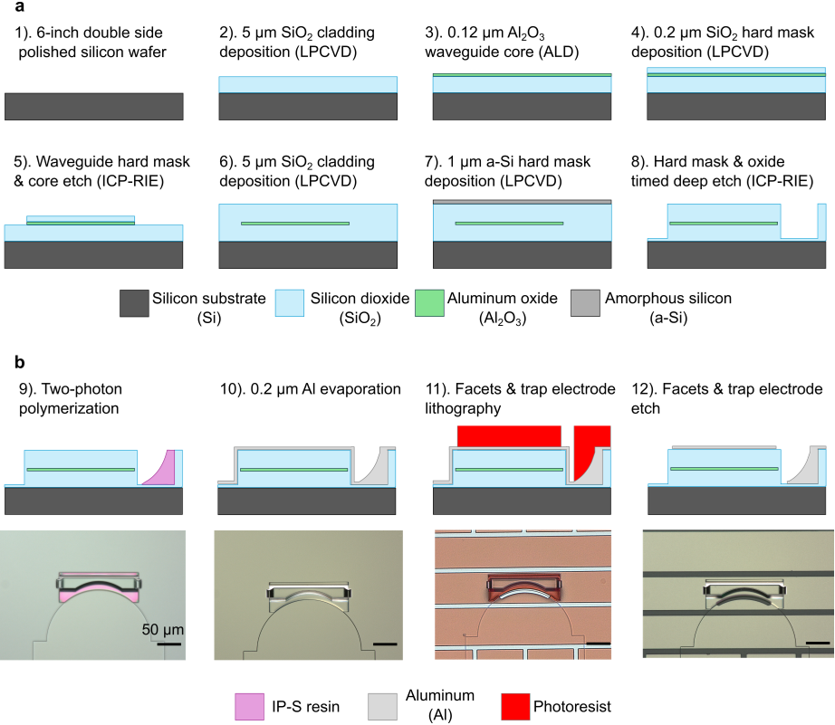

How can tiny circuits of light control the fragile quantum bits inside a trapped-ion quantum computer? Imagine guiding multiple colors of laser light through microscopic pathways on a chip, then focusing them with pinpoint accuracy onto individual ions suspended in vacuum. This precise optical control is essential for manipulating the quantum states that power next-generation quantum processors. A new study from researchers at UC Berkeley and UCLA unveils an innovative photonic integrated circuit that combines planar waveguides with 3D-printed micromirrors to deliver broadband, multi-wavelength light beams to individual ions with micron-level precision. This breakthrough could help scale up trapped-ion quantum computers by simplifying and miniaturizing their complex optical control systems.

> **TL;DR**
> - The team developed a broadband photonic integrated circuit that delivers multiple laser wavelengths to individual trapped ions with micron-scale precision and low crosstalk.
> - The device integrates planar waveguide lenses with 3D-printed micromirrors fabricated at wafer scale, enabling scalable, multi-qubit optical control in trapped-ion quantum processors.

*Note: this summary is based on a preprint — research shared ahead of formal peer review.*

Trapped ions are among the leading platforms for quantum computing, prized for their long coherence times and high-fidelity operations. However, controlling many ions simultaneously requires delivering multiple laser wavelengths—spanning near-ultraviolet to near-infrared—with exquisite spatial precision. Conventional free-space optics become bulky, vibration-sensitive, and difficult to scale as qubit counts grow. Integrated photonics offers a promising solution by routing light on-chip through waveguides and coupling it out near the ions. Yet, existing approaches using grating couplers suffer from narrow bandwidth and large footprints, limiting their scalability. The new work addresses these challenges by introducing a hybrid photonic architecture that combines broadband waveguide lenses with micromirrors fabricated via two-photon polymerization, enabling precise, multi-wavelength, multi-ion addressing in a compact, monolithic device.

The researchers fabricated their device on 6-inch silicon wafers, starting with an amorphous aluminum oxide waveguide core symmetrically clad in silicon dioxide to support broadband light routing from 405 nm to 880 nm. The on-chip emission zone features a planar waveguide lens that expands and collimates the guided light. Above this lens, a 3D biconic-aspherical micromirror—printed directly on the wafer using two-photon polymerization—redirects and focuses the beam approximately 75 microns above the chip surface, where ions are trapped. A 200 nm aluminum layer serves both as the reflective coating for the micromirror and as electrodes for the surface ion trap fabricated atop the photonic stack. This monolithic integration of 2D waveguides and 3D-printed optics with ion trap electrodes is a key innovation enabling broadband, multi-ion optical addressing.

Testing revealed that the device could focus light tightly along the ion trap axis with full width at half maximum (FWHM) spot sizes ranging from about 0.7 microns at 405 nm to 1.5 microns at 880 nm. Importantly, the device maintained low optical crosstalk—below -27 dB—between adjacent focal spots spaced 5 microns apart, allowing individual addressing of multiple ions. The broadband design supports all key wavelengths needed for calcium and barium ion control, including cooling, repumping, and quantum gate operations. Experiments trapping 40Ca+ and 138Ba+ ions above the device demonstrated individual ion repumping and characterization of optical leakage, confirming the device’s practical utility. Overall, the architecture enables multi-wavelength, multi-qubit control using a single shared optical element on-chip.

This work represents a meaningful advance toward scalable trapped-ion quantum computers by overcoming a major optical bottleneck: delivering multiple laser wavelengths precisely and compactly to many ions. The integration of planar waveguide lenses with 3D-printed micromirrors fabricated at wafer scale opens new design possibilities for on-chip quantum control architectures. By enabling broadband, low-crosstalk, multi-ion addressing in a monolithic device, this approach reduces the complexity, size, and alignment sensitivity of optical systems needed for large-scale quantum processors. More broadly, combining additive manufacturing techniques with integrated photonics and ion trapping hardware may accelerate the development of novel quantum technologies with enhanced functionality and scalability.

While the device shows promising broadband performance and precise ion addressing, current optical losses—particularly at shorter wavelengths—are relatively high, mainly due to the waveguide material platform. These losses could be reduced with further process optimization. Additionally, the field of view is limited by optical aberrations, which may require more complex optics for larger ion arrays. Trapping ions directly above the micromirrors remains an area of ongoing investigation, including managing photo-induced charging effects from exposed dielectrics. Finally, while the device was demonstrated with a few ions, scaling to hundreds or thousands of qubits will require further engineering to integrate many such optical elements and maintain performance. Nonetheless, this work lays important groundwork for future scalable quantum computing hardware.

## Figures

*Nanophotonic device focuses light precisely across colors 405-880 nm, showing sharp spots, low crosstalk, and detailed loss measurements. — Figure from Daniel Klawson et al., [CC BY 4.0](http://creativecommons.org/licenses/by/4.0/), caption edited.*

*This device uses layered materials and tiny lenses to precisely direct light beams onto ions for advanced experiments. — Figure from Daniel Klawson et al., [CC BY 4.0](http://creativecommons.org/licenses/by/4.0/), caption edited.*

*Fluorescence images and measurements show how a charged dielectric affects electric fields and potentials along its axis, matching simulations closely. — Figure from Daniel Klawson et al., [CC BY 4.0](http://creativecommons.org/licenses/by/4.0/), caption edited.*

*We made 6-inch wafers with tiny 3D-printed optics, adding layers and electrodes for advanced light control in small devices. — Figure from Daniel Klawson et al., [CC BY 4.0](http://creativecommons.org/licenses/by/4.0/), caption edited.*

## Sources

- [A broadband, individually addressing two- and three-dimensional photonic integrated circuit for trapped-ion qubit control](https://arxiv.org/abs/2607.25062)
- DOI: [10.48550/arxiv.2607.25062](https://doi.org/10.48550/arxiv.2607.25062)

*This article reuses and adapts text and figures from the original research by Daniel Klawson et al., available via arXiv Quantum Physics, under the [CC BY 4.0](http://creativecommons.org/licenses/by/4.0/) license.*
