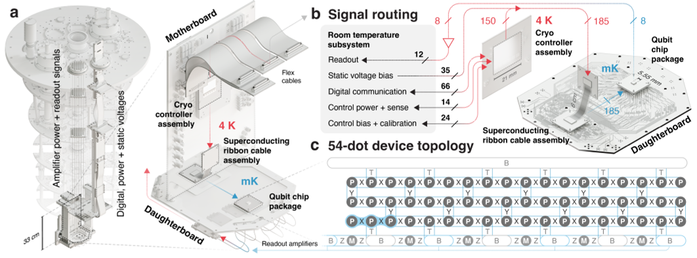
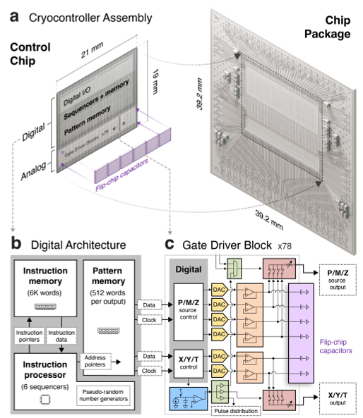
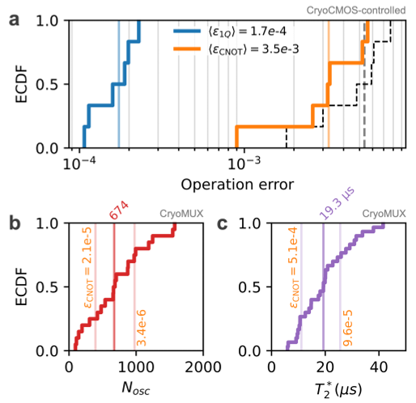
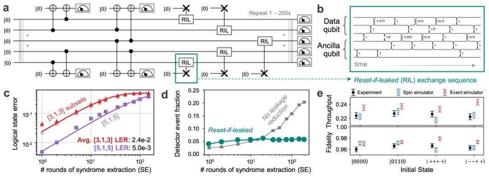

Quantum computing promises to revolutionize technology by solving problems beyond the reach of classical computers. Yet building a practical quantum computer requires not only high-quality qubits but also scalable, efficient control systems to manage them. Recently, a team of scientists unveiled a silicon quantum processing unit that integrates 18 qubits with custom-designed cryogenic electronics and advanced superconducting cables. This breakthrough represents a significant step toward manufacturable, large-scale quantum computers.

> **TL;DR**
> - The team built a silicon quantum chip hosting up to 18 exchange-only qubits arranged in a 3×6 grid, controlled by a custom cryogenic CMOS chip operating at 4 K.
> - They demonstrated improved qubit gate fidelities and implemented quantum error correction codes, validating the system’s potential for scalable quantum computing.

*Note: this summary is based on a preprint — research shared ahead of formal peer review.*

Quantum computers rely on qubits, the quantum analogues of classical bits, which can exist in superpositions of states. Among various qubit technologies, silicon exchange-only (EO) qubits stand out due to their compatibility with existing semiconductor manufacturing and relatively simple control signals. However, challenges remain in achieving low noise, high-fidelity operations, and scalable wiring and control solutions. Traditional approaches either place control electronics at room temperature—leading to complex wiring—or directly next to the qubits at millikelvin temperatures, which imposes severe cooling demands. An intermediate temperature control system offers a promising compromise but requires innovative engineering to maintain signal integrity and thermal isolation.

The researchers designed a quantum processing unit (QPU) integrating three key components: a silicon quantum chip with 54 exchange-coupled quantum dots configurable as 18 EO qubits; a custom cryogenic CMOS controller chip operating at 4 K that generates precise voltage pulses for qubit manipulation; and a novel high-density superconducting ribbon cable that connects the controller to the quantum chip at millikelvin temperatures. The quantum dots are formed in an isotopically enriched Si/SiGe heterostructure to reduce magnetic noise, with electrostatic gates defining and controlling the qubits. The cryo-CMOS controller uses a specialized digital architecture to autonomously execute qubit control sequences with low power consumption. The superconducting cable maintains excellent signal fidelity while minimizing thermal load between temperature stages. The team tested qubit performance using randomized benchmarking and implemented quantum error correction codes, including distance-5 repetition codes and a [[4,2,2]] quantum error detecting code.

This integrated system achieved single-qubit gate errors around 0.02% and two-qubit (CNOT) gate errors near 0.3%, representing roughly an order of magnitude improvement over previous EO qubit demonstrations. The intrinsic charge and magnetic noise of the devices were significantly reduced, contributing minimally to overall error rates. Implementing a distance-5 repetition code with seven qubits showed logical error rates consistent with theoretical predictions, and the inclusion of leakage reduction units helped maintain stable error detection over multiple rounds. The [[4,2,2]] quantum error detecting code was successfully demonstrated on six qubits, achieving a logical state fidelity of approximately 95% after three rounds of syndrome extraction. Detailed comparisons with simulations indicated that the system’s errors are well characterized and manageable, supporting the viability of scalable quantum error correction with this architecture.

This work marks a milestone in silicon-based quantum computing by integrating a large array of EO qubits with custom cryogenic control electronics and advanced interconnects, all fabricated using semiconductor manufacturing techniques. The demonstrated improvements in qubit fidelity and error correction capabilities bring silicon quantum processors closer to commercial relevance. By addressing both the qubit device and control system challenges in a unified platform, this approach offers a practical path toward utility-scale quantum computers with manageable operational complexity and capital costs.

While the results show promising advances, the system still operates at millikelvin temperatures and requires complex dilution refrigeration. The error rates, though improved, remain above the thresholds needed for fault-tolerant quantum computing at large scale, necessitating further optimization. Additionally, the specialized hardware and control schemes are highly technical and may limit immediate broad accessibility. Continued research is needed to scale qubit counts further, integrate readout electronics more fully inside cryostats, and reduce overhead for error correction before practical quantum advantage can be realized.

## Figures

*A quantum processor inside a fridge uses advanced cables and gates to control and read 54 quantum dots forming up to 18 qubits in a 3×6 grid. — Figure from Members of the HRL Quantum Team et al., [CC BY 4.0](http://creativecommons.org/licenses/by/4.0/), caption edited.*

*A complex cryogenic CMOS controller with 70M transistors manages precise voltage and timing signals for quantum device control. — Figure from Members of the HRL Quantum Team et al., [CC BY 4.0](http://creativecommons.org/licenses/by/4.0/), caption edited.*

*This figure shows the error rates and noise effects on qubit gates, highlighting low error rates and how charge and magnetic noise impact performance. — Figure from Members of the HRL Quantum Team et al., [CC BY 4.0](http://creativecommons.org/licenses/by/4.0/), caption edited.*

*We tested a 5-qubit error-correcting code using repeated checks and special resets, reducing errors and improving data reliability over many trials. — Figure from Members of the HRL Quantum Team et al., [CC BY 4.0](http://creativecommons.org/licenses/by/4.0/), caption edited.*

## Sources

- [A digitally controlled silicon quantum processing unit](https://arxiv.org/abs/2604.16216)
- DOI: [10.1038/s41586-026-10754-7](https://doi.org/10.1038/s41586-026-10754-7)

*This article reuses and adapts text and figures from the original research by Members of the HRL Quantum Team et al., available via Nature 655, 1154 2026, under the [CC BY 4.0](http://creativecommons.org/licenses/by/4.0/) license.*
