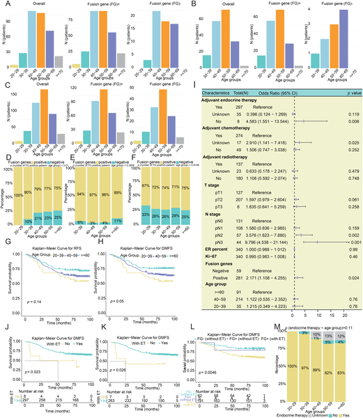
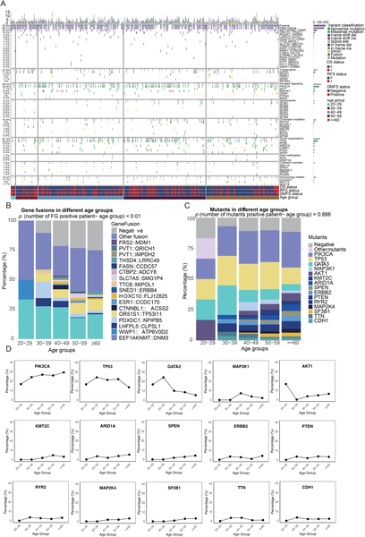
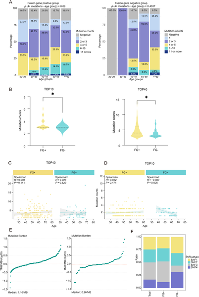

Breast cancer diagnosed in younger women often behaves more aggressively and leads to poorer outcomes than in older patients, especially in the luminal subtype, which is typically hormone receptor-positive. But why does age make such a difference? A recent study by scientists at Fudan University Shanghai Cancer Center uncovers a novel genetic clue—a fusion-deletion event in the tumor genome—that may help explain this troubling pattern.

> **TL;DR**
> - Young patients with luminal breast cancer frequently harbor a unique fusion gene combined with a deletion in another gene, linked to more aggressive tumor behavior and worse survival.
> - This fusion-deletion event, along with a broader pattern of genomic remodeling in early-onset breast cancer, could serve as a biomarker to better predict prognosis and guide treatment decisions.

Breast cancer is a leading cause of cancer-related illness worldwide, affecting women across all ages. Yet, younger patients—often defined as those under 40 or 35 years—tend to experience more aggressive disease and poorer outcomes, despite receiving standard therapies. The luminal subtype, which expresses hormone receptors like estrogen receptor (ER), is usually considered less aggressive, but this is not always the case in younger women. Understanding the molecular reasons behind this age-associated aggressiveness has been a challenge. Gene fusions, where parts of two different genes abnormally join together, can create new proteins that drive cancer progression. However, their role in breast cancer, particularly in younger patients, has been underexplored.

The researchers analyzed a large, multi-omics dataset from 351 breast cancer patients treated at Fudan University, focusing on genomic alterations such as gene fusions, mutations, and copy number variations. They used RNA sequencing data to detect fusion transcripts with specialized computational tools and validated findings with laboratory techniques including RT-PCR and Sanger sequencing. Clinical data on patient outcomes were integrated to assess the prognostic significance of identified genomic events. Functional assays in cell lines and mouse models further explored the biological effects of the fusion gene. Statistical analyses evaluated correlations between genomic features, patient age, and survival outcomes.

The study revealed that younger patients with luminal breast cancer had a higher burden of gene fusions compared to older patients, with a notable co-occurrence of a novel fusion between the genes EEF1AKNMT and DNM3, alongside deletion of the gene KDM6B. This fusion-deletion event was strongly associated with aggressive tumor characteristics, such as higher grade and proliferation rates, and with poorer survival outcomes including recurrence and metastasis. Importantly, patients harboring this genomic signature showed resistance to conventional endocrine therapy, which is typically effective in luminal breast cancer. The researchers also observed widespread genomic remodeling in early-onset cases, including distinct mutational patterns and altered gene expression programs that collectively contribute to a high-risk clinical phenotype.

Identifying the EEF1AKNMT::DNM3 fusion combined with KDM6B deletion as a prognostic biomarker provides new mechanistic insight into why breast cancer can be more aggressive in younger women. This discovery opens avenues for improved risk stratification, enabling clinicians to identify young patients at higher risk of poor outcomes earlier and tailor treatments accordingly. Moreover, understanding the molecular underpinnings of this aggressive subtype could guide the development of targeted therapies that overcome resistance to standard endocrine treatments, ultimately improving survival and quality of life for young breast cancer patients.

While this study robustly links the fusion-deletion event to poor prognosis in a well-characterized patient cohort, further research is needed to validate these findings in diverse populations and clinical settings. Functional studies are required to fully elucidate the biological mechanisms by which this genomic alteration drives tumor aggressiveness. Additionally, translating these insights into clinical practice will depend on developing accessible diagnostic tests and evaluating targeted treatment strategies in clinical trials. As with all biomarker discoveries, caution is warranted before widespread implementation.

## Figures

*Age groups and FG status affect breast cancer subtypes, survival rates, and treatment outcomes in the FUSCC-BRCA patient cohort.*

*This figure shows how certain gene changes in breast cancer vary with age, while overall mutation levels stay steady across age groups.*

*FG+ breast cancer patients tend to have more mutations, with mutation counts and types varying by age and FG status.*

## Sources

- [A fusion-deletion genomic-event underlies poor prognosis in young patients with luminal breast cancer](https://journals.plos.org/plosone/article?id=10.1371/journal.pone.0349410)
- DOI: [10.1371/journal.pone.0349410](https://doi.org/10.1371/journal.pone.0349410)
