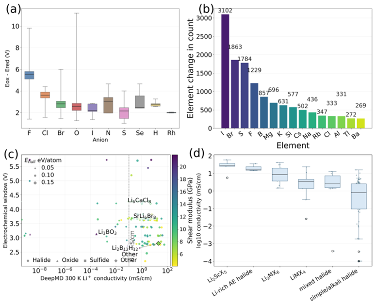
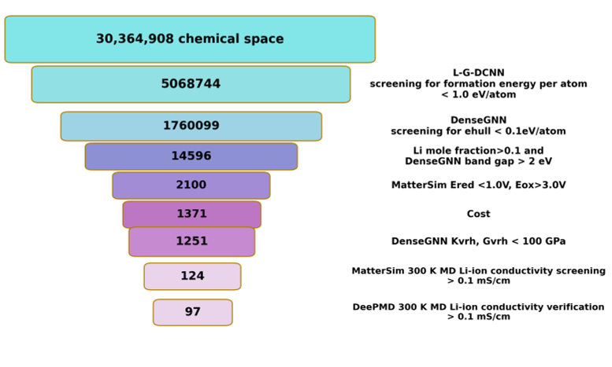
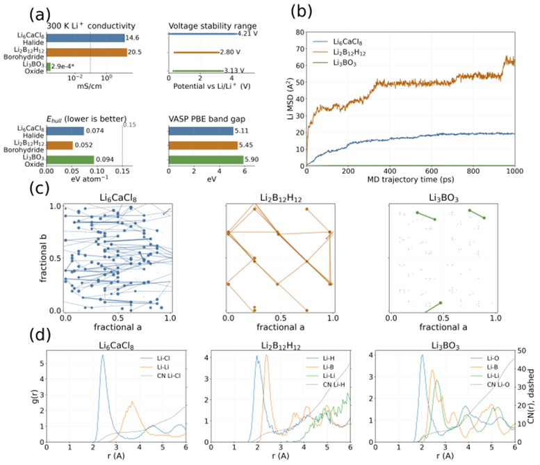
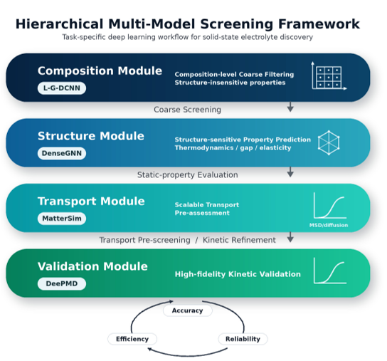

Batteries power our smartphones, laptops, and electric vehicles, but improving their safety and efficiency remains a major challenge. Solid-state electrolytes—materials that conduct ions without the flammable liquids used today—offer a promising path forward. Yet discovering new solid electrolytes that combine high ionic conductivity, stability, and mechanical strength is a complex puzzle. Now, researchers have harnessed advanced artificial intelligence (AI) to speed up this search, analyzing millions of candidate materials with unprecedented accuracy.

> **TL;DR**
> - A novel hierarchical AI framework combines multiple specialized models to efficiently and reliably screen over 30 million candidate solid-state electrolytes.
> - The study identifies 97 promising materials, revealing that lithium ion jump-network connectivity is key to ionic conductivity, guiding future battery material design.

*Note: this summary is based on a preprint — research shared ahead of formal peer review.*

Solid-state electrolytes (SSEs) are critical components for next-generation batteries, potentially enabling safer, longer-lasting, and higher-performance energy storage. Unlike traditional liquid electrolytes, SSEs must simultaneously exhibit high ionic conductivity at room temperature, wide electrochemical stability, excellent electronic insulation, and suitable mechanical properties. Achieving all these properties in one material is challenging. Computational methods have helped by predicting material properties, but existing models often struggle to balance accuracy, speed, and reliability, especially when screening vast chemical spaces containing millions of hypothetical compounds.

To overcome these challenges, the researchers developed a hierarchical synergistic deep learning framework that integrates four specialized AI modules, each tailored to different aspects of the screening process. The first module rapidly filters candidates based on composition using a compositional deep convolutional neural network (L-G-DCNN). The second module evaluates structural and multi-property features like thermodynamic stability and mechanical strength with a graph neural network (DenseGNN) that fuses data of varying fidelity. The third module simulates ionic transport pre-assessment using MatterSim, while the fourth performs high-precision kinetic validation through DeePMD molecular dynamics simulations. This tiered approach balances computational efficiency with prediction accuracy and ensures reliability by progressively refining candidate selection.

Applying this framework to over 30 million candidate materials derived from known crystal structures and hypothetical expansions, the team identified 97 high-performance solid-state electrolytes with room-temperature ionic conductivities ranging from 0.1 to nearly 60 mS/cm. Most of these were halides, with a few oxides and borohydrides. Comparison with experimental data confirmed that many predicted halides fall within known high-conductivity structural regions, validating the approach. Importantly, analysis revealed that the connectivity of lithium ion jump networks—how ions hop between sites—rather than the sheer number of lithium sites, governs ionic conductivity. For oxides, engineering lithium defects improved transport, but the rigid oxide framework likely limits their ultimate performance.

This study demonstrates how combining multiple AI models in a hierarchical framework can effectively tackle the complex, multi-objective challenge of discovering solid-state electrolytes. By screening an ultra-large chemical space with validated accuracy, the approach accelerates the identification of safer, more efficient battery materials critical for electric vehicles and grid storage. The insight that ionic jump-network connectivity is a core determinant of conductivity offers a clear design principle for future materials engineering. Overall, this work exemplifies how advanced AI can bridge the gap between computational prediction and experimental validation in materials science.

While the framework shows strong predictive capability and agreement with experimental trends, the complexity of solid-state electrolytes means that real-world performance depends on additional factors such as synthesis conditions, interface stability, and long-term durability that are not fully captured here. The kinetic simulations, though more precise than static models, still approximate atomic-scale dynamics and require further experimental validation. Moreover, the technical nature of the AI models and materials science involved may limit immediate accessibility to broader audiences, underscoring the need for continued interdisciplinary collaboration.

## Figures

*This figure shows how different elements affect battery material stability, conductivity, and structure in 124 promising candidates. — Figure from Hongwei Du et al., [CC BY 4.0](http://creativecommons.org/licenses/by/4.0/), caption edited.*

*A step-by-step filtering process narrowed 30 million materials down to 97 top candidates for stable, efficient energy transport at room temperature. — Figure from Hongwei Du et al., [CC BY 4.0](http://creativecommons.org/licenses/by/4.0/), caption edited.*

*Comparison of lithium ion movement and properties in three materials, showing conductivity, jump networks, and atomic distances at 300 K over time. — Figure from Hongwei Du et al., [CC BY 4.0](http://creativecommons.org/licenses/by/4.0/), caption edited.*

*A step-by-step screening process uses advanced models to efficiently find the best materials by checking composition, structure, and movement. — Figure from Hongwei Du et al., [CC BY 4.0](http://creativecommons.org/licenses/by/4.0/), caption edited.*

## Sources

- [A Hierarchical Synergistic Deep Learning Framework Integrating Composition, Structure, and Ionic Transport for Solid-State Electrolyte Discovery](https://arxiv.org/abs/2608.25592)
- DOI: [10.48550/arxiv.2608.25592](https://doi.org/10.48550/arxiv.2608.25592)

*This article reuses and adapts text and figures from the original research by Hongwei Du et al., available via arXiv Materials Science, under the [CC BY 4.0](http://creativecommons.org/licenses/by/4.0/) license.*
