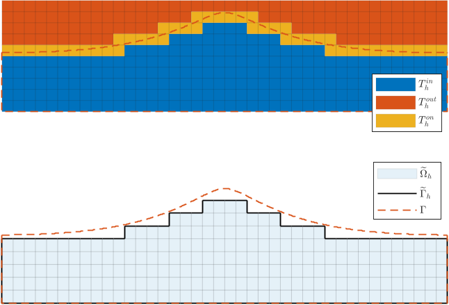
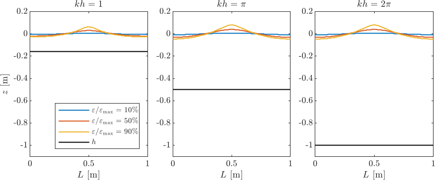

Imagine trying to predict how wild ocean waves crash against offshore platforms or coastal barriers—not just for a few seconds, but over long periods, capturing every twist and swell as waves rise, break, and interact with complex underwater landscapes. Achieving this level of realism in computer simulations has long been a challenge, especially because ocean surfaces move and deform in complicated ways that are tough to model accurately. Now, a team of researchers has developed a new mathematical method that lets computers simulate these fully nonlinear water waves with unprecedented accuracy and stability, all while avoiding the time-consuming process of constantly reshaping the computational grid.

> **TL;DR**
> - A high-order polynomial-corrected shifted boundary method enables accurate simulation of fully nonlinear water waves on simple Cartesian meshes without re-meshing.
> - This approach captures complex wave behaviors and interactions with varying seafloor shapes and structures, supporting long-term, stable wave propagation modeling.

*Note: this summary is based on a preprint — research shared ahead of formal peer review.*

Numerical modeling plays a crucial role in ocean engineering, helping scientists and engineers study wave propagation and wave-structure interactions without costly physical experiments. Traditional methods often require meshes that conform exactly to the moving boundaries of waves and underwater features, which means the mesh must be updated or rebuilt as the wave surface changes—an expensive and complex process. To simplify this, unfitted methods use fixed background meshes that don’t have to align with boundaries, but accurately enforcing boundary conditions on these non-conforming meshes is challenging. The shifted boundary method (SBM) offers a promising solution by approximating boundary conditions on a surrogate domain, allowing for high-order accuracy without remeshing.

The researchers developed a computational framework based on the fully nonlinear potential flow (FNPF) equations, which approximate fluid flow assuming the water is incompressible, inviscid, and irrotational. They combined the SBM with high-order spectral element discretizations on a simple Cartesian mesh. The key innovation is a polynomial-corrected shifted boundary approximation that accurately enforces boundary conditions on the moving and deforming free surface and complex bathymetry without remeshing. Additionally, they implemented a polynomial-preserving gradient recovery technique to precisely capture vertical velocities at the free surface. Time integration uses arbitrary-order finite differences augmented with hyperviscosity to ensure numerical stability during long simulations.

Through a series of verification and validation tests—including wave propagation in periodic and finite domains, nonlinear wave interactions with vertical walls and curved bathymetry, and long-term simulations of high-amplitude solitons—the method demonstrated high-order convergence and stability. The model successfully captured complex nonlinear wave phenomena such as harmonic generation over submerged bars and soliton-wall interactions, all without the need for mesh updates. Speed-up analyses confirmed the efficiency gains of using high-order methods paired with optimal gradient recovery. These results suggest that the approach can reliably simulate realistic ocean wave dynamics over extended periods.

This work represents a significant advance in computational ocean engineering by providing a flexible, accurate, and efficient tool for simulating fully nonlinear water waves interacting with complex geometries. By eliminating the need for costly remeshing and enabling high-order accuracy, the method can support improved design and analysis of offshore structures, coastal defenses, and environmental assessments. Its ability to handle complex, moving boundaries on simple meshes opens new possibilities for large-scale, long-term wave simulations that were previously computationally prohibitive.

While promising, the method is currently demonstrated in two-dimensional settings and assumes potential flow conditions, which neglect viscous effects and wave breaking. Extending the approach to fully three-dimensional problems and incorporating additional physical phenomena like turbulence or wave overturning will require further development. Additionally, the technical nature of the numerical method means its immediate application may be limited to specialists in computational fluid dynamics and ocean engineering. Nonetheless, the framework lays important groundwork for future enhancements and broader adoption.

## Figures

*Top shows how the final wave model is built; bottom shows the wave shape of a strong nonlinear water wave. — Figure from Jens Visbech et al., [CC BY 4.0](http://creativecommons.org/licenses/by/4.0/), caption edited.*

*Depths of three waves measured at different heights and energy levels are shown for comparison. — Figure from Jens Visbech et al., [CC BY 4.0](http://creativecommons.org/licenses/by/4.0/), caption edited.*

## Sources

- [A high-order polynomial-corrected shifted boundary method for simulating fully nonlinear water waves](https://arxiv.org/abs/2608.28123)
- DOI: [10.48550/arxiv.2608.28123](https://doi.org/10.48550/arxiv.2608.28123)

*This article reuses and adapts text and figures from the original research by Jens Visbech et al., available via arXiv Mathematics, under the [CC BY 4.0](http://creativecommons.org/licenses/by/4.0/) license.*
