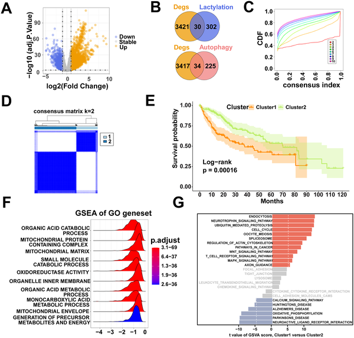

Liver cancer remains a formidable health challenge worldwide, with limited treatment options and often poor outcomes. But what if the key to slowing tumor growth lies not within the cancer cells themselves, but in the signals sent by the liver’s own blood vessels? Recent research uncovers how a protein secreted by specialized liver endothelial cells acts as a metabolic brake on liver cancer, opening new doors for understanding and potentially treating this deadly disease.

> **TL;DR**
> - Liver sinusoidal endothelial cells (LSECs) secrete a protein called CLEC3B that is significantly reduced in liver cancer tissues.
> - CLEC3B suppresses liver tumor growth by reducing lactylation, a metabolic protein modification, and inhibiting autophagy, a cellular recycling process tumors use to survive.

Hepatocellular carcinoma (HCC) is the most common form of liver cancer and a leading cause of cancer deaths worldwide. Despite advances in medicine, patients with advanced HCC face poor prognoses due to tumor recurrence, spread, and resistance to therapies. Scientists have increasingly recognized that the tumor microenvironment—the complex neighborhood of cells and signals surrounding cancer cells—plays a crucial role in tumor progression. Among these neighboring cells, liver sinusoidal endothelial cells (LSECs) line the tiny blood vessels of the liver and help regulate liver function. However, their role in liver cancer biology has remained mysterious. Meanwhile, two cellular processes—lactylation, a chemical modification of proteins driven by tumor metabolism, and autophagy, a self-recycling mechanism—have emerged as important factors in cancer survival and growth. Understanding how these processes interact within the liver tumor environment could reveal new therapeutic targets.

Researchers combined computational analyses of large public datasets with laboratory experiments to explore the role of CLEC3B in liver cancer. They analyzed gene expression data from hundreds of HCC patients to identify molecular subtypes linked to lactylation and autophagy, pinpointing CLEC3B as a key gene. Single-cell RNA sequencing allowed them to trace CLEC3B expression specifically to LSECs. The team then collected liver tissue and blood samples from patients to validate CLEC3B levels. In the lab, they engineered LSECs to produce more CLEC3B and tested how the secreted protein affected liver cancer cell growth. They also investigated the underlying mechanisms, focusing on changes in lactylation and autophagy within cancer cells.

The study revealed that CLEC3B is predominantly produced by LSECs and is markedly decreased in liver cancer tissues compared to normal liver. When liver cancer cells were exposed to media conditioned by CLEC3B-overexpressing LSECs, their proliferation slowed significantly. Mechanistic experiments showed that CLEC3B reduces lactylation levels—a metabolic modification influenced by tumor-produced lactate—and concurrently inhibits autophagy, a survival strategy cancer cells often exploit. Importantly, the suppression of lactylation appeared to initiate the reduction in autophagy, suggesting a linked pathway. These findings position CLEC3B as a novel metabolic mediator that bridges two critical cancer-related processes, acting as a tumor suppressor within the liver microenvironment.

This research uncovers a previously unrecognized tumor-suppressive role for CLEC3B secreted by liver endothelial cells, highlighting the importance of the tumor microenvironment in liver cancer progression. By connecting metabolic regulation and autophagy inhibition, CLEC3B offers a dual-pronged mechanism to restrain tumor growth. Clinically, CLEC3B could serve as a prognostic biomarker to stratify patients by risk and as a potential therapeutic target. Restoring CLEC3B signaling or mimicking its effects might open new treatment avenues for a cancer type that urgently needs better options. Moreover, this study exemplifies how integrating computational data with experimental validation can reveal novel insights into cancer biology.

While these findings are promising, they are primarily based on analyses of patient data and laboratory models. The exact molecular details of how CLEC3B modulates lactylation and autophagy require further elucidation. Additionally, translating these insights into effective therapies will require extensive clinical testing to confirm safety and efficacy. The complexity of the tumor microenvironment means that other factors may influence CLEC3B’s role in different patient contexts. Future research should also explore how CLEC3B interacts with immune cells and other components within the liver to fully understand its therapeutic potential.

## Figures

*We identified key genes linked to lactylation and autophagy in liver cancer, grouped patients into two types, and compared their survival and biological pathways.*

## Sources

- [A lactylation- and autophagy-associated prognostic signature reveals LSEC-derived CLEC3B as a novel mediator of hepatocellular carcinoma suppression](https://journals.plos.org/ploscompbiol/article?id=10.1371/journal.pcbi.1014426)
- DOI: [10.1371/journal.pcbi.1014426](https://doi.org/10.1371/journal.pcbi.1014426)
