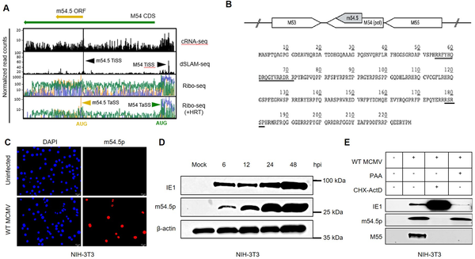
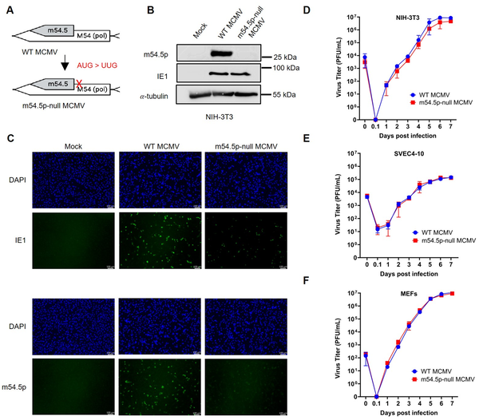
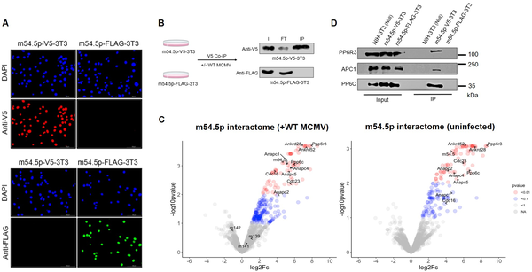
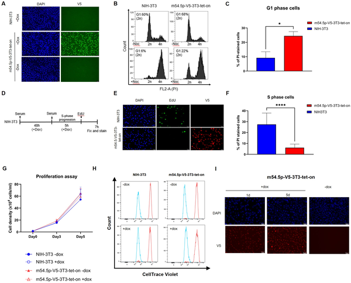

Viruses are masters of disguise and manipulation, often hijacking the inner workings of our cells to ensure their own survival and spread. In a surprising twist, scientists studying murine cytomegalovirus (MCMV)—a mouse virus closely related to human cytomegalovirus—have uncovered a previously hidden viral gene nestled within one of the virus’s most essential enzymes. This gene encodes a protein that cleverly stalls the host cell cycle, creating a favorable environment for viral replication. This discovery sheds light on viral evolution and the intricate ways viruses can control their hosts.

> **TL;DR**
> - A novel viral gene, m54.5, was found embedded within the highly conserved DNA polymerase gene of murine cytomegalovirus, encoding a nuclear protein called m54.5p.
> - m54.5p interacts with host cell cycle regulators, inactivates the anaphase-promoting complex/cyclosome (APC/C), and arrests cells at the G1 phase, facilitating viral replication and showing evolutionary innovation.

Cytomegaloviruses are a group of herpesviruses that infect a wide range of mammals, including humans and mice. These viruses depend heavily on the host cell’s machinery to replicate their DNA and produce new viral particles. The cell cycle—the process by which cells grow and divide—is tightly regulated by cellular complexes such as the anaphase-promoting complex/cyclosome (APC/C). Viruses often manipulate the cell cycle to create conditions that favor viral DNA replication while blocking the host’s own DNA synthesis. Understanding these viral strategies is crucial for grasping how infections progress and for identifying potential therapeutic targets.

Using advanced sequencing techniques like ribosome profiling and transcription start site mapping, researchers identified hundreds of previously unknown viral genes expressed during active MCMV infection. One standout was m54.5, a gene completely embedded within the viral DNA polymerase gene (M54). To study its function, scientists generated a mutant virus lacking m54.5p, created antibodies specific to the m54.5p protein, and performed protein interaction studies using co-immunoprecipitation paired with mass spectrometry. They also examined how m54.5p expression affected cell cycle progression in cultured mouse cells and assessed viral replication in vitro and in infected mice.

The m54.5 gene encodes a nuclear protein, m54.5p, expressed early during infection. This protein binds to two key host complexes: the APC/C, which controls progression through the cell cycle, and protein phosphatase-6 (PP6). Expression of m54.5p causes the APC/C complex to become inactive, leading to the buildup of proteins normally targeted for degradation and resulting in a cell cycle arrest at the G1 phase. Interestingly, while the mutant virus lacking m54.5p replicated normally in cultured cells, it showed reduced replication efficiency in mouse lungs after two weeks, indicating a role in infection in vivo. This work highlights a unique viral strategy: evolving a new gene within a highly conserved viral enzyme to manipulate host cell biology.

This discovery reveals remarkable evolutionary plasticity in herpesviruses, showing that even highly conserved viral genes can harbor new functional proteins that help the virus manipulate host cells. By inactivating the APC/C complex to arrest the cell cycle, m54.5p exemplifies a novel mechanism distinct from related viral proteins in human cytomegalovirus. Understanding such viral innovations deepens our knowledge of virus-host interactions and may inform future antiviral strategies targeting viral manipulation of the cell cycle.

Although m54.5p is dispensable for viral replication in cultured cells, its mild attenuation in mouse lungs suggests a subtler role during infection that requires further study. The exact molecular details of how m54.5p inactivates the APC/C complex remain to be fully elucidated. Additionally, since this gene appears unique to murine cytomegalovirus, its relevance to human infections is indirect but offers a valuable model for viral evolution and cell cycle control.

## Figures

*The m54.5 gene produces a nuclear protein early in infection, shown by RNA and protein data in mouse cells infected with MCMV virus.*

*A mutant virus lacking m54.5p grows just as well as the normal virus in various mouse cells in lab tests.*

*m54.5p protein interacts with PP6 and APC/C complex parts, shown by staining, protein pull-downs, and mass spectrometry analysis.*

*m54.5p protein stops cells from dividing by blocking their progress at a key cell cycle stage, shown by DNA and protein staining.*

## Sources

- [A murine cytomegalovirus cell cycle regulator (m54.5p) evolved within the conserved viral DNA polymerase gene](https://journals.plos.org/plospathogens/article?id=10.1371/journal.ppat.1013424)
- DOI: [10.1371/journal.ppat.1013424](https://doi.org/10.1371/journal.ppat.1013424)
