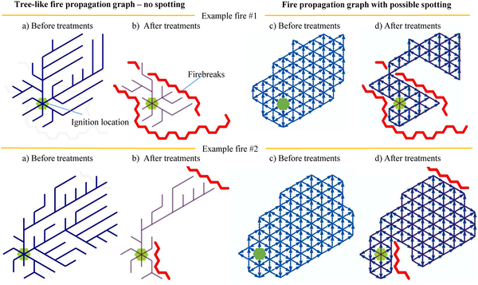
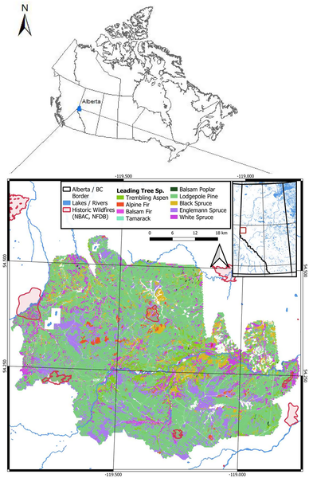
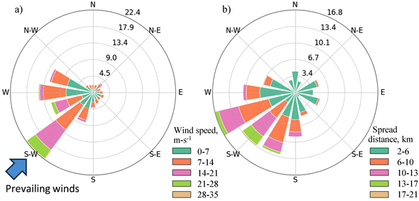
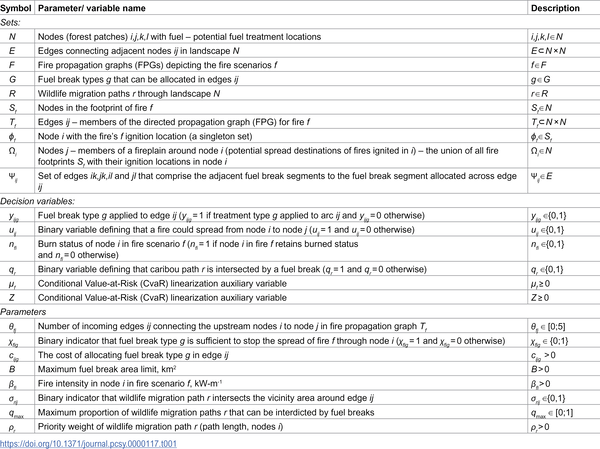

Wildfires are a growing threat to forests and communities across North America, especially as climate change fuels longer and more intense fire seasons. One common strategy to slow wildfire spread is to create fuel breaks—strips of land where vegetation is removed or reduced to stop fires from jumping across the landscape. But these breaks can also disrupt wildlife habitats and migration routes, posing a dilemma for land managers. How can we design fuel breaks that protect both forests and the animals that depend on them?

> **TL;DR**
> - The study introduces a new mathematical model that plans fuel breaks to minimize wildfire spread while preserving key migration routes for endangered woodland caribou.
> - By representing fire spread as a network of possible paths and accounting for the chance that fuel breaks might fail, the model helps balance wildfire risk reduction with wildlife conservation goals.

In fire-prone regions like Alberta’s Red Rock-Prairie Creek area, wildfires can cause devastating environmental and economic damage. Fuel breaks are a proven tool to segment the landscape and reduce fire intensity, but they can also fragment habitats critical for species like the woodland caribou, which rely on connected migration corridors to survive seasonal changes. Caribou populations have been declining partly due to habitat fragmentation, so any wildfire mitigation efforts must carefully consider their impact on these animals. Historically, wildfire management and wildlife conservation have been planned separately, but growing awareness of their interdependence calls for integrated approaches.

The researchers developed a mixed-integer programming model that treats the landscape as a network of fuel patches. They used fire propagation graphs—a way to represent all possible fire spread paths from various ignition points under uncertain conditions—to simulate thousands of fire scenarios. Each fuel break’s effectiveness depends on its width and the intensity of the fire it encounters, allowing the model to account for potential failures where fires might jump over breaks. The model optimizes the placement and size of fuel breaks to minimize the expected burned area while ensuring that a target proportion of caribou migration routes remain intact. The approach was applied to the Red Rock-Prairie Creek region, integrating spatial data on forest types, historic fires, and known caribou paths.

The model successfully identified fuel break configurations that reduce wildfire spread potential across the landscape with only moderate disruption to caribou migration routes. By explicitly considering the risk of fuel break failure and the spatial connectivity of both fuels and wildlife corridors, the approach offers a more nuanced planning tool than previous methods. It showed that some trade-offs are inevitable, but carefully optimized fuel breaks can achieve wildfire mitigation goals while maintaining critical ecosystem services.

This work represents a meaningful advance in wildfire management by bridging fire science, optimization modeling, and conservation biology. The ability to plan fuel breaks that account for uncertain fire behavior and wildlife needs simultaneously is crucial as fire seasons intensify and endangered species face mounting pressures. The methodology provides land managers with a practical decision-support tool to develop balanced strategies that protect both human communities and vulnerable wildlife populations. Its application in Alberta serves as a valuable case study for other fire-prone regions worldwide.

While promising, the model relies on the quality and resolution of input data, such as fire behavior simulations and wildlife migration maps, which can vary in accuracy. The approach assumes that fire propagation graphs adequately capture the complexity of fire spread and that caribou migration routes are well known and static, though both can change over time. Additionally, the optimization focuses on a single species and may not fully represent other ecological impacts of fuel breaks. Future work could extend the framework to include multiple species and evolving landscape conditions to further enhance its utility.

## Figures

*Fire spread patterns showing how fuel breaks can slow or stop fires from spreading through different forest layouts.*

*Map showing the Red Rock-Prairie Creek area in Alberta, Canada, with boundaries, historic fires, waterways, and land cover.*

*Diagrams showing main wind directions and how fires spread between locations across the study area.*

*Overview of the key variables and parameters used in the model.*

## Sources

- [A network optimization framework for fuel break planning in wildfire-prone landscapes: Accounting for fuel break failures and wildlife conservation goals](https://journals.plos.org/complexsystems/article?id=10.1371/journal.pcsy.0000117)
- DOI: [10.1371/journal.pcsy.0000117](https://doi.org/10.1371/journal.pcsy.0000117)
