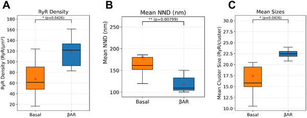
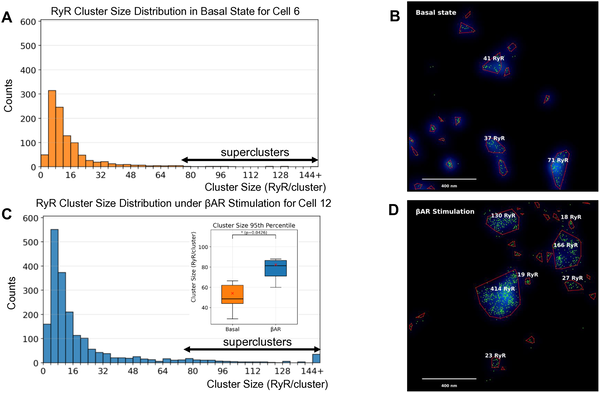
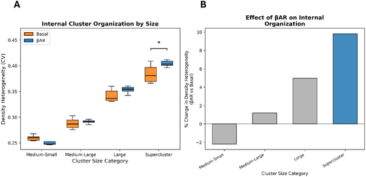
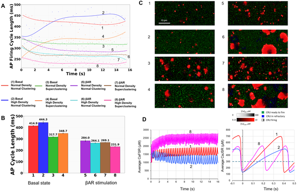

When you suddenly face a stressful situation—whether it’s a looming deadline or an unexpected threat—your heart races, pumping blood faster to prepare your body for action. This rapid heartbeat is orchestrated by specialized cells in your heart’s natural pacemaker, the sinoatrial node. But how exactly do these cells speed up their rhythm at the molecular level? Recent advances in super-resolution microscopy and computational modeling have uncovered a surprising nanoscale mechanism involving the reorganization of tiny protein clusters that control calcium release inside pacemaker cells. This discovery sheds new light on how your heart naturally accelerates during fight-or-flight moments.

> **TL;DR**
> - Ryanodine receptors (RyRs), calcium release channels in heart pacemaker cells, form clusters of varying sizes, including rare large 'superclusters'.
> - During β-adrenergic stimulation (the fight-or-flight response), RyR density and supercluster formation increase, creating calcium release hotspots that accelerate the heartbeat.

The heartbeat originates in the sinoatrial node (SAN), a small region of the heart containing pacemaker cells that generate rhythmic electrical signals called action potentials. These signals trigger each heartbeat. The automaticity of these cells depends on a finely tuned interplay between proteins in the cell membrane and calcium-handling structures inside the cell, especially the sarcoplasmic reticulum (SR). The SR releases calcium through ryanodine receptors (RyRs), which are organized into clusters. These local calcium releases (LCRs) help depolarize the cell membrane, ultimately leading to action potentials. While the general role of calcium signaling in pacemaker cells has been studied, the precise nanoscale organization of RyRs and how it changes during stress was previously unknown.

To explore RyR organization, the researchers used direct Stochastic Optical Reconstruction Microscopy (dSTORM), a super-resolution imaging technique capable of pinpointing individual molecules with about 20 nanometer precision. They examined rabbit sinoatrial node cells under normal conditions and after five minutes of β-adrenergic receptor stimulation using isoproterenol, which mimics the fight-or-flight response. They quantified RyR cluster sizes, densities, and spatial arrangements. To understand the functional impact of these structural changes, they developed a computational model of a sinoatrial node cell that explicitly represented each RyR according to the imaging data. This model simulated how RyR clustering affected calcium release and pacemaker firing rates.

The study found that RyRs are not evenly distributed but form clusters ranging from small groups of a few channels to rare large 'superclusters' containing more than 76 RyRs. Under β-adrenergic stimulation, the overall RyR density nearly doubled, and the number and size of superclusters increased significantly, with some clusters reaching over 400 RyRs. These superclusters showed more uneven internal density, suggesting they form by merging smaller clusters. Computational simulations revealed that these superclusters act as calcium release hotspots that fire early during the pacemaker cycle, recruiting neighboring clusters to release calcium through a calcium-induced calcium release mechanism. This coordinated activity shortens the action potential cycle length, effectively speeding up the heartbeat. The combined effect of increased RyR density, superclustering, and enhanced calcium cycling and membrane currents during β-adrenergic stimulation produced the strongest acceleration of pacemaker firing.

This work uncovers a previously unknown nanoscale structural mechanism by which heart pacemaker cells accelerate their rhythm during stress. The dynamic reorganization of RyR clusters into superclusters creates powerful calcium release hotspots that enhance the cell’s ability to generate faster action potentials. Understanding this mechanism deepens our knowledge of how the heart’s natural pacemaker adapts to physiological demands and may inform future research into cardiac arrhythmias or the development of therapies and devices that target pacemaker function at the molecular level.

While the study provides compelling evidence linking RyR superclustering to pacemaker acceleration, it was conducted in rabbit sinoatrial node cells and computational models, so further research is needed to confirm these findings in human cells and in vivo. The direct clinical implications remain to be explored, and it is not yet clear how these nanoscale changes might be affected in heart disease. Nonetheless, the combination of cutting-edge imaging and modeling offers a robust framework for future investigations.

## Figures

*Box plots show that βAR stimulation increases RyR density and cluster size while decreasing spacing between clusters in heart cells.*

*βAR stimulation increases the size and number of RyR protein clusters, forming larger superclusters compared to basal conditions.*

*Beta-adrenergic stimulation changes internal RyR cluster patterns, with larger clusters showing more uneven density.*

*Simulations show how RyR density and clustering together affect heart cell firing rates during βAR stimulation.*

## Sources

- [A new Fight-or-Flight Pacemaker Mechanism via Ryanodine Receptor abundance and superclustering](https://journals.plos.org/ploscompbiol/article?id=10.1371/journal.pcbi.1014267)
- DOI: [10.1371/journal.pcbi.1014267](https://doi.org/10.1371/journal.pcbi.1014267)
