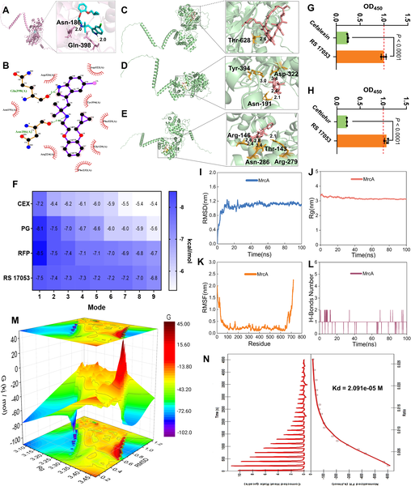
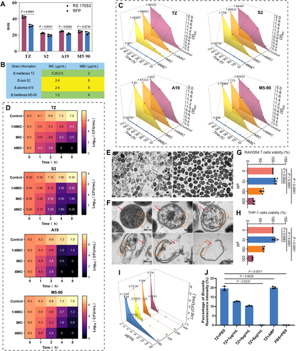
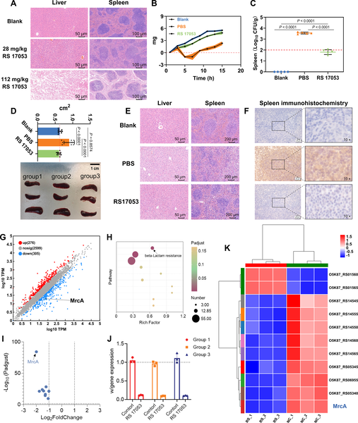
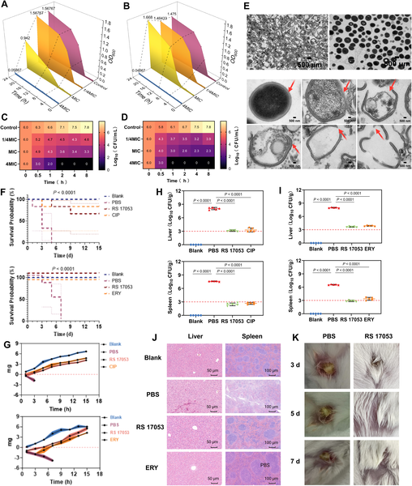

Antibiotic resistance is one of the most pressing health challenges of our time, especially when bacteria hide inside our own cells where many drugs cannot reach them. Imagine a drug that not only stops bacteria from building their protective cell walls but also sneaks inside human cells to finish the job. Scientists have recently discovered such a promising candidate by repurposing a drug originally designed for a completely different purpose.

> **TL;DR**
> - RS 17053, originally an α1A-adrenoceptor antagonist, has been repurposed as a novel antibiotic that targets bacterial penicillin-binding proteins (PBPs) essential for cell wall synthesis.
> - This compound uniquely penetrates host cells to kill intracellular pathogens like Brucella and Salmonella, shows efficacy against drug-resistant bacteria including MRSA, and improves survival in mouse infection models.

The rise of antibiotic-resistant bacteria, especially those that can hide inside human cells, poses a major global health threat. Gram-negative bacteria such as Brucella and Salmonella can survive inside immune cells, evading many conventional antibiotics that cannot effectively enter these cellular niches. Methicillin-resistant Staphylococcus aureus (MRSA) is another notorious pathogen resistant to many treatments. Traditional antibiotics like β-lactams target penicillin-binding proteins (PBPs) to disrupt bacterial cell wall formation but often fail to reach intracellular bacteria. Finding new drugs that can overcome this barrier is critical.

Researchers turned to drug repurposing, screening a library of approved and bioactive compounds to identify candidates with antibacterial activity. RS 17053, known previously as an α1A-adrenoceptor antagonist, emerged as a strong binder to Class A PBPs, particularly MrcA in Gram-negative bacteria and MecA in MRSA. Using molecular docking and dynamics simulations, they confirmed this binding. Laboratory tests measured the minimum inhibitory concentrations (MICs) of RS 17053 against various bacteria, including intracellular pathogens. The team also assessed the drug’s ability to penetrate mammalian cells and kill intracellular bacteria within macrophages. Mouse models of infection were used to evaluate therapeutic efficacy and safety. Multi-omics analyses helped elucidate the drug’s mechanism of action.

RS 17053 demonstrated potent antibacterial activity in vitro against Gram-negative bacteria like Brucella and Salmonella, as well as Gram-positive MRSA, with MICs ranging from 0.25 to 4 μg/mL. Importantly, it effectively eradicated intracellular Brucella inside macrophages at 8 μg/mL, a feat many antibiotics cannot achieve. Serial exposure to RS 17053 led to a slower development of resistance compared to traditional antibiotics. In mouse infection models, daily treatment with 10 mg/kg RS 17053 significantly reduced bacterial loads in organs by about 100-fold and improved survival rates. The drug normalized pro-inflammatory cytokine levels, indicating reduced infection severity. Molecular analyses confirmed that RS 17053 selectively targets PBPs, disrupting peptidoglycan synthesis and causing bacterial cell wall collapse and lysis.

This study introduces RS 17053 as a promising new antibiotic candidate with a unique mechanism that overcomes two major challenges in infectious disease treatment: drug resistance and intracellular bacterial survival. By repurposing a known compound, the researchers have potentially shortened the path toward clinical use. The ability of RS 17053 to penetrate host cells and kill hidden pathogens could transform treatment strategies for persistent infections caused by bacteria like Brucella and MRSA, which are difficult to eradicate with existing drugs.

While the preclinical results are encouraging, RS 17053’s safety and efficacy in humans remain to be established through clinical trials. The long-term potential for resistance development, optimal dosing, and possible side effects also require further investigation. Additionally, although mouse models provide valuable insights, human infections can be more complex. Therefore, cautious optimism is warranted as this compound progresses toward potential therapeutic use.

## Figures

*Simulated images and tests show how the new drug RS 17053 binds to a key protein in Brucella, revealing its potential as an antibiotic.*

*RS 17053 effectively kills various Brucella bacteria and can enter cells to destroy them, shown by growth tests and detailed microscopy images.*

*RS 17053 helps mice fight B. melitensis infection by damaging bacteria and protecting liver and spleen health.*

*RS 17053 effectively kills various bacteria, including MRSA, and improves survival and health in infected mice.*

## Sources

- [A novel penicillin-binding protein inhibitor with unprecedented intracellular activity eradicates multiple pathogenic bacteria](https://journals.plos.org/plospathogens/article?id=10.1371/journal.ppat.1014242)
- DOI: [10.1371/journal.ppat.1014242](https://doi.org/10.1371/journal.ppat.1014242)
