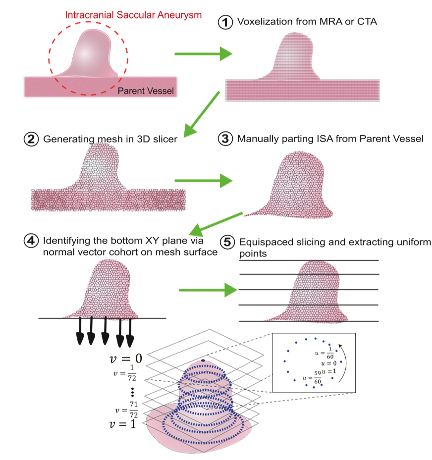
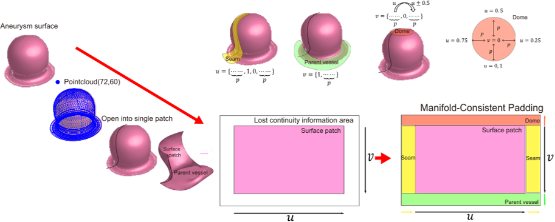
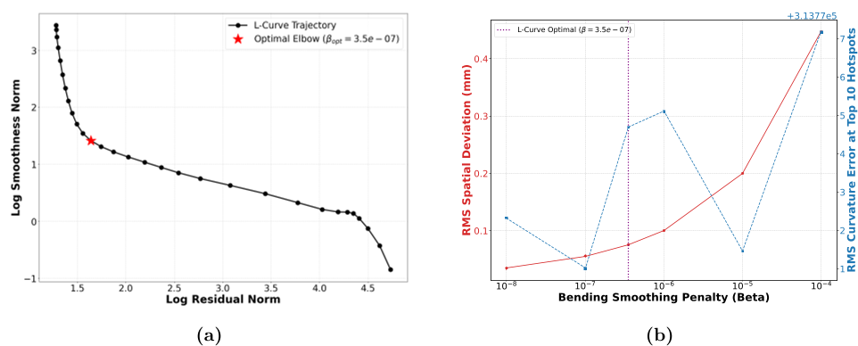

Imagine trying to spot a tiny, fragile bubble on a blood vessel in the brain—a bubble that could rupture and cause a life-threatening stroke. Medical imaging technologies like MRI and CT scans provide 3D pictures of these aneurysms, but the images often contain noise and distortions that can hide or mimic dangerous features. What if artificial intelligence could not only clean up these images but also use the laws of physics to tell real danger signs from artifacts? That’s exactly what a new physics-informed neural network approach aims to do, potentially giving neurosurgeons a sharper tool to assess rupture risk and save lives.

> **TL;DR**
> - Traditional smoothing methods for 3D aneurysm images can erase critical pathological features, making rupture risk assessment less accurate.
> - A physics-informed neural network uses biomechanical equilibrium principles to reconstruct aneurysm surfaces, preserving true high-curvature features like rupture-prone blebs while filtering out imaging noise.

*Note: this summary is based on a preprint — research shared ahead of formal peer review.*

Intracranial saccular aneurysms (ISAs) are balloon-like bulges in brain blood vessels that pose a significant health threat worldwide, with ruptures causing hundreds of thousands of deaths annually. Assessing which aneurysms are likely to rupture is challenging because existing clinical scoring systems rely on population averages and often fail to capture patient-specific risks. High-resolution imaging combined with computational models of aneurysm mechanics offers a promising path forward. However, the raw 3D images from MRI or CT angiography are noisy and sometimes distorted, which complicates accurate surface reconstruction—a crucial step for biomechanical analysis and risk prediction.

The researchers developed a novel computational framework that integrates physics-informed neural networks (PINNs) with B-spline surface representations to reconstruct aneurysm geometries from clinical imaging data. Unlike conventional smoothing techniques that indiscriminately blur out both noise and real pathological features, this approach embeds the physical principle of Laplace membrane equilibrium—the balance of stresses on the aneurysm wall—directly into the neural network’s loss function. This physics-based constraint guides the network to distinguish between non-physical imaging artifacts and genuine high-curvature features such as rupture-prone blebs. The method uses a Manifold-Consistent Convolutional Neural Network to maintain the correct closed-surface topology of the vascular geometry while optimizing control points of the B-spline surface to fit the imaging data under biomechanical equilibrium conditions.

Applying this physics-informed reconstruction to patient-specific clinical datasets, the team demonstrated that their method effectively removes non-physical concave artifacts caused by imaging noise without compromising diagnostically important geometric anomalies. A practicing neurosurgeon evaluated the reconstructed aneurysm surfaces and confirmed that the resulting rupture risk maps—highlighting stress concentration at the aneurysm dome apex—aligned well with intraoperative observations. This suggests that the approach not only improves the geometric fidelity of aneurysm models but also enhances the clinical relevance of biomechanical rupture risk assessments.

By combining advanced AI techniques with fundamental biomechanical principles, this work presents a promising new tool for personalized rupture risk assessment of brain aneurysms. Preserving subtle but critical surface features while filtering out noise can lead to more accurate computational biomarkers, potentially informing neurosurgical decision-making and improving patient outcomes. The approach bridges a gap between mathematical image smoothing and biomechanical modeling, offering a more physically grounded reconstruction pipeline that could be adapted to other vascular or soft tissue imaging challenges.

While the results are encouraging, the study is based on datasets from a single clinical center and remains a preprint pending peer review. Further validation on larger and more diverse patient populations is necessary to confirm generalizability. Additionally, integrating this reconstruction method into routine clinical workflows will require user-friendly software tools and real-time processing capabilities. The approach also depends on accurate segmentation of imaging data, which itself can be challenging. Nonetheless, this physics-informed framework represents an important step toward more reliable and interpretable AI-assisted medical imaging.

## Figures

*Step-by-step process to create a 3D point cloud from medical images, separating and slicing blood vessel structures for analysis. — Figure from Hyomin Ryu et al., [CC BY 4.0](http://creativecommons.org/licenses/by/4.0/), caption edited.*

*Diagram showing how special padding fixes edge issues when flattening a 3D shape into 2D by restoring connections and smoothing boundaries. — Figure from Hyomin Ryu et al., [CC BY 4.0](http://creativecommons.org/licenses/by/4.0/), caption edited.*

*Graph shows how smoothing factor β affects data fit and curvature, highlighting the best value at β = 3.5×10⁻⁷ for optimal smoothing. — Figure from Hyomin Ryu et al., [CC BY 4.0](http://creativecommons.org/licenses/by/4.0/), caption edited.*

## Sources

- [A physics-informed neural network for improving surface reconstruction of intracranial saccular aneurysms via variational membrane equilibrium](https://arxiv.org/abs/2607.22055)
- DOI: [10.48550/arxiv.2607.22055](https://doi.org/10.48550/arxiv.2607.22055)

*This article reuses and adapts text and figures from the original research by Hyomin Ryu et al., available via arXiv Mathematics, under the [CC BY 4.0](http://creativecommons.org/licenses/by/4.0/) license.*
