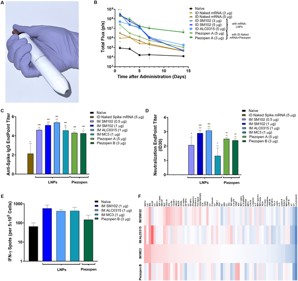
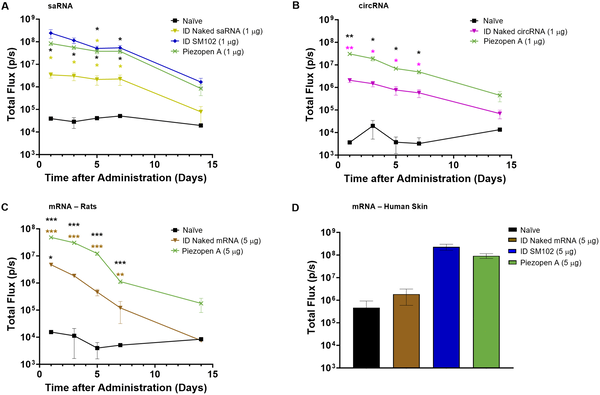

Could a device costing less than a dollar change how RNA vaccines are delivered? The COVID-19 pandemic showcased the power of mRNA vaccines, but their reliance on complex lipid nanoparticles (LNPs) has posed challenges including high costs, side effects, and manufacturing hurdles. Now, researchers have introduced a simple, handheld electroporation tool called Piezopen that uses tiny needles and electrical pulses to boost the effectiveness of 'naked' RNA vaccines—RNA delivered without the usual protective nanoparticles. This innovation could pave the way for safer, more affordable vaccines accessible to people around the globe.

> **TL;DR**
> - Piezopen, a low-cost piezoelectric electroporation device with microneedles, significantly improves intracellular delivery and immune response to naked RNA vaccines.
> - This device achieves immune responses comparable to advanced lipid nanoparticle formulations but with less inflammation and at potentially lower cost, validated across mice, rats, and human skin samples.

mRNA vaccines have revolutionized infectious disease prevention, especially during the COVID-19 pandemic, thanks to their rapid development and strong protection. However, these vaccines typically require lipid nanoparticles (LNPs) to protect the fragile RNA and help it enter cells. LNPs, while effective, are costly to produce and can cause unwanted inflammation and side effects. Moreover, their complex manufacturing limits vaccine accessibility in low-resource settings. Delivering RNA without these carriers—so-called 'naked' RNA—has been considered impractical because RNA degrades quickly and struggles to enter cells. This new study challenges that assumption by demonstrating that electroporation, a method using brief electrical pulses to open cell membranes, can enable naked RNA vaccines to work effectively.

The researchers developed Piezopen, a lightweight, battery-free device costing under one dollar, which combines piezoelectric electroporation with microneedle electrodes. These microneedles penetrate the skin’s outer layer, targeting immune cells directly. When activated, Piezopen delivers short, high-voltage pulses that temporarily create pores in cell membranes, allowing naked RNA molecules to enter cells rapidly. The team tested this device in mice, rats, and ex vivo human skin samples, delivering various RNA types—including standard mRNA, self-amplifying RNA, and circular RNA—and compared the results to those obtained with clinically approved LNP formulations.

Piezopen delivery of naked RNA led to gene expression levels comparable to or exceeding those achieved with LNPs, with expression persisting longer—up to 10 to 100 times higher at two weeks post-delivery. Importantly, the device induced strong immune responses against the SARS-CoV-2 spike protein, including production of neutralizing antibodies and T cell activation, comparable to or slightly below that of LNP vaccines but without systemic inflammation. The device’s effectiveness was consistent across species and RNA types, and it performed well in human skin samples, suggesting potential for clinical translation. Additionally, Piezopen’s localized delivery to skin immune cells minimized off-target effects and reduced reactogenicity compared to LNPs.

This study offers a promising alternative to lipid nanoparticles for RNA vaccine delivery. By enabling effective vaccination with naked RNA, Piezopen could reduce manufacturing complexity and costs, lower side effects, and increase vaccine accessibility worldwide—especially in low- and middle-income countries. The device’s simple design and low cost make it suitable for widespread use and rapid deployment during pandemics. Furthermore, its ability to deliver diverse RNA types opens doors for new vaccine and therapeutic applications beyond COVID-19. This approach also highlights the potential of combining physical delivery methods with RNA technology to overcome longstanding challenges in nucleic acid medicine.

While the results are encouraging, some limitations remain. The study compared Piezopen intradermal delivery to intramuscular LNP injections, so differences in immune responses may partly reflect delivery routes rather than delivery platforms alone. The doses of naked RNA used were initially higher than those for LNPs, though subsequent optimization showed dose reductions are possible. Systemic inflammation was measured only at a single time point, and longer-term safety and efficacy studies are needed. Finally, clinical trials will be required to confirm Piezopen’s performance and tolerability in humans. Nonetheless, this work provides a strong foundation for further development of electroporation-based RNA vaccine delivery.

## Figures

*The Piezopen, a cheap handheld device, boosts gene expression and immune response to RNA vaccines in mice, matching advanced lipid nanoparticle methods.*

*Piezopen helps deliver RNA into cells in mice, rats, and human skin, boosting gene activity compared to standard methods.*

## Sources

- [A piezoelectric electroporator (Piezopen) for enhanced “naked” RNA vaccine delivery](https://journals.plos.org/plosone/article?id=10.1371/journal.pone.0353214)
- DOI: [10.1371/journal.pone.0353214](https://doi.org/10.1371/journal.pone.0353214)
