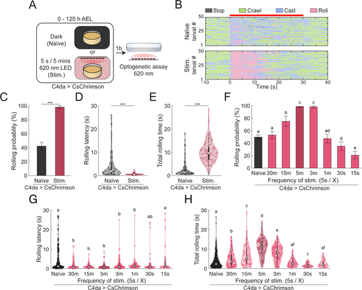
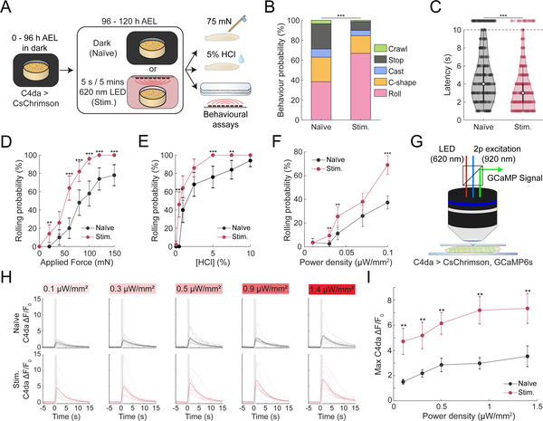
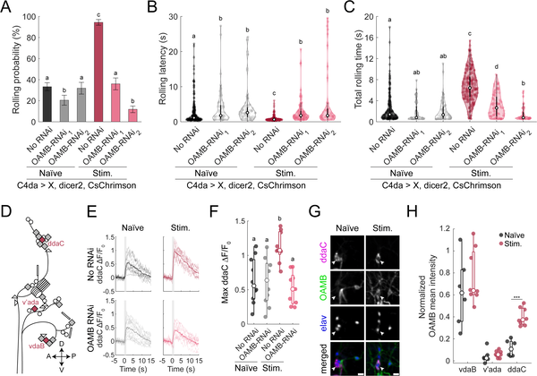
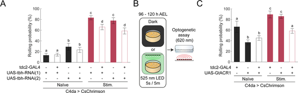

How do tiny fruit fly larvae learn to escape danger better over time? Unlike simple reflexes, their responses to painful stimuli can become stronger with experience. Recent research reveals a fascinating neural feedback loop that amplifies pain signals, helping these little creatures adapt their behavior to survive threats more effectively.

> **TL;DR**
> - Repeated painful stimulation in fruit fly larvae increases the likelihood and intensity of their escape rolling behavior.
> - A positive feedback loop between pain-sensing neurons and octopaminergic neurons, mediated by the octopamine receptor OAMB, sustains this heightened sensitivity.

Animals must adapt their behavior based on past experiences to survive in complex environments. In fruit fly larvae, a well-studied nociceptive system detects harmful stimuli and triggers escape behaviors like rolling. While these responses are stereotyped, they are not fixed; prior encounters with noxious stimuli can sensitize the larvae, making them respond more strongly and quickly to future threats. Understanding the neural mechanisms behind this plasticity sheds light on how nervous systems balance innate reflexes with experience-driven adaptation.

Researchers used optogenetics to repeatedly activate the larvae’s pain-sensing class IV dendritic arborization (C4da) neurons during development. By exposing larvae to controlled light pulses that mimic noxious stimulation, they tracked changes in escape behavior using machine-learning software. They also tested responses to natural mechanical and chemical pain stimuli to confirm behavioral effects. Genetic tools were employed to manipulate octopamine signaling, particularly focusing on the OAMB receptor and octopaminergic ventral unpaired median (VUM) neurons, to dissect their roles in the sensitization process.

Larvae exposed to repeated C4da neuron activation during development showed a dramatic increase in rolling behavior, rolling earlier and for longer durations than naïve larvae. This sensitization was frequency-dependent: moderate stimulation intervals enhanced responses, while very high-frequency stimulation led to habituation. Importantly, the increased sensitivity was not limited to artificial stimulation; developmentally stimulated larvae also responded more strongly to natural noxious mechanical and chemical stimuli. At the neural level, this heightened behavioral sensitivity correlated with sustained increased activity within the nociceptive sensory neurons themselves. Crucially, the neuromodulator octopamine and its receptor OAMB were necessary to maintain this sensitized state. Octopaminergic VUM neurons provided positive feedback to sensory neurons, amplifying their output and thus reinforcing the behavioral sensitization.

This study uncovers a novel positive feedback mechanism within the nociceptive system of fruit fly larvae, where neuromodulatory circuits dynamically tune pain sensitivity based on experience. By demonstrating that octopamine signaling sustains heightened sensory neuron activity and escape behavior, it highlights how even simple nervous systems integrate internal state and past experience to adapt survival behaviors. These insights contribute to a broader understanding of pain plasticity and neuromodulation, with potential implications for studying how more complex animals, including humans, modulate pain sensitivity.

While fruit fly larvae provide a powerful model for dissecting neural circuits, their simplicity means findings may not directly translate to mammals. The study focuses on a specific neuromodulator and receptor in one species, so other factors likely contribute to nociceptive plasticity in more complex systems. Additionally, the behavioral sensitization was induced through optogenetic stimulation, which, although carefully controlled, differs from natural patterns of noxious input. Further research is needed to explore how these mechanisms operate in diverse environmental contexts and across species.

## Figures

*Early pain-like nerve activation changes how larvae react later, affecting their rolling behavior and response speed.*

*Prior painful experiences make larvae more sensitive to touch and chemical pain, causing quicker and stronger protective reactions.*

*The octopamine receptor OAMB is essential for larvae to become more sensitive to harmful stimuli after experience, shown by behavior and neuron activity tests.*

*Blocking octopamine signals in specific neurons stops pain sensitivity changes after experience, without affecting normal pain responses.*

## Sources

- [A positive feedback loop between sensory and octopaminergic neurons underlies nociceptive plasticity in Drosophila larvae](https://journals.plos.org/plosgenetics/article?id=10.1371/journal.pgen.1012122)
- DOI: [10.1371/journal.pgen.1012122](https://doi.org/10.1371/journal.pgen.1012122)
