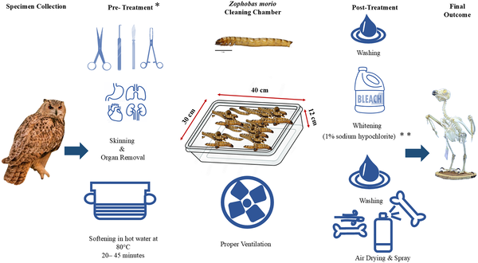
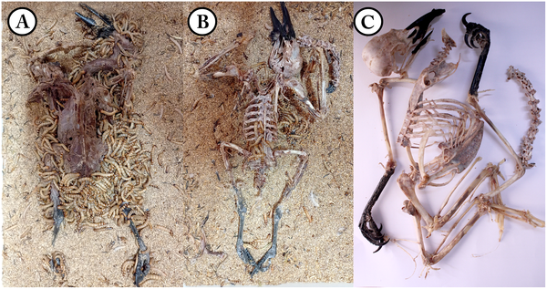
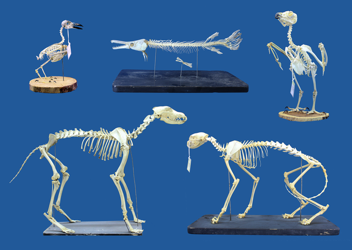

In natural history museums, preserving pristine skeletons is vital for research, education, and display. Traditionally, cleaning these bones involves chemical treatments or colonies of dermestid beetles, both of which can be slow, risky, or damaging. But what if tiny larvae known as superworms could do the job faster and safer? Recent research explores how these insects might transform museum curation by efficiently removing soft tissues without harming delicate bones.

> **TL;DR**
> - Superworms (Zophobas morio) can rapidly clean vertebrate skeletons by consuming soft tissues, often within hours to days depending on specimen size.
> - Using an optimal ratio of larvae to specimen weight balances cleaning speed with bone safety, offering museums a practical and low-risk alternative to traditional methods.

Skeletal specimens form the backbone of anatomical collections, enabling scientists to study evolutionary relationships, functional anatomy, and developmental biology. Preparing these skeletons requires removing all soft tissue while preserving fragile bone structures. Conventional methods like maceration, chemical baths, or boiling can damage bones or take weeks to complete. Dermestid beetle colonies have become a popular biological alternative, but they carry risks such as beetle escape and egg contamination, which can threaten museum collections. Seeking a safer, faster option, researchers have turned to superworms, the larvae of Zophobas morio, known for their voracious appetite and ease of rearing.

The study tested superworms on a variety of vertebrate specimens ranging from small birds and rodents to large mammals like wolves and wild cats. After removing skin and internal organs, specimens were pretreated—small ones were placed directly with larvae, while medium and large specimens were softened in hot water to aid tissue removal. Researchers standardized the cleaning containers and experimented with different larva-to-specimen weight ratios to find the best balance between efficiency and bone preservation. Larvae were rotated every 6–8 hours into fresh containers to maintain feeding activity, and environmental conditions were controlled to optimize larval performance. Post-cleaning, skeletons were rinsed and dried, with minimal use of potentially damaging chemicals.

Results showed that superworms effectively removed soft tissues, including from hard-to-reach internal cavities, within hours to several days depending on specimen size. A larva-to-specimen weight ratio of about 10–15 was optimal, providing thorough cleaning while minimizing damage to fragile bones. Higher ratios increased the risk of bone damage, while lower ratios prolonged cleaning times. Unlike dermestid beetles, superworms remain in the larval stage under crowded conditions, reducing risks of escape or infestation. The larvae could be maintained easily in-house with simple feeding regimes, making them accessible for museum use. Compared to traditional boiling methods, superworm cleaning preserved delicate skeletal features better and avoided deformation.

This research introduces superworms as a practical, adaptable, and safer alternative for skeletal preparation in museums and research institutions. By reducing cleaning times and minimizing risks associated with chemicals or beetle colonies, superworms can streamline specimen preparation workflows. Their commercial availability and straightforward colony management further support their adoption. This method could improve the quality and safety of anatomical collections, facilitating more detailed scientific study and enhancing public exhibits.

While promising, the superworm method requires careful control of larval density to avoid bone damage, and larger specimens may need to be divided among multiple containers. Prolonged feeding on animal tissue can affect larval health, so supplemental plant-based feeding is necessary between cleaning sessions. Additionally, brief bleaching steps used in some protocols may risk bone damage and are not recommended. Further studies could explore long-term effects on bone integrity and optimize protocols for a wider range of specimen types.

## Figures

*Overview of cleaning larval skeletons using superworms, including specimen prep, cleaning steps, and final bone preparation.*

*Superworm larvae clean a Hooded Crow specimen by eating soft tissues over 12 hours, leaving the bones intact.*

*Superworms cleaning skeletons of various animals like rook, alligator gar, eagle owl, gray wolf, and wild cat.*

## Sources

- [A practical and safe alternative method for skeletal cleaning for museum specimens using superworms (Zophobas morio)](https://journals.plos.org/plosone/article?id=10.1371/journal.pone.0349669)
- DOI: [10.1371/journal.pone.0349669](https://doi.org/10.1371/journal.pone.0349669)
