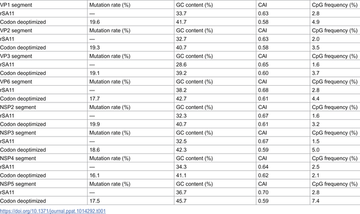
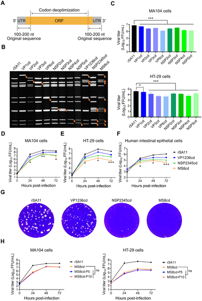
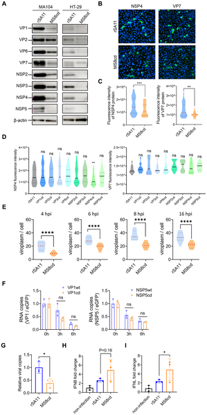

Rotavirus is a leading cause of severe diarrhea in infants and young children worldwide, often resulting in dangerous dehydration and even death, especially in low-income countries. While existing vaccines have helped reduce this burden, challenges remain due to the virus’s genetic diversity and the need for safer, broadly protective vaccines. Recently, researchers have turned to an innovative genetic engineering technique called codon deoptimization to create a live-attenuated rotavirus vaccine candidate that is both safer and effective. This approach involves subtly rewriting the virus’s genetic code to slow down its replication without changing the proteins it produces, offering a fresh strategy to combat this persistent pediatric threat.

> **TL;DR**
> - Codon deoptimization—replacing common viral codons with rare synonymous ones—was used to attenuate a rotavirus strain, significantly reducing its replication in cells and mice.
> - The attenuated virus elicited strong immune responses and protected newborn mice from infection by wild-type rotavirus, demonstrating potential as a safe and effective vaccine candidate.

Rotavirus causes acute gastroenteritis, leading to severe diarrhea and dehydration in infants and young children. Despite the availability of vaccines like Rotarix and RotaTeq, rotavirus remains a major cause of childhood illness globally, partly due to the virus’s many genotypes that can evade immune protection. Traditional vaccine attenuation methods, such as repeated passage through non-human hosts, can be time-consuming and less controllable. Advances in reverse genetics have introduced codon deoptimization as a promising alternative. By altering the virus’s RNA sequence to use rare codons—without changing the proteins themselves—scientists can reduce viral protein production and replication, effectively weakening the virus while maintaining its ability to stimulate immunity.

In this study, researchers applied codon deoptimization to eight gene segments of a simian rotavirus strain (SA11) that encode key structural and non-structural proteins essential for viral replication. They carefully avoided modifying the outer capsid proteins VP4 and VP7, which determine the virus’s antigenic properties, allowing these to be swapped later to target different human rotavirus genotypes. Using a reverse genetics system, they generated recombinant viruses with codon-deoptimized segments, including a multi-segment variant (MS8cd) with all eight targeted segments altered. The team tested viral replication in various cell lines and human intestinal epithelial cells derived from stem cells, assessed genetic stability through serial passage, and measured viral protein production and immune responses in neonatal mice using a maternal immunization model.

The multi-segment codon-deoptimized virus (MS8cd) showed markedly reduced replication in cell cultures and human intestinal epithelial cells compared to the wild-type virus. This attenuation was linked to decreased viral protein production rather than changes in mRNA stability. Importantly, MS8cd was genetically stable over multiple passages, with no reversion mutations detected. When used to immunize mother mice, MS8cd induced strong systemic and mucosal antibody responses that protected their newborn pups against challenge with wild-type rotavirus. Furthermore, by swapping the outer capsid proteins VP4 and VP7 with those from prevalent human rotavirus strains, the researchers created reassortant viruses capable of eliciting genotype-specific and broad-spectrum immunity, highlighting the vaccine candidate’s adaptability.

This work demonstrates that codon deoptimization is a viable and efficient strategy to develop live-attenuated rotavirus vaccines that are both safe and effective. The approach offers advantages over classical attenuation methods by being more controllable, faster, and potentially more cost-effective. The ability to modify outer capsid proteins to match circulating human strains further enhances the vaccine’s relevance across diverse viral genotypes. Given rotavirus’s ongoing impact on global child health, especially in resource-limited settings, this vaccine platform could accelerate the development of improved vaccines and provide a rapid-response tool against emerging rotavirus variants and possibly other RNA viruses.

While the results in neonatal mouse models are promising, further studies are needed to evaluate the safety, immunogenicity, and protective efficacy of codon-deoptimized rotavirus vaccines in humans. The complexity of human immune responses and genetic diversity of rotavirus strains require comprehensive clinical testing. Additionally, the long-term stability and potential for reversion under real-world conditions must be carefully monitored. Finally, the molecular mechanisms by which codon deoptimization reduces protein production and viral fitness warrant deeper investigation to optimize this approach for broader vaccine applications.

## Figures

*Table showing mutation rates, GC content, codon adaptation, and CpG frequency in gene segments from humans and altered versions.*

*This figure shows how modified rotaviruses were designed, their genetic changes, and how they grow in different cell types over time.*

*Reducing codon efficiency lowers rotavirus protein levels without affecting mRNA stability, shown by protein tests and cell imaging.*

## Sources

- [A rotavirus vaccine candidate attenuated by codon deoptimization protects neonatal mice against wild-type virus infection](https://journals.plos.org/plospathogens/article?id=10.1371/journal.ppat.1014292)
- DOI: [10.1371/journal.ppat.1014292](https://doi.org/10.1371/journal.ppat.1014292)
