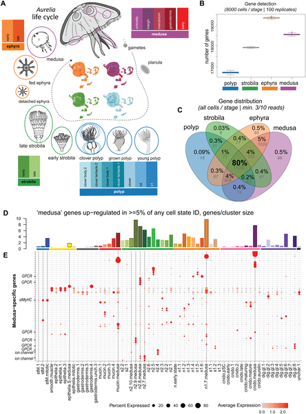
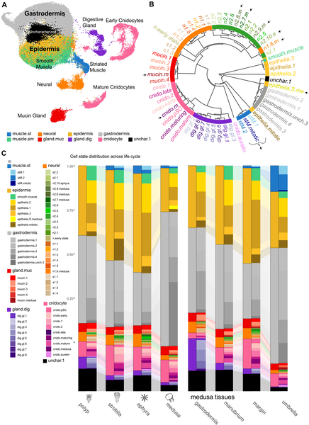
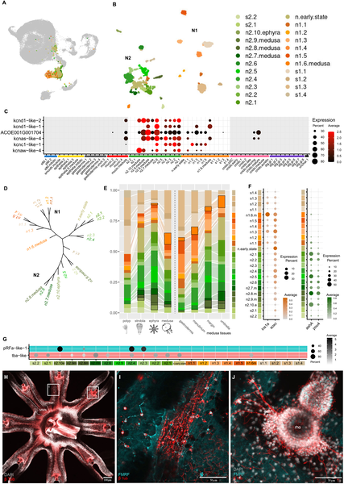

Jellyfish are well known for their graceful, pulsating swim through ocean waters, but few realize that their lives begin in a very different form: a sessile, asexually reproducing polyp attached to a surface. The transformation from this stationary polyp into a free-swimming medusa is one of nature’s more dramatic body plan overhauls. But what happens at the cellular and molecular level during this metamorphosis? Recent advances in single-cell RNA sequencing have now allowed scientists to map the diverse cell types involved in this transition, revealing surprising new cell states unique to the medusa stage and shedding light on the evolutionary origins of jellyfish muscles and neurons.

> **TL;DR**
> - The transition from polyp to medusa in Aurelia coerulea involves an increase in cell type diversity, including new neural subtypes and the emergence of striated muscles unique to the medusa.
> - Comparative analysis suggests that the regulation of muscle contraction in jellyfish striated muscles resembles ancestral smooth muscle mechanisms, differing from the troponin-based regulation found in bilaterian striated muscles.

Cnidarians, the group that includes jellyfish, sea anemones, and corals, occupy a pivotal place in animal evolution as the sister group to bilaterians — animals with bilateral symmetry that include humans. Most medusozoan cnidarians, like the moon jelly Aurelia coerulea, have a complex life cycle alternating between a sessile polyp stage and a motile medusa stage. While the morphology of these stages has long been studied, the molecular and cellular changes underlying this dramatic transformation have remained largely unknown. Understanding these changes can provide insights into how new cell types evolve and how muscle and nervous systems diversify across animal lineages.

Researchers generated a comprehensive single-cell transcriptomic atlas by sequencing thousands of individual cells from Aurelia coerulea at multiple life stages: polyp, strobila (early medusa formation), ephyra (juvenile medusa), and mature medusa. They also sequenced cells from different medusa tissues to capture tissue-specific cell types. Using advanced computational methods, the team integrated these datasets to identify distinct cell populations and their gene expression profiles across the life cycle. This approach allowed them to pinpoint cell types unique to the medusa stage and to compare muscle and neuron gene expression patterns with those of other cnidarians and bilaterians.

The study revealed that the shift from polyp to medusa is accompanied by an increase in the diversity of cell types, notably an expansion of neuronal subtypes and the appearance of striated muscle cells in the medusa’s swimming bell. Two major families of neurons were found to be specified by transcription factors shared with the sea anemone Nematostella vectensis, suggesting these neuronal lineages originated in a common ancestor around 500 million years ago. Intriguingly, although striated and smooth muscles in Aurelia differ morphologically, their contractile regulation mechanisms are similar and resemble those of bilaterian smooth muscles. This contrasts with bilaterian striated muscles, which rely on troponin-based regulation, implying that the ancestral muscle contraction mechanism was smooth muscle-like and that troponin regulation evolved later in bilaterians.

This work provides the first single-cell resolution view of the cellular changes underlying the jellyfish’s polyp-to-medusa transformation, uncovering medusa-specific cell states that contribute to its unique motile lifestyle. The findings illuminate the evolutionary history of muscle and neuron types in cnidarians and highlight gene duplication as a driver of cellular complexity. By revealing that jellyfish striated muscles regulate contraction similarly to smooth muscles, the study challenges assumptions about muscle evolution and offers a new perspective on how complex muscle types arose in animals. These insights deepen our understanding of animal evolution and the molecular basis of life cycle transformations in marine organisms.

While the single-cell atlas offers a detailed snapshot of cell types and gene expression, it reflects data from a laboratory strain of Aurelia coerulea and may not capture the full diversity present in wild populations. The functional roles of newly identified cell types and gene regulatory networks require further experimental validation. Additionally, although evolutionary relationships are inferred from gene expression and transcription factor homology, direct evidence of ancestral states depends on broader comparative studies across cnidarian species. Thus, while the study advances our understanding, it represents a step toward a more complete picture of jellyfish biology and evolution.

## Figures

*This figure maps gene activity changes across jellyfish life stages, highlighting unique genes active in the medusa phase.*

*A cell atlas maps different cell types and states throughout the life cycle, highlighting unique Medusa cell states and their distribution.*

*Two main neural cell types with medusa-specific subtypes are identified by gene expression and protein staining in jellyfish nerve cells.*

## Sources

- [A single-cell transcriptomic atlas reveals the emergence of medusa-specific cell states in the Aurelia coerulea scyphozoan](https://journals.plos.org/plosbiology/article?id=10.1371/journal.pbio.3003931)
- DOI: [10.1371/journal.pbio.3003931](https://doi.org/10.1371/journal.pbio.3003931)
