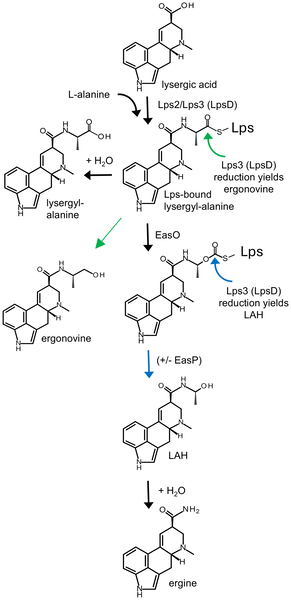
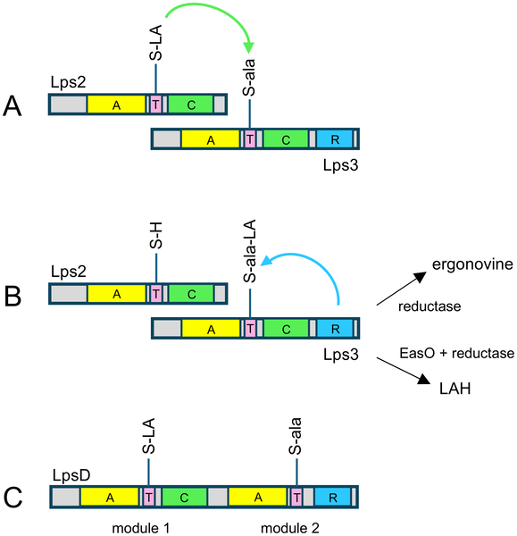
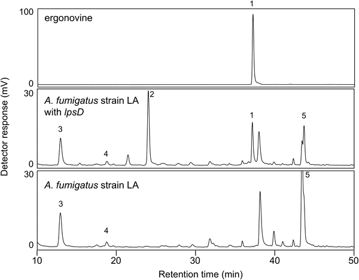

Fungi are masters of biochemical innovation, often evolving surprising shortcuts to create complex molecules. One such group, the Aspergillus species, has recently been found to produce medically valuable compounds called ergot alkaloids using a single multifunctional enzyme—replacing a more complicated two-enzyme system seen in their fungal relatives. This discovery sheds light on fungal evolution and could inform future pharmaceutical production.

> **TL;DR**
> - Aspergillus fungi produce ergot alkaloids like ergonovine and lysergic acid α-hydroxyethylamide (LAH) using a novel single two-module enzyme called LpsD.
> - This single enzyme performs the combined functions of two separate enzymes found in related fungi, demonstrating an independent evolutionary adaptation.

Ergot alkaloids are a family of compounds derived from lysergic acid that have played significant roles in agriculture and medicine for centuries. Historically, these molecules caused ergotism when contaminated grains were consumed, but they also serve as powerful pharmaceuticals for conditions like migraines and Parkinson’s disease. Traditionally, fungi in the Clavicipitaceae family produce these compounds through a complex involving two separate enzymes—Lps2 and Lps3—that work together to assemble lysergic acid amides. Recently, scientists discovered that certain Aspergillus species, which also produce these alkaloids, lack the genes for Lps2 and Lps3 but instead possess a single gene encoding a two-module enzyme named LpsD. Understanding how LpsD functions could reveal new insights into fungal biochemistry and evolution.

To investigate the role of LpsD, researchers cloned the lpsD gene from Aspergillus leporis and introduced it into a genetically engineered strain of Aspergillus fumigatus that accumulates lysergic acid, the precursor molecule. They also introduced additional genes associated with ergot alkaloid biosynthesis, such as easO and easP, to observe their effects on product formation. Using high-performance liquid chromatography (HPLC) and liquid chromatography-mass spectrometry (LC-MS), the team analyzed the fungal cultures to detect and quantify the production of ergonovine and LAH. This approach allowed them to test whether LpsD alone or in combination with other enzymes could synthesize these alkaloids.

The experiments demonstrated that introducing lpsD into the lysergic acid-accumulating Aspergillus fumigatus strain led to the production of ergonovine, confirming that LpsD can independently catalyze the assembly of lysergic acid amides. When the easO gene, encoding a monooxygenase essential for LAH formation, was also introduced, the fungi produced lysergic acid α-hydroxyethylamide (LAH). Adding the easP gene, which encodes a hydrolase that enhances LAH levels but is not essential, further increased LAH accumulation. These results support the hypothesis that Aspergillus species evolved a single multifunctional enzyme, LpsD, that replaces the two-enzyme system found in Clavicipitaceae fungi for ergot alkaloid biosynthesis.

This discovery highlights an elegant example of convergent evolution, where Aspergillus fungi independently developed a streamlined enzyme to carry out a complex biosynthetic process. Understanding this unique enzymatic mechanism expands our knowledge of fungal natural product biosynthesis and could have practical implications. For instance, harnessing or engineering such enzymes might improve the production of medically important ergot alkaloids, potentially making drug manufacturing more efficient. Additionally, these insights deepen our appreciation of fungal diversity and adaptation at the molecular level.

While the study provides strong evidence for LpsD’s role in assembling lysergic acid amides, the precise biochemical mechanisms and structural details of this enzyme remain to be fully elucidated. The research focused on laboratory-engineered fungal strains, so how LpsD functions under natural conditions and its regulation in Aspergillus species warrants further study. Moreover, translating these findings into industrial applications will require additional optimization and understanding of the biosynthetic pathway’s complexity.

## Figures

*This diagram shows how lysergic acid is converted into different amides, highlighting key enzymes and pathways studied.*

*Diagrams show how enzymes in fungi build ergot alkaloids by linking lysergic acid and alanine through specialized protein parts.*

*HPLC analysis shows different chemical compounds in fungus A. fumigatus with and without a gene from A. leporis, compared to an ergonovine standard.*

## Sources

- [A single lysergyl peptide synthetase assembles lysergic acid amides in Aspergillus species](https://journals.plos.org/plosone/article?id=10.1371/journal.pone.0350650)
- DOI: [10.1371/journal.pone.0350650](https://doi.org/10.1371/journal.pone.0350650)
