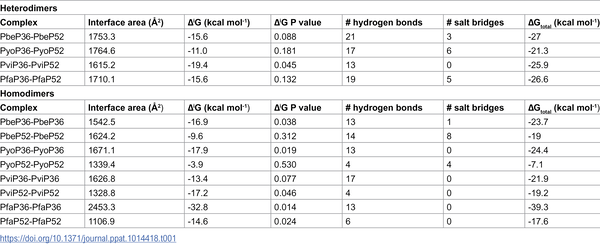
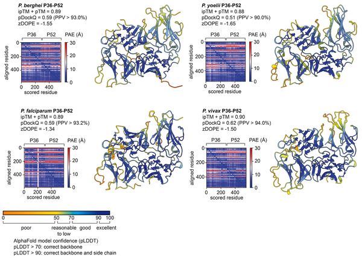
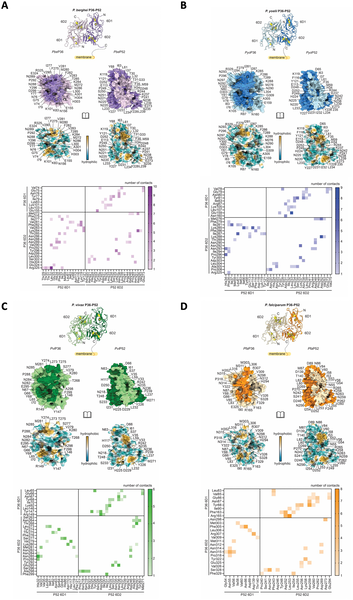
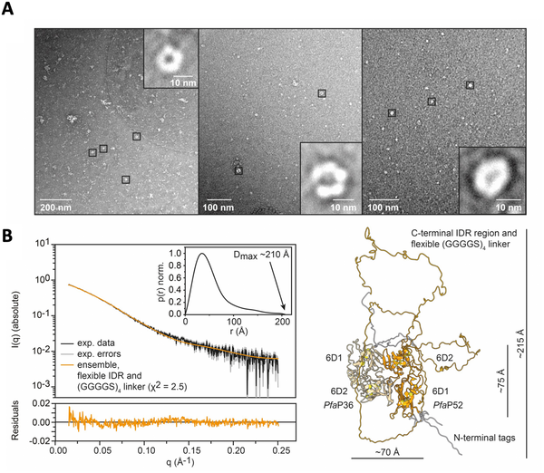

Malaria remains a global health challenge, claiming hundreds of thousands of lives annually. While current vaccines target a major surface protein on the malaria parasite’s infectious sporozoite stage, protection is partial and limited. Now, scientists have zoomed in on two lesser-known parasite proteins, P36 and P52, that play crucial roles during the parasite’s invasion of liver cells. By mapping their 3D structure and pinpointing antibody-accessible sites, this research highlights promising new targets to block malaria infection before it takes hold.

> **TL;DR**
> - The malaria parasite proteins P36 and P52 form a tightly interacting pair with a distinctive head-to-tail structure conserved across species.
> - Antibodies targeting specific exposed regions on the P36-P52 complex can effectively prevent parasite invasion of liver cells in lab models, suggesting new vaccine or antibody therapy targets.

Malaria infection begins when an infected mosquito injects sporozoites into the skin. These sporozoites travel to the liver, invading hepatocytes to multiply silently before causing disease. Current vaccines focus on the circumsporozoite protein (CSP), the main surface protein on sporozoites. However, CSP-targeting antibodies mainly act in the skin, and only some show effects in the bloodstream and liver. This has led researchers to explore other sporozoite proteins involved in liver invasion that might serve as additional targets for vaccines or antibody therapies.

The researchers combined cutting-edge computational modeling with experimental biophysics to study the P36 and P52 proteins from rodent malaria parasites. Using AlphaFold-Multimer, an AI-based protein structure prediction tool, they generated detailed 3D models of the P36-P52 complex. These models suggested a head-to-tail arrangement with a large, conserved interaction interface. To validate these predictions, they performed electron microscopy and small-angle X-ray scattering experiments. They then designed an innovative epitope tagging strategy, inserting small antibody-recognizable tags at different positions on P36 and P52. Using antibodies against these tags, they tested whether blocking these sites could prevent sporozoite invasion of liver cells cultured in the lab.

The study revealed that P36 and P52 form a heterodimer with a distinctive head-to-tail architecture, where certain domains lie closer to the parasite membrane and others extend outward. Importantly, the interface between the two proteins is highly conserved across multiple malaria species, indicating a crucial functional role. Antibodies targeting tagged regions on the membrane-distal side of the heterodimer effectively blocked sporozoite invasion of hepatocytes in culture. In contrast, antibodies against a related protein, B9, showed no inhibitory effect regardless of tag placement. These results demonstrate that the P36-P52 complex contains vulnerable sites accessible to neutralizing antibodies and that these sites can be strategically targeted to prevent liver infection.

By identifying new antibody-accessible sites on essential malaria parasite proteins involved in liver invasion, this work broadens the landscape of potential vaccine and therapeutic targets beyond the well-studied CSP. Targeting the P36-P52 complex could complement existing strategies, potentially enhancing protection by blocking parasite entry into liver cells. Such advances are vital given the stalled progress in malaria control and the urgent need for more effective interventions. The integrative approach combining structural biology, epitope tagging, and functional assays exemplifies how detailed molecular insights can inform next-generation malaria vaccine design and antibody therapies.

While these findings are promising, the study was conducted using a rodent malaria model and in vitro liver cell assays. Further research is needed to confirm whether antibodies targeting P36-P52 can provide protection in humans and in real-world infection scenarios. Additionally, challenges remain in producing these proteins recombinantly for vaccine development. The precise biological roles of P36 and P52 during infection also require deeper exploration to fully understand how best to exploit these targets. Nonetheless, this work lays important groundwork for future translational studies.

## Figures

*Table showing how P36 and P52 proteins interact at their connection points.*

*AlphaFold models show P36-P52 protein pairs with quality scores indicating how accurate and reliable the predicted structures are.*

*Visualizing how proteins P36 and P52 from four malaria species interact at their connection points and attach to membranes.*

*Images and analysis confirm the P36-P52 protein fusion matches the predicted 3D model, showing a flexible, globular structure.*

## Sources

- [A structure-based epitope tagging approach identifies vulnerable sites on the malarial P36-P52 protein complex for antibody-mediated neutralization of Plasmodium sporozoites](https://journals.plos.org/plospathogens/article?id=10.1371/journal.ppat.1014418)
- DOI: [10.1371/journal.ppat.1014418](https://doi.org/10.1371/journal.ppat.1014418)
