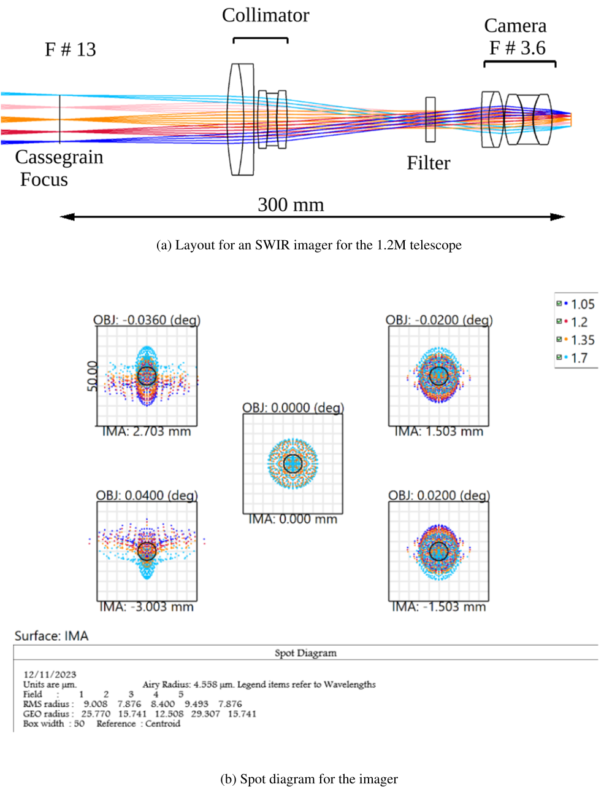
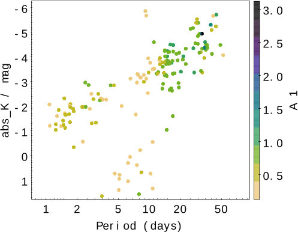
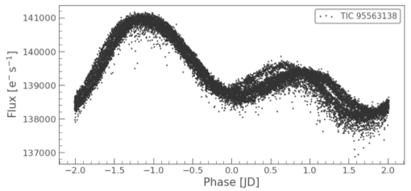
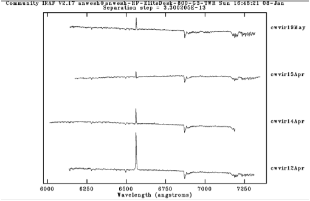

Pulsating variable stars—those fascinating celestial objects that rhythmically brighten and dim—aren't just cosmic curiosities. They're essential tools for unraveling the mysteries of stellar evolution and even for measuring the vast distances across the universe.

> **TL;DR:**
> - New instruments at Mt. Abu Observatory are poised to boost observations of pulsating stars.
> - Improved follow-up could help resolve lingering questions in cosmology and stellar physics.

*Figure 10: (a) Optical layout of the SWIR imager on a 1.2 m telescope, converting F#13 to F#3.6 for the detector. (b) Spot sizes across the field and wavelen...*

The landscape of variable star research has exploded in recent years, thanks to large-scale sky surveys like OGLE and TESS. These efforts have revealed floods of new variable stars—especially pulsating types such as RR Lyrae, classical cepheids, and their lesser-known cousins, type-II cepheids. Pulsating variables have become essential for both astrophysical theory and practical cosmology: they're used to help calculate the Hubble constant, deepening our understanding of the expanding universe and the ongoing 'Hubble tension' debate.

But while survey telescopes discover new targets at a remarkable pace, there's a growing need for careful, *follow-up* observations to characterize these stars in detail. This is where 1-2 meter class telescopes, like those at India's Mt. Abu Observatory, come in. These mid-sized instruments are ideally suited for detailed work that complements wide-area surveys, especially if they're equipped with specialized instruments.

*Figure 1: Period and brightness of OGLE type-II Cepheids are shown, with amplitude represented by color. Some stars form a fork-like pattern.*

The researchers behind this study highlighted both the astrophysical intrigue and the technical challenges. For instance, type-II cepheids—fainter than their classical counterparts—populate older stellar environments like globular clusters. Understanding their mass, luminosity, and evolutionary stages can refine our cosmic distance measurements. Yet, observing these stars is no small feat: their brightness variations are subtle, and they often glow brighter in the infrared than in visible light. Infrared observation, however, is restricted by the limited availability of suitable instruments and technical difficulties with detectors.

To address these needs, the team proposed several thoughtfully designed instruments for the Mt. Abu facility. Chief among these is a high-throughput, two-channel spectrograph (as illustrated in the figures), optimized to capture both blue and red wavelengths simultaneously using a clever dichroic beamsplitter. By splitting incoming starlight, both ends of the spectrum can be examined in greater detail and efficiency—key for extracting subtle information about a star's composition, temperature, and evolutionary state. Spot diagrams reveal that the spectral resolution should be high, with spectral detail limited only by the size of the detector pixels.

*Figure 2: TESS lightcurve of KT COM shows brightness changes with a recurring secondary bump that varies in size between cycles.*

Additional ideas include a new Short-Wave Infrared (SWIR) imager to pick up the vital long-wavelength signals from red, evolved stars, and upgrades to existing photopolarimeters. Together, these enhancements would allow astronomers to closely monitor changes in brightness and spectrum, hunt for minute details like phase lags between optical and infrared light, and even witness evidence of mass loss in the stars themselves.

For the public, such advances won't just refine our star maps—they could eventually yield more accurate measurements of cosmic distances. That means a better-defined Hubble constant, which underpins our grasp of the universe's age and expansion rate. With improved instrumentation, India’s Mt. Abu Observatory could play a much bigger international role, filling crucial gaps in global follow-up work highlighted by the massive survey projects.

*Figure 3: Spectra of W VIR from four times show changes in emission lines and a redder spectrum when emission lines weaken.*

Of course, some challenges remain. The designs must contend with real-world limitations such as detector imperfections and the telescope's capacity for long-term, intensive campaigns. Deciphering the true nature of outliers—like stars that deviate from expected brightness-period relationships or display puzzling lightcurve features—will require both technical upgrades and persistent observation.

Ultimately, the study underscores both the scientific excitement and the ongoing need for agile, adaptable infrastructure. As new generations of space- and ground-based surveys keep stacking up astronomical discoveries, only targeted, high-quality follow-up will turn raw data into real cosmic insight.

## Sources

- [arXiv preprint](http://arxiv.org/abs/2510.26507v1)
- [DOI: 10.1007/s12036-024-10019-7](https://doi.org/10.1007/s12036-024-10019-7)
