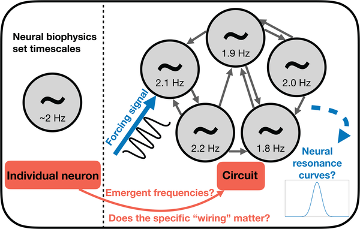

Did you know that fireflies flashing their lights and crickets chirping might be communicating at nearly the same rhythm? This curious observation from a field trip in Thailand sparked a deeper investigation into whether a common tempo underlies animal communication across a vast range of species — and if so, why. Scientists have uncovered evidence suggesting that many animals, from insects to mammals, tend to send signals at a pace between about half a cycle to four cycles per second. Intriguingly, this tempo range aligns with how their brains' neurons process information, hinting at a shared biological foundation for communication rhythms.

> **TL;DR**
> - Many evolutionarily distinct animals communicate using rhythmic signals clustered around 0.5 to 4 Hz, a tempo range surprisingly consistent across species and communication modes.
> - Computational models suggest that neural circuits in receivers’ brains are naturally tuned to respond most strongly to signals in this tempo range, potentially shaping the evolution of communication rhythms.

During a 2022 field study in Thailand, researchers noticed that Pteropyx malaccae fireflies flashing their bioluminescent signals and nearby crickets chirping produced rhythms that were almost identical, both near 2.4 Hz. This raised a fascinating question: why would such different animals, using different senses and signaling methods, settle on such similar tempos? To explore this, the researchers surveyed published data on animal communication tempos across a wide range of species, including insects, amphibians, birds, fish, and mammals. They found a striking pattern: many species communicate using isochronous signals—regularly timed beats—falling within a tempo “hotspot” of about 0.5 to 4 Hz. This tempo range coincides with the brain’s delta wave frequencies, known in neuroscience for their role in various neural processes.

To investigate whether this common tempo might be linked to neural processing, the team turned to computational modeling. They constructed small neural circuits using simplified neuron models that reflect typical biophysical properties, such as integration times on the order of hundreds of milliseconds. By simulating these circuits’ responses to rhythmic external stimuli at different tempos, they examined whether the circuits would be most responsive—or resonate—at tempos matching the observed animal communication range. They tested a wide variety of circuit wiring patterns to see if the response depended on specific neural connections, and explored how factors like neural diversity affected the circuits’ sensitivity to different tempos.

The modeling revealed that most small neural circuits, regardless of their exact wiring, showed strongest responses to external signals in the 0.5 to 4 Hz range. This resonance means that neural circuits are naturally tuned to be most sensitive to rhythms in this band. Additionally, circuits with greater diversity among neurons showed broader tuning curves, allowing them to respond well even to tempos slightly outside this range. These findings support the idea that the tempo animals use to communicate may be shaped by the biophysical constraints and resonant properties of their brains’ neural circuits, rather than by the mechanics of signal production or sensory organs alone.

This discovery provides a compelling example of how evolutionary pressures might operate from the receiver’s brain backward to the signaler’s behavior, a concept known as sensory drive. The fact that such a wide variety of animals, spanning eight orders of magnitude in body size and using different communication modalities, share a common communication tempo suggests a deep-rooted biological principle. Understanding this tempo “hotspot” enriches our knowledge of animal behavior and neural processing, and may have implications for studying rhythmic communication in humans and other species. It also illustrates how neural circuit biophysics can influence ecological and social interactions across the animal kingdom.

While the data show a clear clustering of communication tempos around 0.5 to 4 Hz, the authors acknowledge potential biases. The literature and databases surveyed may not fully represent all animal communication tempos, and some species communicate outside this range. The modeling uses simplified neuron representations and small circuits, which, though grounded in known biophysics, cannot capture the full complexity of real brains. Further empirical studies are needed to directly test how neural resonance influences communication tempo in diverse species, and to explore how environmental and ecological factors also shape these rhythms.

## Figures

*Diagram showing how we model brain circuits to study frequency inheritance and resonance using external stimuli.*

## Sources

- [A widespread animal communication tempo may resonate with the receiver’s brain](https://journals.plos.org/plosbiology/article?id=10.1371/journal.pbio.3003735)
- DOI: [10.1371/journal.pbio.3003735](https://doi.org/10.1371/journal.pbio.3003735)
