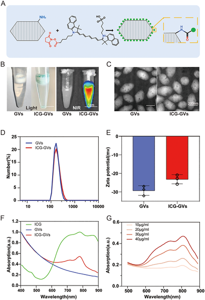
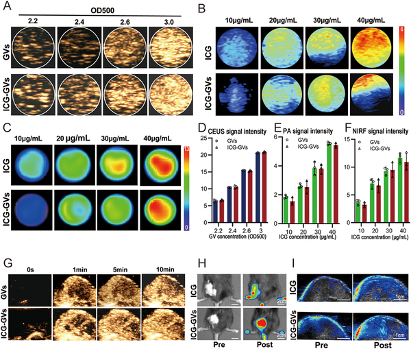
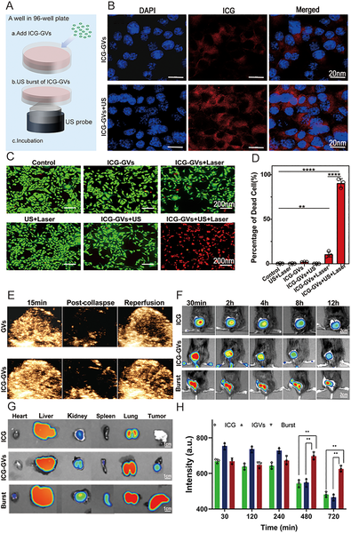
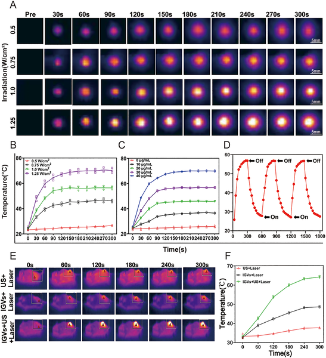

Imagine using sound waves to deliver a glowing dye directly into a tumor, then shining a laser to heat and shrink the cancer—all without surgery or harsh drugs. This is exactly what a team of scientists has achieved by combining tiny gas-filled bubbles with an FDA-approved photothermal agent, creating a new, noninvasive approach to cancer therapy that can be seen and controlled in real time.

> **TL;DR**
> - Researchers engineered biosynthetic gas vesicles coated with indocyanine green (ICG), a clinically approved photothermal dye, to enhance tumor targeting and imaging.
> - Using ultrasound to trigger these gas vesicles, they achieved precise delivery and effective heating of tumors in mice, leading to complete tumor regression without detectable toxicity.

Photothermal therapy (PTT) uses light to heat and destroy cancer cells, offering a promising complement to traditional treatments like chemotherapy and surgery. Indocyanine green (ICG) is the only photothermal agent approved by the FDA, valued for its ability to absorb near-infrared light and convert it to heat. However, ICG’s clinical use is limited by its instability in the body, rapid clearance from the bloodstream, and poor accumulation in tumors. To overcome these challenges, scientists have explored various delivery systems, but many face issues such as toxicity or inability to target tumors effectively.

In this study, the researchers harnessed biosynthetic gas vesicles (GVs) produced by certain microbes—tiny, stable, gas-filled nanostructures about 200 nanometers in size. They chemically attached ICG molecules to the surface of these GVs, creating ICG-GVs that combine the imaging capabilities of both components. These ICG-GVs were injected into mice bearing bladder cancer tumors. Using ultrasound, the team remotely triggered the gas vesicles to cavitate—creating mechanical effects that push the ICG deeper into tumor tissue. The process was monitored in real time using three imaging methods: ultrasound, near-infrared fluorescence, and photoacoustic imaging. Finally, the tumors were irradiated with an 808 nm laser to activate the photothermal effect and heat the tumor tissue.

The ICG-GVs showed uniform size and good stability, with an impressive 58% loading of ICG. In lab tests, they enhanced ultrasound, fluorescence, and photoacoustic signals, confirming their multimodal imaging potential. Pharmacokinetic studies revealed that ICG-GVs significantly prolonged the circulation time of ICG in the bloodstream compared to free dye. When ultrasound was applied, it triggered cavitation of the gas vesicles within tumors, improving ICG delivery and accumulation. Laser irradiation then raised tumor temperatures above 60°C, sufficient to ablate cancer cells. In treated mice, this approach led to complete tumor regression and extended survival without signs of toxicity. Importantly, the multimodal imaging allowed precise visualization of the delivery and treatment process.

This work presents a clinically relevant strategy to improve photothermal cancer therapy by combining an FDA-approved agent with biosynthetic gas vesicles and ultrasound-triggered delivery. The approach addresses key limitations of ICG, including poor stability and tumor targeting, while enabling real-time imaging to guide treatment. By enhancing drug delivery and treatment efficacy noninvasively, this technology holds promise for safer, more precise cancer therapies that could complement or reduce reliance on conventional methods. Its use of biocompatible materials and established imaging techniques further supports potential translation to clinical settings.

While results in mouse tumor models are encouraging, further studies are needed to assess safety, efficacy, and optimal parameters in humans. The complexity of tumor environments and differences in human physiology may affect delivery and treatment outcomes. Additionally, long-term effects and potential immune responses to biosynthetic gas vesicles require evaluation. Nonetheless, this study lays important groundwork for advancing acoustic delivery systems in photothermal cancer therapy.

## Figures

*Scientists created glowing green particles by coating tiny gas vesicles with a dye, then studied their size, shape, and light properties.*

*Images show how ICG-GVs improve ultrasound, photoacoustic, and fluorescence signals in lab tests and tumor-bearing mice.*

*Ultrasound boosts delivery of ICG dye into tumor cells, improving treatment and showing higher tumor targeting in mice.*

*This figure shows how ICG-GVs heat up under laser light, with effects varying by concentration, repeated exposure, and ultrasound treatment.*

## Sources

- [Acoustic delivery of indocyanine green via biosynthetic gas vesicles for tumor photothermal therapy](https://journals.plos.org/plosbiology/article?id=10.1371/journal.pbio.3003786)
- DOI: [10.1371/journal.pbio.3003786](https://doi.org/10.1371/journal.pbio.3003786)
