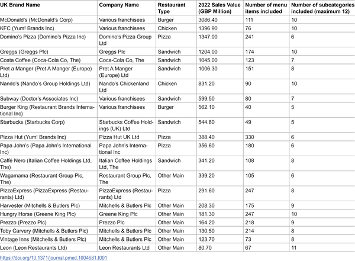
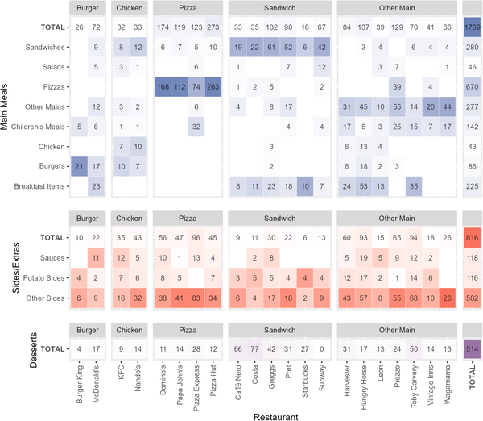
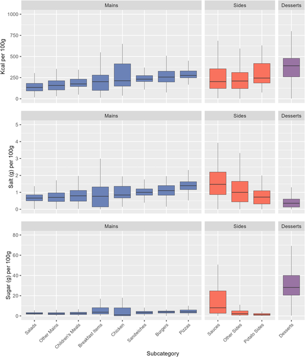

When you order a meal from a popular UK restaurant chain, you might wonder: is it meeting government health guidelines for sugar, salt, and calories? The UK government has set voluntary reduction targets to tackle diet-related diseases, but how well are these big chains actually doing? A recent comprehensive study sheds light on this question by analyzing thousands of menu items across the country’s top eateries.

> **TL;DR**
> - Among 3,099 menu items from 21 leading UK restaurant chains, only 43% met all applicable voluntary targets for sugar, salt, and calories in 2024.
> - Adherence varied widely by restaurant and food type, with pizza restaurants showing the lowest overall compliance and some chains like Papa John’s and Burger King performing particularly poorly on certain targets.

Diet-related diseases such as obesity and cardiovascular conditions remain a major public health challenge in the UK. To address this, the government introduced voluntary targets aimed at reducing sugar, salt, and calorie content in foods sold by retailers and restaurants. While these targets have shown some success in packaged foods, less is known about the out-of-home (OOH) sector — the restaurants and takeaways where many people eat regularly. Given that eating out has become increasingly popular, understanding how well restaurant chains meet these targets is crucial for assessing progress and guiding future policy.

Researchers collected nutritional data directly from the online menus of the 21 highest-grossing UK restaurant chains in early 2024. They categorized 3,099 menu items into 12 common food subcategories like pizzas, burgers, and desserts. Each item’s sugar, salt, and calorie content per serving was compared against the UK government’s voluntary reduction targets. The study calculated what proportion of items met each individual target and all relevant targets collectively, providing a detailed snapshot of adherence across different restaurants and food types.

The study found that 61% of menu items met calorie targets, 58% met salt targets, but only 36% met sugar targets. Overall, less than half (43%) of all items met all applicable targets. Adherence varied by restaurant: for example, Papa John’s had the lowest compliance for calories (35%) and salt (8%), while Burger King, KFC, Nando’s, and Vintage Inns had no menu items meeting sugar targets. Pizza restaurants as a group had the lowest overall adherence (32%). Interestingly, even restaurants with similar menu types showed notable differences in meeting targets, suggesting room for improvement without changing menu focus.

This study highlights that voluntary nutritional targets have only been partially successful in the UK’s out-of-home food sector. Given the significant role these restaurant chains play in people’s diets, the findings suggest that relying on voluntary compliance may not be sufficient to improve public health outcomes. The variation in adherence also indicates that some chains can meet targets more effectively than others, pointing to opportunities for sharing best practices. Policymakers might consider mandatory regulations to ensure more consistent improvements in the nutritional quality of restaurant food.

One limitation of the study is the lack of sales data for individual menu items, meaning the analysis reflects available items rather than what customers actually purchase. This could affect the real-world impact of nutritional quality on consumer diets. Additionally, the study only assessed menu information from 2024, so ongoing changes in recipes or menus after data collection are not captured. Despite these caveats, the large sample size and rigorous methods provide a credible overview of current adherence to voluntary nutritional targets in UK restaurants.

## Figures

*Table showing restaurant details like company, type, 2022 sales, menu items, and subcategories, ranked by sales value.*

*This chart shows how many and what type of menu items each restaurant offers, with colors indicating main meals, sides, and desserts.*

*This chart shows calories, salt, and sugar in different meal types, with main meals in blue, sides in red, and desserts in purple.*

## Sources

- [Adherence to voluntary UK sugar, salt, and calorie reduction targets in the highest-grossing restaurant chains: A cross-sectional study](https://journals.plos.org/plosmedicine/article?id=10.1371/journal.pmed.1004681)
- DOI: [10.1371/journal.pmed.1004681](https://doi.org/10.1371/journal.pmed.1004681)
