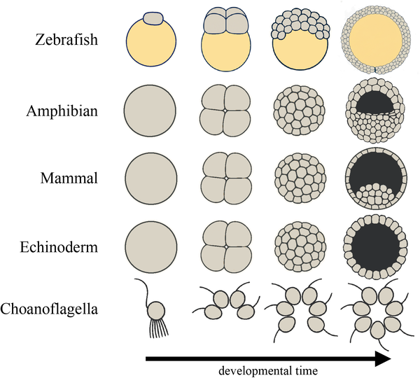
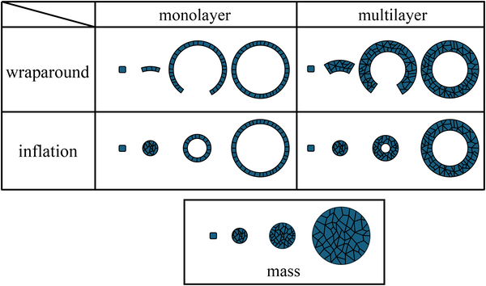
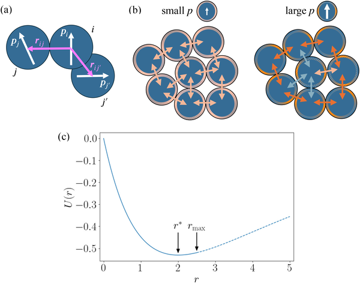

How do cells know how to build complex tissues like spheres, layers, and cavities during embryonic development? It turns out that remarkably simple physical rules, centered on how cells stick to each other and orient themselves, can explain much of this intricate architecture. Recent computational research has uncovered how just two cell properties—polarity strength and its mechanical regulation—can generate the variety of tissue forms seen across species, from single-layered spheres to multilayered masses with internal cavities.

> **TL;DR**
> - A minimal computational model shows that varying cell polarity strength and its regulation can reproduce five fundamental tissue morphologies observed in embryos.
> - These findings suggest that physical constraints and cell adhesion mechanics play a central role in morphogenesis, with implications for tissue engineering and organoid design.

Embryonic development transforms a single fertilized cell into a complex organism composed of diverse tissues. Across species, early embryos organize cells into distinct patterns such as solid cell masses, monolayer or multilayer spheres, and hollow structures formed either by wrapping cells around a cavity or inflating from within. While genetic programs are crucial, the physical interactions between cells—especially adhesion mediated by proteins like cadherins and the orientation of cells known as polarity—are fundamental drivers of these patterns. Yet, how these microscopic cellular properties translate into the large-scale shapes of tissues has remained unclear.

To explore this, researchers developed a computational model simulating a population of proliferating cells that interact through adhesion forces influenced by cell polarity. Each cell is assigned a polarity vector representing the directionality of its adhesive surface. The model incorporates two key parameters: the strength of cell polarity, which controls how anisotropic (direction-dependent) the adhesion is around a cell’s surface, and the timescale over which polarity is regulated by mechanical signals from neighboring cells. Cells move and adjust their polarity to minimize an adhesion potential, with short-range interactions governing their dynamics. By systematically varying these parameters, the model simulates how different tissue morphologies emerge over time.

Surprisingly, this minimal model reproduced five basic morphogenetic types observed in real embryos: solid cell masses, monolayer spheres, multilayer spheres, and two distinct modes of hollow sphere formation—one by cells wrapping around a cavity and another by inflating from the inside. The polarity strength controls the degree of adhesion anisotropy, which influences whether cells form tight masses or hollow structures. The regulation timescale of polarity determines whether tissues form single or multiple layers. Analytical insights revealed phase transitions between these morphologies, showing how small changes in cell polarity and adhesion parameters can switch the tissue from one architectural type to another.

These results highlight that complex tissue architectures can arise from simple physical principles without requiring detailed genetic instructions for every shape. Understanding how polarity and adhesion mechanics govern morphogenesis provides a unified framework linking microscopic cell behaviors to macroscopic tissue forms. This has exciting implications for developmental biology and regenerative medicine, offering a foundation for designing artificial tissues and organoids by tuning just a few physical parameters. The model’s ability to recapitulate diverse embryonic patterns suggests that physical constraints are central to the evolution and robustness of tissue formation.

While the model captures key morphogenetic patterns, it simplifies many biological complexities. It assumes homogeneous cell populations without differentiation and focuses on apico-basal polarity in two dimensions, though extensions to three dimensions are possible. The model does not incorporate genetic regulation, biochemical signaling pathways, or the full mechanical environment of developing embryos. Experimental validation remains indirect, and real tissues involve additional factors such as extracellular matrix interactions and dynamic changes in cell properties. Nonetheless, this work provides a valuable conceptual framework that complements experimental studies and guides future research in tissue engineering.

## Figures

*Diagram showing early embryo development and colony formation in simple animals and choanoflagellates over time, with cells in gray and yolk in yellow.*

*Fig 2 shows how the 5 basic types develop over time, with time on the horizontal axis.*

*Diagram shows cells as blue circles with arrows for movement direction, color-coded edges for stickiness, and how cells interact based on distance and adhesion.*

## Sources

- [Adhesion and polarity-driven morphogenesis: Mechanisms and constraints in tissue formation](https://journals.plos.org/ploscompbiol/article?id=10.1371/journal.pcbi.1013939)
- DOI: [10.1371/journal.pcbi.1013939](https://doi.org/10.1371/journal.pcbi.1013939)
