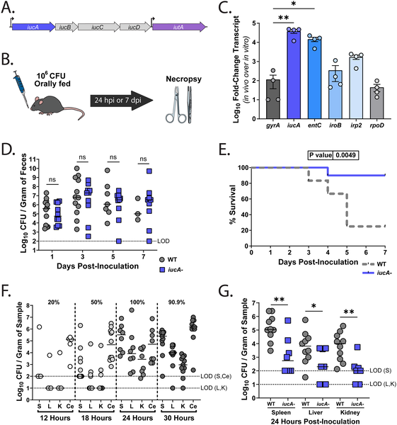

Imagine a microscopic invader quietly residing in your gut, harmlessly coexisting—until it suddenly breaches your body's defenses and causes a life-threatening infection. Scientists have long known that the bacterium Klebsiella pneumoniae can live in the gastrointestinal tract without causing problems, but sometimes it escapes and spreads, triggering severe illness. What enables this bacterial escape? Recent research shines a light on a tiny molecule called aerobactin that plays a crucial role in helping these bacteria sneak past the gut barrier and invade the body.

> **TL;DR**
> - Aerobactin, a siderophore molecule produced by hypervirulent Klebsiella pneumoniae, is not required for gut colonization but is essential for the bacteria to translocate from the gut to other organs.
> - Aerobactin regulates the bacterial capsule’s properties, enhancing adhesion and invasion of intestinal cells, thereby promoting systemic infection.

Klebsiella pneumoniae is a common bacterium that can colonize the human gut, often without causing symptoms. However, certain hypervirulent strains (hvKP) carry extra genetic factors that make them capable of causing serious systemic infections, such as liver abscesses and bloodstream infections. These strains possess a large virulence plasmid encoding factors like aerobactin, a molecule that helps bacteria scavenge iron—a vital nutrient that is scarce inside the host. While it was known that aerobactin contributes to bacterial virulence, its specific role in how hvKP crosses the gut barrier to cause invasive disease was unclear. Understanding this process is critical because gut colonization often precedes these dangerous infections.

Researchers used a mouse model with an intact gut microbiota to study how hvKP colonizes the gastrointestinal tract and spreads to other organs. They compared a clinical hypervirulent strain (hvKP1) to a genetically engineered mutant lacking the gene iucA, which is essential for aerobactin production. They tracked bacterial colonization by measuring fecal shedding and assessed translocation by quantifying bacterial presence in organs like the spleen, liver, and kidneys. Complementary cell culture experiments with human intestinal epithelial cells examined bacterial adhesion, invasion, and translocation at the cellular level. Gene expression analyses and measurements of bacterial capsule properties were also performed to understand the molecular mechanisms involved.

The study found that aerobactin is actively produced by hvKP in the gut but is not necessary for the bacteria to establish colonization there. However, mice colonized with the aerobactin-deficient mutant showed significantly reduced bacterial burdens in extra-intestinal organs and increased survival, indicating impaired translocation and virulence. Cell culture assays revealed that the mutant had decreased ability to adhere to and invade intestinal cells. Interestingly, loss of aerobactin led to increased hypermucoviscosity—a thick, sticky capsule phenotype—linked to upregulation of the rmp locus, which likely hinders adhesion to host cells. These results suggest that aerobactin helps regulate capsule properties to optimize bacterial adhesion and entry into intestinal cells, facilitating a transcellular route of translocation from the gut to systemic sites.

This research uncovers a previously unrecognized role for aerobactin beyond iron acquisition: it modulates the bacterial capsule to promote gut barrier crossing and systemic infection by hypervirulent Klebsiella pneumoniae. By clarifying how hvKP transitions from a gut colonizer to an invasive pathogen, these findings open new avenues for preventing or treating severe infections. Targeting aerobactin production or its regulatory effects on the capsule could be a promising strategy to limit the spread of these dangerous bacteria, especially as multidrug-resistant strains become more prevalent.

While the study provides strong evidence from mouse models and cell cultures, the complexity of human gut environments and immune responses means that further research is needed to confirm these mechanisms in people. Additionally, the interplay between aerobactin, other siderophores, and virulence factors requires more detailed exploration. The findings highlight a specific role for aerobactin in translocation but do not exclude contributions from other bacterial or host factors. As with all model systems, translating these insights into clinical interventions will require careful validation.

## Figures

*Aerobactin genes help K. pneumoniae spread and cause severe infection but aren't needed for gut colonization in mice.*

## Sources

- [Aerobactin is a key driver of hypervirulent Klebsiella pneumoniae translocation and virulence](https://journals.plos.org/plospathogens/article?id=10.1371/journal.ppat.1014122)
- DOI: [10.1371/journal.ppat.1014122](https://doi.org/10.1371/journal.ppat.1014122)
