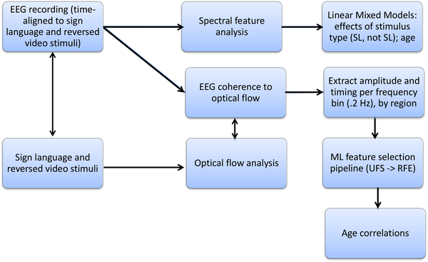
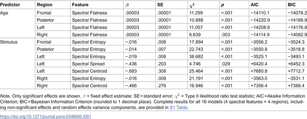
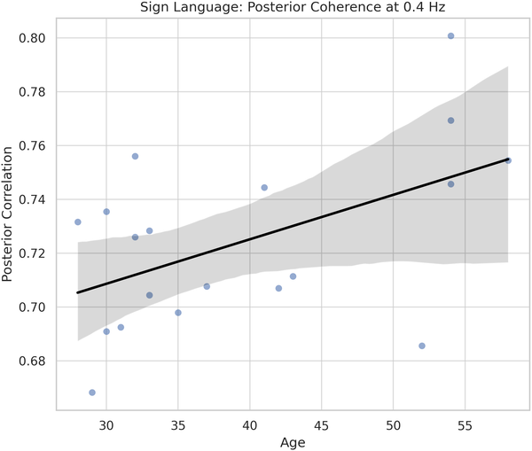

How does using sign language shape your brain’s ability to predict what you see? For Deaf individuals who communicate visually through sign language, the brain’s capacity to anticipate linguistic information unfolds in a unique sensory landscape. But how does this predictive skill change as signers age? Recent research using brainwave recordings uncovers how lifelong visual language experience and aging together modulate the brain’s predictive processing in the visual realm.

> **TL;DR**
> - The brain’s predictive responses to sign language motion become stronger and more refined with age, reflecting cumulative visual linguistic experience.
> - Age-related changes in brain activity differ between processing meaningful sign language and non-linguistic visual motion, highlighting how experience can offset some neural aging effects.

Our brains constantly anticipate incoming sensory information, using past experience to predict what comes next. This predictive processing is well studied in spoken language, where brain rhythms synchronize with the sounds of speech. But sign languages, which convey meaning through complex hand and body movements, offer a distinct window into how prediction works in the visual domain. Deaf signers develop specialized neural systems to process these rich visual patterns, yet how aging influences these predictive mechanisms has remained unclear. Understanding this interaction sheds light on brain plasticity and the unique ways sensory and linguistic systems collaborate.

Researchers recorded electroencephalography (EEG) from 24 Deaf Austrian Sign Language users aged 28 to 68 as they watched videos of natural sign language sentences and their time-reversed versions. The reversed videos contained identical motion but lacked linguistic meaning, serving as a control. By analyzing the coherence between brain activity and the visual motion dynamics (optical flow) of the stimuli, the team assessed how well the brain’s rhythms synchronized with meaningful versus non-meaningful visual input. They also examined changes in neural signal complexity and timing across ages to understand how predictive processing evolves over the lifespan.

The study found that as signers age, their brains show increased coherence with the motion patterns of meaningful sign language, especially in fronto-central and parietal brain regions linked to sensory integration and language processing. This suggests that lifelong experience with visual language sharpens the brain’s ability to predict linguistic input. Conversely, when viewing non-linguistic, reversed videos, older participants exhibited slower neural responses and reduced synchronization, indicating greater difficulty predicting unpredictable visual motion. These contrasting patterns highlight how experience with structured visual language can enhance predictive processing despite general neural aging.

These findings provide fresh insight into how the brain’s predictive coding adapts not only to aging but also to the modality of language experience. They demonstrate that the brain’s visual prediction mechanisms are shaped by lifelong sign language use and continue to evolve over decades. This challenges the notion that aging uniformly degrades cognitive function, showing instead that extensive sensory-linguistic experience can refine and preserve certain neural processes. The work also expands our understanding of language processing beyond the auditory domain, emphasizing the brain’s remarkable flexibility.

While the study offers valuable insights, it focuses on a relatively small group of Deaf Austrian Sign Language users, which may limit generalizability. The EEG data cannot be publicly shared due to privacy concerns, although derived data are available for replication. Additionally, the study uses age as a proxy for cumulative experience, which may not capture all individual differences in language exposure or neural health. Future research could explore these dynamics in larger, more diverse populations and investigate how these neural changes relate to behavioral language abilities.

## Figures

*EEG data from sign language and reversed videos were analyzed to study brain responses and their relation to age using advanced models and machine learning.*

*Table showing how age and different stimuli affect brain activity in various regions.*

*Older participants show slower brain responses in the front area when processing visual motion in reversed videos.*

## Sources

- [Age and language experience modulate predictive processing in the visual modality](https://journals.plos.org/plosone/article?id=10.1371/journal.pone.0346695)
- DOI: [10.1371/journal.pone.0346695](https://doi.org/10.1371/journal.pone.0346695)
