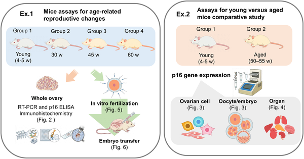
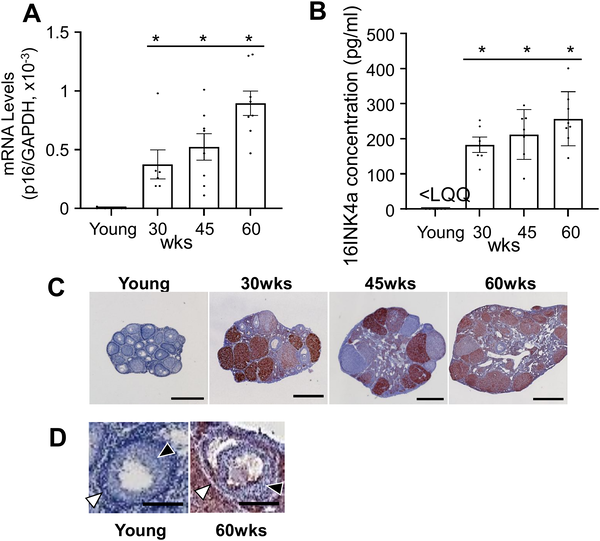
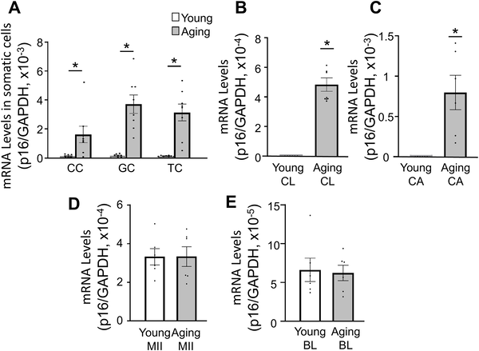

Why do female fertility rates drop with age? While it’s well known that the number and quality of eggs decline over time, recent research suggests that the aging of the ovarian environment itself—the cells that support and nurture eggs—may play a crucial role. A new study in mice has found that a key marker of cellular aging, called p16, increases specifically in ovarian somatic cells as animals age, and this increase correlates with a decline in reproductive function. This insight opens new avenues for understanding how the ovarian environment influences fertility and may help guide future fertility preservation strategies.

> **TL;DR**
> - The cellular aging marker p16 steadily increases with age in ovarian somatic cells (support cells), but not in the eggs themselves, in mice.
> - Higher p16 levels in these somatic cells correlate with reduced ovulation numbers and poorer post-implantation pregnancy outcomes, linking cellular aging in the ovary’s environment to fertility decline.

Female reproductive aging is a complex process marked by a gradual loss of fertility and increased risks during pregnancy. While much attention has focused on the eggs (oocytes), the ovarian environment—composed of various somatic cells such as granulosa, cumulus, and theca cells—provides essential support for egg development and maturation. Cellular senescence, a state where cells stop dividing and undergo functional changes, is a hallmark of aging tissues. The protein p16 is a well-established biomarker of senescence, known to increase in many aging tissues. However, how p16 levels change specifically in different ovarian cell types and how this relates to fertility has remained unclear. Understanding these dynamics is important because it could reveal new targets for assessing and potentially mitigating ovarian aging.

Researchers used female ICR mice at different ages ranging from young (4–5 weeks) to aged (up to 60 weeks) to study p16 expression across tissues and ovarian cell types. They measured p16 gene and protein levels using quantitative PCR, ELISA, and immunohistochemistry. To pinpoint which ovarian cells showed changes, they isolated somatic cells (cumulus, granulosa, theca) and oocytes for separate analysis. Functional fertility was assessed by inducing ovulation, performing in vitro fertilization, and transferring embryos to surrogate mothers to track implantation and live birth rates. This comprehensive approach allowed the team to link molecular changes in ovarian cells to actual reproductive outcomes.

The study found that p16 levels increased significantly with age in ovarian tissue overall, showing a nearly sevenfold rise by 60 weeks compared to young mice. Importantly, this increase was driven by somatic cells: granulosa cells showed a 4.6-fold increase, cumulus cells 3.2-fold, and theca cells 2.8-fold. In contrast, oocytes and early embryos did not exhibit significant changes in p16 expression. Functionally, aged mice had fewer ovulated eggs, though fertilization rates and early embryo development remained stable. However, post-implantation success dropped sharply, with implantation rates falling from 78% in young mice to 38% in aged mice, and live birth rates halving. These results suggest that senescence in ovarian support cells, rather than the eggs themselves, may impair the environment needed for successful pregnancy progression.

This study highlights the importance of the ovarian somatic cell environment in reproductive aging. By showing that p16—a marker of cellular aging—rises in these support cells and correlates with fertility decline, it suggests that ovarian aging is not solely about egg quality but also about the aging of the cells that nurture eggs. These findings could inform the development of new biomarkers for ovarian aging and inspire therapeutic strategies aimed at maintaining or restoring the health of ovarian somatic cells to improve fertility outcomes. Such approaches might one day complement existing fertility treatments or help women better understand their reproductive lifespan.

While these findings provide valuable insights, it is important to note that this research was conducted in mice, which, although informative, do not fully replicate human reproductive aging. The study shows correlation but does not establish a direct causal link between increased p16 in somatic cells and fertility decline. Additionally, the mechanisms by which senescent somatic cells affect egg competence and pregnancy progression remain to be elucidated. Further research, including studies in human tissues and exploration of interventions targeting senescent cells, will be needed to translate these findings into clinical applications.

## Figures

*This study used young and aged mice to explore reproductive aging through tissue analysis, fertilization tests, and cell-specific protein levels.*

*p16 levels in mouse ovaries rise with age, shown by gene expression, protein tests, and tissue staining from young to 60-week-old mice.*

*p16 gene levels rise with age in certain ovarian cells but stay the same in egg cells, shown in young and old mice samples.*

## Sources

- [Age-related upregulation of p16 expression in mouse ovarian somatic cells correlated with reproductive function decline p16 expression and ovarian aging in mice](https://journals.plos.org/plosone/article?id=10.1371/journal.pone.0348870)
- DOI: [10.1371/journal.pone.0348870](https://doi.org/10.1371/journal.pone.0348870)
