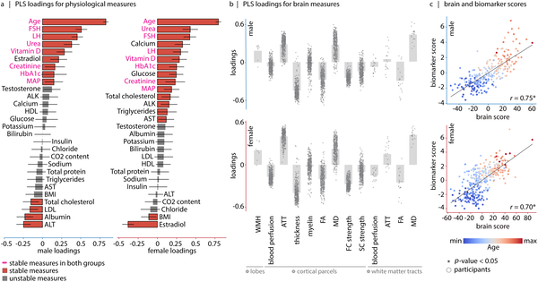
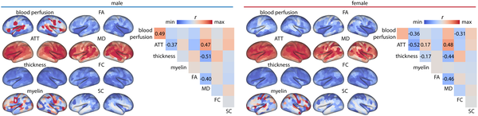
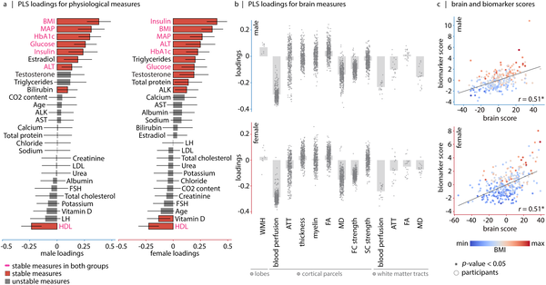
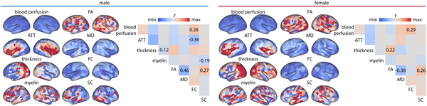

Did you know that the effects of aging and metabolism on your brain are largely independent? While we often think of aging as the main driver behind changes in brain health, new research reveals that metabolic factors like body weight, blood pressure, and blood sugar levels also play a distinct role. Understanding these separate influences could help us better protect our brains as we grow older.

> **TL;DR**
> - Aging primarily affects brain structure and blood vessel function, leading to thinner cortex and reduced cerebral blood flow.
> - Metabolic health factors such as high BMI, blood pressure, and blood sugar independently reduce brain blood perfusion and are linked to cognitive deficits, especially in females.

The brain and body are intricately connected, but studies on aging have traditionally examined them separately. We know that aging leads to brain atrophy and vascular changes, while metabolic conditions like obesity and diabetes are associated with cognitive decline. However, it has been unclear whether these effects overlap or act independently. To clarify this, researchers analyzed two large datasets combining detailed brain imaging with comprehensive metabolic and vascular biomarkers from thousands of adults spanning middle age to old age.

Using advanced multivariate pattern analysis called partial least squares (PLS), the study examined how a wide range of brain features — including structural MRI, functional connectivity, diffusion imaging, and measures of cerebral blood flow — covaried with demographic and physiological markers such as age, body mass index (BMI), blood pressure, cholesterol, glucose, and insulin levels. This approach allowed the researchers to identify underlying patterns linking brain and body health across two large cohorts: the Human Connectome Project–Aging (about 600 participants aged 36 to 100) and the UK Biobank (over 3,000 participants aged 51 to 83). The analysis was performed separately for males and females to capture sex-specific effects.

The analysis revealed two distinct axes of brain-body associations. The first, the “aging axis,” was dominated by chronological age and characterized by widespread brain changes including thinner cortex, reduced microstructural integrity, lower cerebral blood perfusion, and longer arterial transit times — all markers of brain aging and vascular decline. The second, the “metabolic axis,” was driven by metabolic health indicators such as elevated BMI, blood pressure, blood sugar (HbA1c), insulin, and liver enzyme levels, along with low HDL cholesterol. This metabolic profile was primarily linked to reduced cerebral blood flow and altered brain functional connectivity, independent of age. Notably, these two axes were statistically independent, meaning that metabolic dysfunction affects the brain in ways separate from aging itself. Furthermore, deviations from a healthy metabolic profile were associated with cognitive deficits, especially among women.

This study advances our understanding of brain aging by demonstrating that metabolic health and chronological aging contribute separately to brain structure and function. The findings suggest that maintaining good metabolic health — through managing weight, blood pressure, and blood sugar — could be a crucial strategy to preserve brain health and cognitive function in aging populations. By identifying distinct biomarker patterns, the research also lays groundwork for developing comprehensive, translatable biomarkers that can assess brain health more holistically, potentially informing personalized interventions.

While the study leverages large, well-characterized datasets and robust analytical methods, it remains observational and cannot definitively establish causality between metabolic factors and brain changes. The metabolic axis explained a smaller portion of the brain-body covariance compared to aging, indicating that other factors also influence brain health. Additionally, the complexity of multivariate patterns means that translating these findings into simple clinical tools will require further research. Finally, sex differences observed warrant deeper investigation to understand underlying biological mechanisms.

## Figures

*This figure shows how key health markers relate to brain features, revealing an aging pattern that explains most differences in males and females.*

*Brain maps show that older participants have thinner cortex, less blood flow, and longer blood arrival times, highlighting key brain changes with age.*

*This figure shows how brain features relate to biomarkers like BMI and blood pressure, highlighting a key metabolic pattern in males and females.*

*Brain maps show that higher BMI links to lower blood flow, with key brain features strongly connected across males and females.*

## Sources

- [Aging and metabolism contribute separately to brain–body health](https://journals.plos.org/plosbiology/article?id=10.1371/journal.pbio.3003856)
- DOI: [10.1371/journal.pbio.3003856](https://doi.org/10.1371/journal.pbio.3003856)
