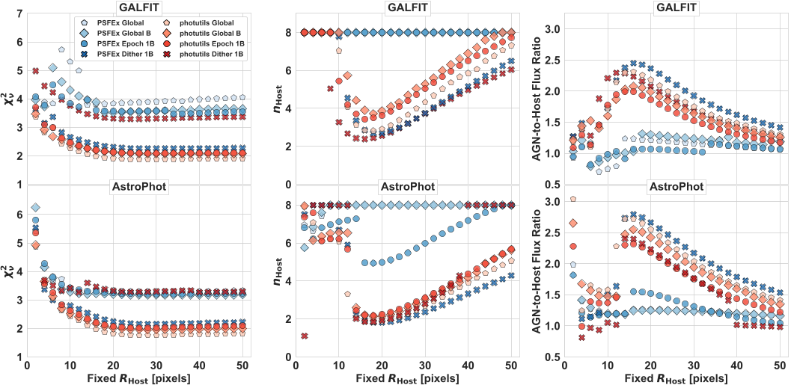
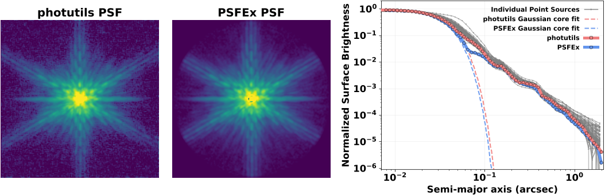
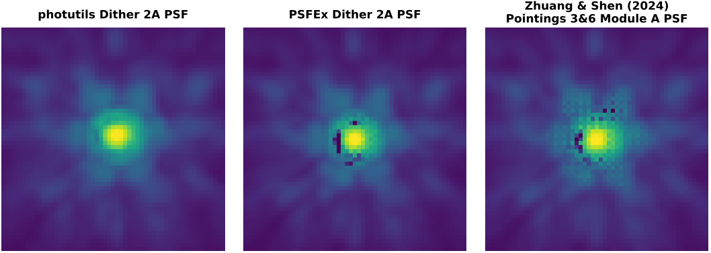
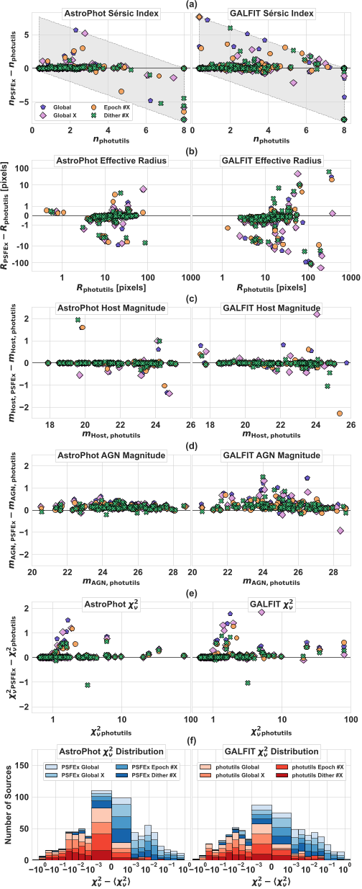

Peering deep into the cosmos, astronomers face an intricate challenge: separating the glare of active galactic nuclei (AGN) from the glow of their host galaxies. With the advent of the James Webb Space Telescope (JWST) and its unprecedented imaging capabilities, scientists are revisiting long-standing assumptions about how best to conduct this cosmic disentanglement.

> **TL;DR:**
> - Standard Sèrsic profile models often fail to uniquely describe AGN host morphologies using JWST data.
> - Different software and PSF models yield significantly varying galaxy parameters, complicating morphological interpretation.

*7: Figure 7 compares fit results for SDSS1420+5300A using Galfit (top) and AstroPhot (bottom) with different PSFs and fixed effective radii.*

Contextually, galaxies containing AGNs intrigue researchers because these luminous black holes are tightly linked to their galaxy's evolution. Historically, the task has relied on clever modeling of light profiles using software designed to unravel the apparent overlap between the central point-like AGN and the extended host galaxy. The Hubble Space Telescope (HST) made early breakthroughs, but was limited by sensitivity, coverage, and wavelength—a handicap when probing the distant, dustier reaches of the universe.

Enter JWST, specifically with its NIRCam instrument. The Cosmic Evolution Early Release Science (CEERS) survey leverages JWST's high-resolution, deep infrared imaging to study over a hundred X-ray detected AGNs in a famous field previously mapped by HST. This particular work narrows in on 87 AGNs (spanning redshifts 0.1 to 4), aiming to see not only how much better JWST performs, but whether our analysis tools are up to the task of interpreting its data.

*4: Figure 4. PSF images from photutils (left) and PSFEx (middle) for JWST/NIRCam F115W filter, with a 4″ diameter. Right shows their 1D radial profiles and Gaus...*

To do this, the researchers combined two elements in their image modeling: a Sèrsic profile (which tries to capture the shape of a galaxy's light) and a point-spread function (PSF, which models the way starlight blurs in the telescope). They created their PSF models with two popular tools, photutils and PSFEx, and tested two widely used fitting programs, Galfit and AstroPhot, for decomposing AGNs from their hosts in the F115W band of NIRCam. As a check, they compared results to older HST imaging in similar bands.

What did they find? Not all tools are created equal. The PSFEx models consistently failed to mimic the shape of real JWST point sources, undermining the accuracy of decompositions relying on them. Meanwhile, the two fitting programs—Galfit and AstroPhot—regularly returned different answers for the same galaxies, with significant divergence in inferred galaxy shapes and sizes. They could reliably estimate the total brightness (magnitude) of the AGN and host, but the finer points of galaxy structure—like the Sèrsic index (which describes how concentrated the light is) and the effective radius—were highly correlated and variable, sometimes changing dramatically without indicating a worse model fit. In short, even with JWST's clarity, our standard models may not be capturing the messy reality of AGN hosts.

*5: Figure 5. Comparison of JWST/NIRCam F115W PSF models for the central 0.825″×0.825″ region from photutils, PSFEx, and a public PSFEx model.*

Why does this matter? Accurately decoding the structure of AGN host galaxies is key to understanding how galaxies and their central black holes grow and co-evolve. If our models are unreliable or non-unique, then previous claims about how AGN hosts change over cosmic time might need revisiting. For the public and future researchers, this is a cautionary tale: as telescopes reveal more detail, our analysis must keep pace, and blind trust in standard profiles or software can be misleading.

Speculatively, these findings could spur the development of more flexible or physically-motivated models—incorporating not just simple shapes but real, complex features seen in galaxies. For now, astronomers studying AGN hosts, whether with JWST or any cutting-edge telescope, are advised to test multiple tools, examine residuals carefully, and avoid over-interpreting morphological parameters that may be model-dependent or covariant.

*11: Figure 11 compares fit results from photutils and PSFEx using AstroPhot (left) and Galfit (right) for various parameters and χ² distributions.*

With all this, some caveats persist. The study's results are tied to the sample, bands, and fitting strategies chosen. Other galaxies, wavelengths, or updated software could shift the picture. Open questions include: can machine learning or non-parametric fitting offer a better route? And, crucially, what suite of models best represents the true diversity of AGN hosts across the universe?

## Sources

- [http://arxiv.org/abs/2510.27214v1](http://arxiv.org/abs/2510.27214v1)
- [https://doi.org/10.48550/arXiv.2510.27214](https://doi.org/10.48550/arXiv.2510.27214)
