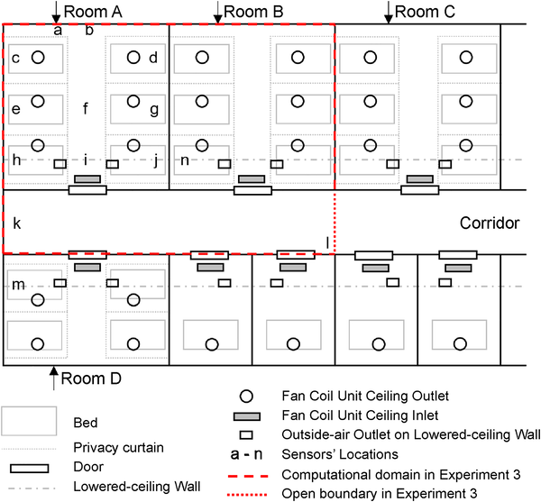
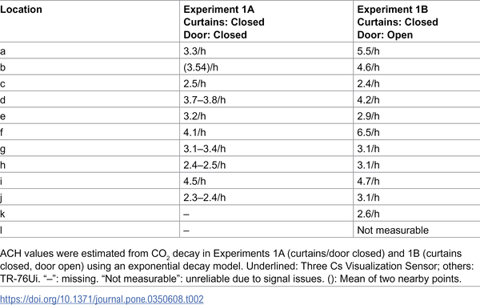

How can opening a hospital room door both help and hurt COVID-19 safety? In a sealed hospital ward where windows stay shut and ventilation is mechanical, the movement of invisible virus-laden aerosols can be surprisingly complex. Recent research from a Japanese hospital outbreak sheds light on how airflow patterns and architectural features like curtains shape the spread of airborne SARS-CoV-2 between patient rooms.

> **TL;DR**
> - Opening patient room doors increases ventilation inside the room but also allows virus-containing aerosols to leak into shared corridors and neighboring rooms.
> - Privacy curtains and the design of ventilation systems can create airflow stagnation zones, leading to uneven aerosol removal and potential hotspots for transmission.

During the COVID-19 pandemic, airborne transmission of SARS-CoV-2 has been recognized as a major route of infection, especially indoors. Hospitals, despite their advanced ventilation systems, have experienced outbreaks where patients and staff in different rooms became infected without direct contact. Understanding how virus-laden aerosols travel in mechanically ventilated, sealed wards is crucial for improving infection control. The study focused on a February 2025 outbreak in a Japanese hospital ward where 17 individuals across multiple rooms tested positive, raising questions about airflow-driven inter-room transmission.

The investigation combined three complementary approaches: First, CO2 decay experiments measured air change rates (ACH) to quantify how well air circulated under different door conditions. Second, aerosol dispersion was tracked using fog particles as surrogates for virus-laden aerosols, with sensors placed inside the index patient’s room, the corridor, and adjacent rooms. Third, computational fluid dynamics (CFD) simulations recreated airflow patterns to visualize how aerosols might move through the ward. These experiments compared scenarios with patient room doors closed versus fully open, while privacy curtains remained drawn as usual.

Results showed that opening the patient room door significantly increased air changes per hour inside the room, improving ventilation. However, this also allowed CO2 and aerosol particles to escape from the room into the corridor and neighboring rooms. Aerosol sensors detected particles not only inside the index room but also in the corridor and adjacent rooms, indicating airborne transport beyond the patient’s immediate space. CFD simulations confirmed these pathways, revealing how aerosols accumulated in curtain-enclosed bed compartments and gradually leaked through door gaps into shared areas. The study highlighted a trade-off: door opening dilutes virus concentration inside rooms but increases contamination risk in shared spaces. Additionally, privacy curtains created airflow stagnation zones that hindered uniform aerosol removal.

This study provides strong, real-world evidence that airborne SARS-CoV-2 transmission can occur between rooms in sealed, mechanically ventilated hospital wards without natural ventilation or structural openings. It underscores the importance of managing airflow pathways and considering architectural features in infection control strategies. Hospitals may need to balance door opening policies with localized air filtration and airflow management to prevent unintended aerosol migration. The findings offer practical insights for designing safer healthcare environments during respiratory disease outbreaks.

While the study used detailed experiments and simulations, some simplifications were made. The CFD model did not include temperature-driven buoyancy effects or particle deposition, which could influence aerosol behavior. The fog particles used as tracers approximate virus-laden aerosols but do not replicate all biological properties. Also, the findings are specific to the ward’s ventilation design and may vary in other settings. Nonetheless, the multimodal approach provides robust qualitative insights into airborne transmission dynamics in sealed hospital wards.

## Figures

*Layout of COVID-19 ward showing rooms, ventilation, air conditioning, and sensor spots used in airflow and air quality tests.*

*Air changes per hour (ACH) measured at different sensor spots during two test conditions.*

## Sources

- [Airborne spread of severe acute respiratory syndrome coronavirus 2 between rooms in a sealed, mechanically ventilated ward: Evidence from a hospital outbreak investigation](https://journals.plos.org/plosone/article?id=10.1371/journal.pone.0350608)
- DOI: [10.1371/journal.pone.0350608](https://doi.org/10.1371/journal.pone.0350608)
