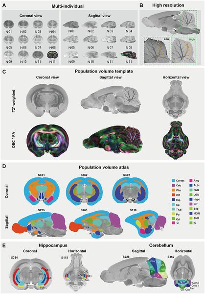
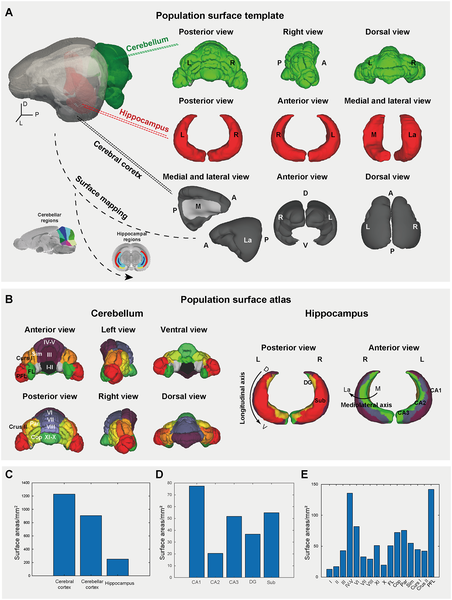
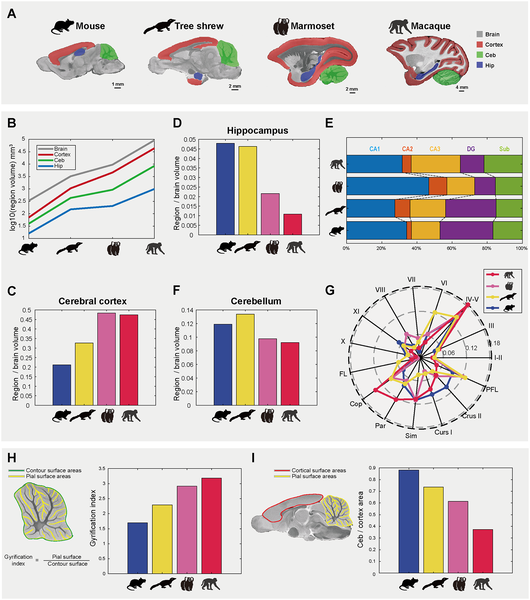
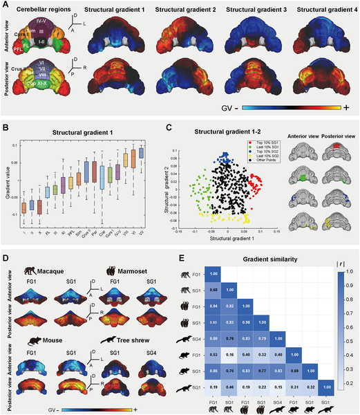

Have you ever wondered how the brains of different mammals relate to one another? The tree shrew, a small arboreal mammal closely related to primates, holds a unique position in the evolutionary family tree. Recent advances in brain imaging have now provided an unprecedentedly detailed map of its brain, revealing how this species bridges the gap between rodents and primates. This new atlas not only offers stunning high-resolution images but also uncovers fundamental principles about how brain shape influences function across diverse animals — from mice to humans.

> **TL;DR**
> - Researchers created an ultra-high-resolution MRI atlas of the tree shrew brain, detailing its anatomy and connectivity at a fine scale.
> - They discovered that despite differences in brain shape across species, a universal spatial alignment exists between brain geometry and functional organization.

The tree shrew (Tupaia belangeri) occupies a pivotal spot in mammalian evolution, sitting close to primates but sharing traits with rodents. This makes it an invaluable model for understanding brain evolution and mechanisms underlying neurological diseases. However, previous imaging studies of the tree shrew brain lacked the resolution needed to reveal detailed structures, limiting comparisons with well-studied rodents and primates. Modern magnetic resonance imaging (MRI) technology now allows scientists to peer inside brains with remarkable clarity, enabling the construction of detailed anatomical atlases that serve as reference maps for research.

In this study, scientists scanned the brains of 11 adult tree shrews using a powerful 9.4 Tesla MRI scanner, achieving an ultra-high resolution of 50 by 50 by 75 micrometers. They combined structural imaging with diffusion MRI, which tracks the pathways of nerve fibers, to map both the brain’s anatomy and its connectivity patterns. By averaging data across individuals, they created a population-based brain template and developed a detailed atlas segmenting major regions like the cerebral cortex, cerebellum, and hippocampus, as well as finer subdivisions within these areas. They also reconstructed three-dimensional surface models to analyze brain geometry and compared these features across species including mice, marmosets, and macaques.

The resulting atlas revealed the tree shrew brain as an evolutionary mosaic. For example, its cerebellum—a region important for motor control—shows significant volumetric expansion and connectivity patterns resembling those of primates. Meanwhile, the hippocampus, crucial for memory and spatial navigation, retains a rodent-like architecture but preserves functional axes conserved through evolution. Importantly, the researchers uncovered a universal organizational principle called geometry–gradient coupling (GGC): the physical shape of the brain constrains how functional connectivity gradients are arranged. This spatial alignment between brain geometry and function was consistent across species from mice to humans, despite their very different brain shapes and sizes.

This comprehensive tree shrew brain atlas provides a critical neuroanatomical benchmark for evolutionary neuroscience. By bridging rodents and primates, it helps clarify how brain structure and function have adapted over millions of years. The discovery of invariant geometry–gradient coupling suggests that fundamental biophysical constraints shape brain organization across mammalian species. This insight not only advances our understanding of brain evolution but also offers a valuable resource for modeling brain diseases and interpreting comparative neurobiology studies.

While this atlas offers unprecedented detail, it is based on ex vivo (postmortem) brain scans, which may differ slightly from living brain dynamics. The study focused on a limited number of individuals, and although population averaging was used, further research could explore variability across larger and more diverse samples. Additionally, functional connectivity inferred from diffusion MRI reflects structural pathways but does not directly measure neural activity. Future studies integrating electrophysiology or functional imaging could deepen understanding of how these anatomical features relate to brain function.

## Figures

*Detailed MRI images and brain maps reveal the tree shrew's brain structure and regions in high resolution and multiple views.*

*3D brain maps show detailed regions of the tree shrew's cerebellum, hippocampus, and cortex with their sizes and locations labeled.*

*Brain region sizes and folding patterns vary across mouse, tree shrew, marmoset, and macaque species, highlighting differences in brain structure and complexity.*

*Tree shrew cerebellum shows distinct structural connectivity patterns compared across species, highlighting key brain region gradients and their correlations.*

## Sources

- [An anatomical and connectivity atlas of the tree shrew brain to bridge rodent and primate neuroanatomy](https://journals.plos.org/plosbiology/article?id=10.1371/journal.pbio.3003773)
- DOI: [10.1371/journal.pbio.3003773](https://doi.org/10.1371/journal.pbio.3003773)
