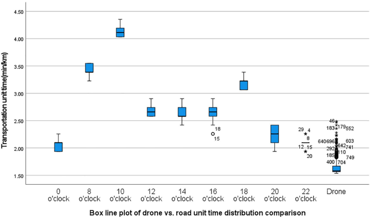

Imagine a busy city hospital with multiple campuses spread across several kilometers. When urgent medical supplies or diagnostic samples need to be transferred quickly, traffic jams and road delays can cost precious time. What if drones could bypass all that congestion and deliver these critical items faster and more reliably? A recent study from China’s Deyang People’s Hospital puts this idea to the test with real-world data, revealing how drone-based logistics can improve healthcare delivery in urban multi-campus hospital systems.

> **TL;DR**
> - Drones transporting medical supplies between two hospital campuses in China were consistently faster than road vehicles, cutting delivery times by up to 60% during peak traffic.
> - This large-scale, real-world study confirms drones offer stable and timely delivery, supporting their practical use in improving hospital logistics and emergency response.

As urban hospitals expand, many adopt a multi-campus model to better serve growing populations. But this creates logistical challenges: transferring specimens, medications, and equipment between campuses quickly and securely is critical, especially for emergencies. Traditionally, ambulances or staff vehicles handle these transfers, but they face delays from traffic congestion and lack real-time tracking. Drone technology offers a promising alternative, flying above traffic and potentially speeding up deliveries. While previous research has explored medical drone use, most studies were small-scale or simulated. This study provides a comprehensive, data-driven look at drone logistics in a real hospital setting in China, addressing a gap in understanding their practical benefits and limitations.

Researchers analyzed 750 drone flights transporting medical supplies between two campuses of Deyang People’s Hospital over nearly four months in 2024. The campuses are about six kilometers apart. They used a specialized intelligent logistics drone capable of carrying up to 4 kilograms at speeds of around 60 km/h. Drone flight times were recorded precisely and compared against travel time estimates from three popular Chinese navigation apps (Baidu Maps, Amap, and Tencent Map) for the same routes and time periods. The study carefully controlled for weather and avoided holidays or unusual traffic conditions. Statistical tests assessed whether drones were significantly faster and more consistent than ground transport across different times of day, including rush hours.

The study found that drones consistently outperformed road transportation in delivery speed. On average, drones took about 1.64 minutes per kilometer, while road travel times ranged from 2.01 to 2.06 minutes per kilometer under smooth traffic conditions. During peak morning traffic around 10 AM, road travel times more than doubled, reaching over 4 minutes per kilometer, while drones maintained their steady pace. This translated to a remarkable 60% time savings during rush hour. Statistical analysis confirmed these differences were highly significant with large effect sizes. Moreover, drone delivery times were more stable and predictable, unaffected by traffic fluctuations that slowed ground vehicles.

This study provides strong empirical evidence that drones can substantially improve the efficiency of medical logistics in urban hospital systems with multiple campuses. Faster and more reliable deliveries of diagnostic samples, medications, and emergency supplies can enhance patient care and operational workflows. The findings support integrating drone technology into hospital logistics, especially in congested cities where traffic delays are common. Beyond routine transfers, drones could play a vital role in public health emergencies by ensuring critical supplies reach their destination quickly. This real-world validation helps move drone medical delivery from experimental trials toward practical, scalable healthcare solutions.

While promising, the study focuses on a specific hospital system in China and a particular drone model and route, which may limit generalizability. Weather conditions were controlled but not extensively varied, so performance under adverse weather remains to be fully explored. Regulatory and airspace management considerations also influence drone deployment feasibility in other regions. Additionally, the study compared drone times to navigation app estimates rather than actual vehicle trips, which could introduce some discrepancies. Future research should examine broader operational challenges, cost-effectiveness, and integration with hospital logistics systems to fully realize the potential of medical drone delivery.

## Figures

*Box plots comparing travel times of road traffic and drones at various times.*

## Sources

- [An empirical study of drone medical logistics transportation in a multi-campus model of Chinese public hospitals: Real-world data-driven validation of timeliness and application effects](https://journals.plos.org/plosone/article?id=10.1371/journal.pone.0345282)
- DOI: [10.1371/journal.pone.0345282](https://doi.org/10.1371/journal.pone.0345282)
