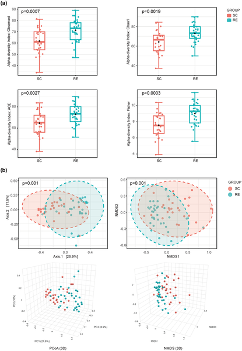
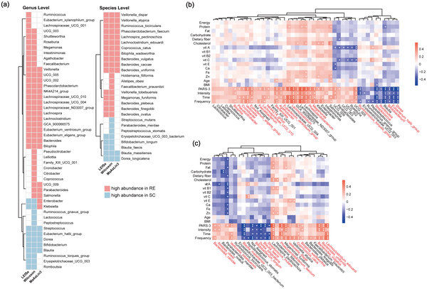

Could the secret to better endurance lie not just in your muscles or lungs, but deep inside your gut? Scientists have long known that exercise benefits health in many ways, but the role of gut bacteria in boosting physical performance is only now coming into focus. A recent study combined observations from young adults with functional experiments in mice to uncover how an exercise-shaped gut microbiome can directly enhance endurance.

> **TL;DR**
> - Young adults who exercise regularly have a more diverse and distinct gut microbiota enriched with beneficial bacteria like Veillonella and Faecalibacterium.
> - Transplanting gut microbes from these active individuals into mice improved the animals’ endurance exercise capacity, suggesting a causal role for the microbiome.

The gut microbiota—a complex community of trillions of microbes living in our intestines—plays a crucial role in human health, influencing metabolism, immune function, and even behavior. Previous research has shown that athletes tend to have more diverse gut bacteria compared to sedentary individuals, but it remained unclear whether these microbial differences actually contribute to improved physical performance or are simply a side effect of exercise. Understanding this relationship is important because exercise is a key modifiable factor in preventing chronic diseases, and the gut microbiome might be a new target to enhance exercise benefits.

Researchers recruited 79 healthy young adult males, assessing their exercise habits using a standardized questionnaire and collecting detailed dietary information. They divided participants into low, moderate, and high exercise groups based on physical activity scores. Fecal samples were collected and analyzed using 16S rRNA gene sequencing to characterize the gut bacterial communities. To test causality, the team transplanted pooled fecal microbiota from high-exercise and low-exercise donors into antibiotic-treated mice. After a period of adaptation, the mice underwent endurance testing on a running wheel to measure exercise capacity.

The study found that individuals in the high-exercise group had significantly greater gut microbiota diversity compared to sedentary controls. Notably, beneficial bacteria such as Veillonella, Faecalibacterium, and Bacteroides were enriched in the active group. When mice received fecal transplants from these active donors, they exhibited markedly improved endurance, running longer distances before exhaustion than mice receiving microbiota from sedentary donors. These results suggest that the exercise-associated gut microbiota can directly enhance physical performance, rather than merely reflecting lifestyle differences.

This research provides compelling evidence linking exercise-induced changes in the gut microbiome to improved endurance capacity. It opens exciting possibilities for developing microbiome-based interventions to boost athletic performance and overall health. For example, targeted probiotics or dietary strategies might one day help mimic the beneficial effects of exercise on the gut microbiota, potentially aiding individuals unable to engage in regular physical activity. Moreover, the study highlights the importance of considering gut microbes as active players in the complex biology of exercise adaptation.

While the findings are promising, several limitations should be noted. The human cohort was limited to young adult males, so results may not generalize across ages, genders, or health statuses. Diet differences, although accounted for, can also influence gut microbiota and complicate interpretations. Additionally, the mouse model, while useful for testing causality, cannot fully replicate human physiology or exercise behavior. Future studies with larger, more diverse populations and mechanistic investigations are needed to better understand how specific gut bacteria influence endurance and how these insights can be translated into practical applications.

## Figures

*People who exercise regularly have significantly different and more diverse gut bacteria compared to those who are less active.*

*This figure shows bacteria types linked to high or low exercise and their connections to exercise and diet habits.*

## Sources

- [An exercise-associated gut microbiota signature enhances endurance performance: A study combining a human cohort and a mice FMT model](https://journals.plos.org/plosone/article?id=10.1371/journal.pone.0351316)
- DOI: [10.1371/journal.pone.0351316](https://doi.org/10.1371/journal.pone.0351316)
