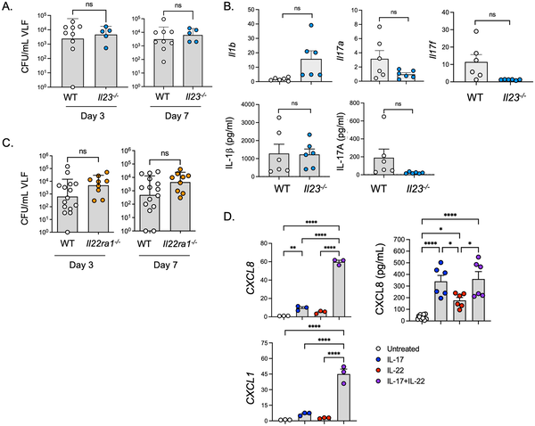
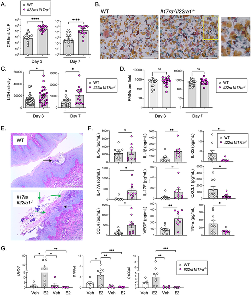
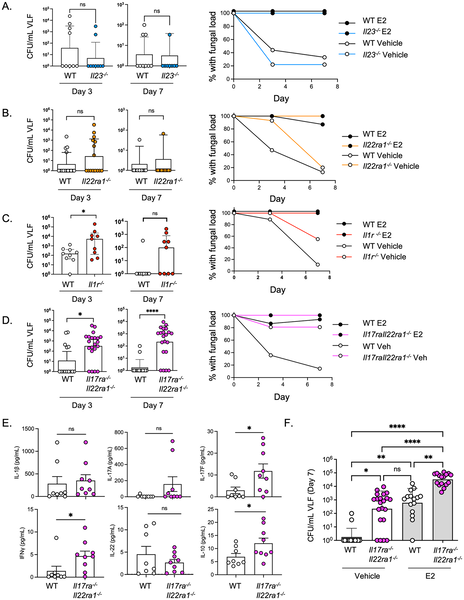
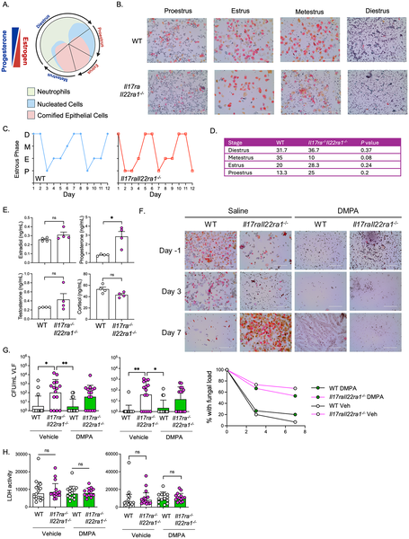

Vaginal yeast infections, medically known as vulvovaginal candidiasis (VVC), affect over 75% of women at some point in their lives. Traditionally, these infections have been closely linked to estrogen levels, with the hormone thought to create a permissive environment for fungal growth. But what if the story is more complex? Recent research uncovers a hidden immune circuit that plays a crucial role in controlling these infections, independent of estrogen. This discovery opens new avenues for understanding and potentially treating a condition that impacts millions worldwide.

> **TL;DR**
> - A combined immune response involving the cytokines IL-1, IL-17, and IL-22 is essential for controlling vaginal yeast infections, acting independently of estrogen.
> - Mice lacking receptors for both IL-17 and IL-22 experience significantly worse infections and tissue damage, revealing a synergistic immune defense previously unappreciated.

Candida albicans, a common fungal species, lives harmlessly in many people but can cause infections under certain conditions. Vulvovaginal candidiasis (VVC) is a widespread infection that causes discomfort and affects quality of life. Unlike other Candida infections that often occur due to immune system weaknesses, VVC has been primarily associated with high estrogen levels, such as during pregnancy or hormone therapy. This hormone-centric view has dominated research and treatment approaches. However, the immune system’s role in VVC has remained unclear, especially regarding the involvement of Type 17 immune responses, which are critical in fighting fungal infections elsewhere in the body.

To explore the immune mechanisms behind VVC, researchers used genetically modified mice lacking specific cytokine receptors involved in Type 17 immunity—namely IL-17RA and IL-22RA1. They infected these mice vaginally with Candida albicans under conditions that mimic human infection, including estrogen treatment to induce susceptibility. The team measured fungal loads, tissue damage, and immune cell responses over time. Complementary experiments involved human vulvar epithelial cells treated with IL-17 and IL-22 to observe how these cytokines influence antifungal gene expression. Additionally, mice deficient in IL-1 receptor signaling were studied to understand upstream regulation of this immune pathway.

The study revealed that mice lacking both IL-17RA and IL-22RA1 receptors had dramatically higher fungal burdens—over 50 times greater—compared to normal mice, along with increased tissue damage and inflammation. This susceptibility was much more severe than in mice missing either receptor alone, indicating a synergistic effect between IL-17 and IL-22 signaling. Interestingly, this immune protection operated independently of estrogen: even without hormone treatment, mice deficient in these cytokine receptors were more prone to infection. Further, IL-1 receptor signaling was found to be upstream of this Type 17 response, as mice lacking IL-1R also showed increased fungal loads and reduced expression of IL-17 and IL-22. Human epithelial cells responded synergistically to IL-17 and IL-22 by activating antifungal genes, supporting the mouse findings.

These findings challenge the prevailing notion that estrogen is the primary driver of susceptibility to vaginal yeast infections. Instead, they highlight a critical immune circuit involving IL-1, IL-17, and IL-22 cytokines that works independently to control fungal growth and tissue damage. Understanding this pathway could shift how we approach prevention and treatment of VVC, especially for recurrent cases where current antifungal therapies may fail. Targeting these immune signals might lead to novel therapies that bolster the body’s natural defenses rather than relying solely on hormone modulation or antifungal drugs.

While the mouse models provide compelling evidence for the immune circuit’s role, human biology is more complex, and further studies are needed to confirm these mechanisms in women. The interplay between hormones and immunity in the vaginal environment involves many factors, including microbiota and other immune cells, which were not fully explored here. Additionally, translating cytokine-targeted therapies into safe and effective treatments will require careful evaluation to avoid unintended immune side effects. Nonetheless, this research lays important groundwork for rethinking VVC susceptibility and opens new directions for investigation.

## Figures

*Losing IL-17R and IL-22R signals raises fungal infection risk and inflammation in vaginal tissue and cells.*

*IL-17/22 signals reduce fungal infection, inflammation, and tissue damage in mice, shown by lower fungal loads and immune responses.*

*Mice lacking IL-17/22 receptors show higher fungal infection without hormone treatment, with immune response differences seen at day 3.*

*This figure shows hormone changes, cell types, infection levels, and tissue damage in mice during their reproductive cycle and after treatments.*

## Sources

- [An IL-1, IL-17, and IL-22 cytokine circuit controls vulvovaginal candidiasis independently of estrogen](https://journals.plos.org/plospathogens/article?id=10.1371/journal.ppat.1014202)
- DOI: [10.1371/journal.ppat.1014202](https://doi.org/10.1371/journal.ppat.1014202)
