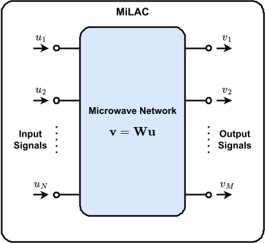
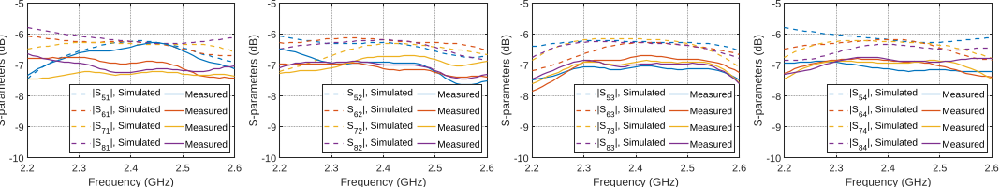

What if some complex calculations could happen instantly, not inside a digital chip, but as signals flow through a network of microwave components? Imagine harnessing the physics of microwaves to perform mathematical operations like the Fourier transform in real time, without converting signals to digital bits. This is the intriguing promise of analog computing using microwave networks, a concept recently explored through a practical hardware prototype that computes key signal transforms with near-zero latency.

> **TL;DR**
> - Microwave networks made solely from hybrid couplers and phase shifters can perform certain linear matrix operations directly on analog signals.
> - A fabricated prototype successfully demonstrated a 4×4 discrete Fourier transform computed in the analog domain, validating the theoretical design.

*Note: this summary is based on a preprint — research shared ahead of formal peer review.*

Digital computers have powered modern technology for decades, but they face fundamental limits in speed and power consumption, especially when processing large amounts of data in real time. Analog computing offers an alternative by performing calculations directly on physical signals—voltages, currents, or electromagnetic waves—without the need for slow analog-to-digital conversions. Among analog approaches, using microwave signals is particularly promising because these signals naturally interfere and combine linearly as they propagate through circuits, enabling instant computation of certain operations. The challenge is designing microwave networks that can perform useful mathematical transforms efficiently and reliably.

This research focuses on microwave linear analog computers (MiLACs) constructed exclusively from two fundamental components: hybrid couplers and phase shifters. Hybrid couplers split and combine microwave signals in controlled ways, while phase shifters adjust the phase of signals as they travel through the network. By connecting these elements in specific arrangements, the researchers derived a mathematical characterization of all linear transformations that such a network can implement. They identified that the discrete Fourier transform (DFT), Hadamard transform, and Haar transform—all important in signal processing—can be realized with these components. The team developed systematic design procedures to build networks for any size power-of-two dimension and fabricated a microstrip prototype implementing a 4×4 DFT. Calibration methods were used to correct for fabrication imperfections, and measurements were compared against theoretical predictions.

The study revealed that any linear transformation computable by a network of hybrid couplers and phase shifters can be decomposed into a sequence of permutation and block diagonal matrices with 2×2 or 1×1 blocks. Within this framework, the discrete Fourier transform matrix fits perfectly, enabling the construction of microwave networks that perform DFTs of arbitrary size (powers of two). The fabricated 4×4 DFT prototype successfully computed the transform in the analog domain, with measured outputs closely matching theoretical expectations. This confirms that complex matrix-vector products can be computed instantaneously as microwave signals propagate through the network, without digital processing delays.

By demonstrating a practical analog computing approach with standard microwave components, this work opens a pathway toward ultra-low-latency, energy-efficient signal processing hardware. Such analog microwave networks could complement digital processors in applications requiring real-time computation, such as wireless communications, radar sensing, and other data-intensive systems. The ability to compute transforms like the DFT directly in hardware at the speed of light propagation offers a compelling alternative to conventional digital methods limited by clock speeds and conversion overheads.

While the prototype and theoretical framework show promise, this analog computing approach currently applies to a specific class of linear transformations and requires precise calibration to mitigate hardware imperfections. Scaling to larger network sizes and integrating with broader computing systems will involve additional challenges. Furthermore, the niche technical nature of microwave analog computing means that broader adoption will depend on further development, cost reduction, and demonstration of advantages in practical applications compared to digital solutions.

## Figures

*Simplified overview of a microwave-based analog computer that processes signals linearly. — Figure from Matteo Nerini et al., [CC BY 4.0](http://creativecommons.org/licenses/by/4.0/), caption edited.*

*Comparison of simulated and measured signal transmission showing ideal values at half strength (−6 dB). — Figure from Matteo Nerini et al., [CC BY 4.0](http://creativecommons.org/licenses/by/4.0/), caption edited.*

## Sources

- [Analog Computing with Hybrid Couplers and Phase Shifters](https://arxiv.org/abs/2603.24604)
- DOI: [10.48550/arxiv.2603.24604](https://doi.org/10.48550/arxiv.2603.24604)

*This article reuses and adapts text and figures from the original research by Matteo Nerini et al., available via arXiv Mathematics, under the [CC BY 4.0](http://creativecommons.org/licenses/by/4.0/) license.*
