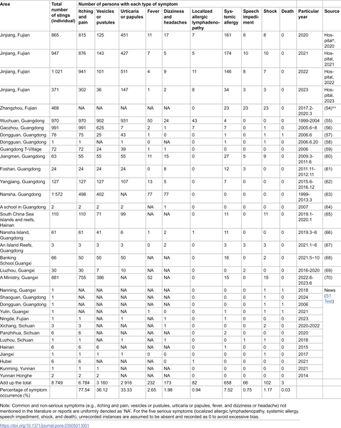
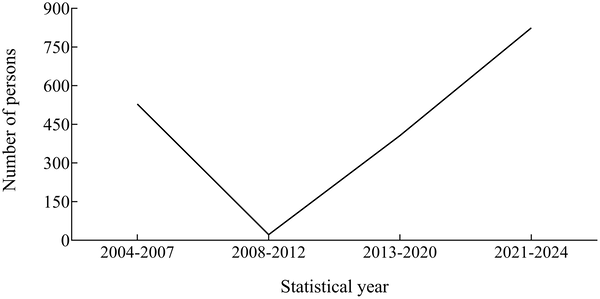
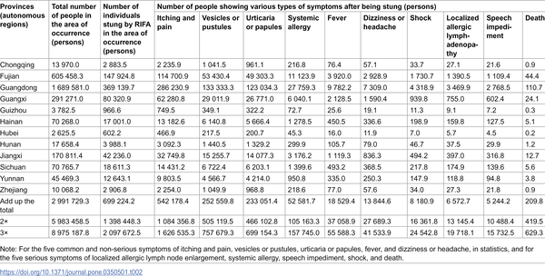

Meet the red imported fire ant, a tiny but aggressive invader rapidly expanding across mainland China. While small, these ants pack a venomous sting that causes intense itching and pain in millions, and in some cases triggers severe allergic reactions and even fatalities. Understanding the scale and severity of this threat is critical as the ants continue to colonize new regions.

> **TL;DR**
> - Red imported fire ants have spread to over 700 counties in 13 provinces in China, threatening the health of around 120 million people.
> - Each year, an estimated 700,000 people in China are stung, with symptoms ranging from mild itching to life-threatening allergic shock and over 200 deaths.

Originally native to South America, the red imported fire ant (Solenopsis invicta) is a highly invasive species known for its aggressive behavior and potent venom. First detected in mainland China in 2004, these ants have rapidly expanded northward, now occupying a vast area overlapping heavily with human populations. Their stings inject venom containing multiple allergenic proteins that can provoke a spectrum of reactions, from localized pain and swelling to systemic allergies and anaphylaxis. Given their proximity to farmland and urban spaces, the health risks posed by these ants are a growing public concern.

Researchers compiled a comprehensive dataset of 8,749 confirmed red imported fire ant sting cases recorded between 2004 and 2024. These cases were gathered from scientific literature, Chinese search engine Baidu, and hospital records from Jinjiang Hospital of Traditional Chinese Medicine. Each case included detailed symptom descriptions. The team analyzed the frequency of various symptoms and combined this with data on ant infestation severity and population density across affected regions to estimate the annual number of people likely to be stung and the health impacts they might experience.

The study found that the most common symptoms following stings were itching and pain (affecting about 78% of cases), followed by vesicles or pustules (36%) and urticaria or papules (33%). More severe systemic allergic reactions occurred in approximately 7.5% of cases, with symptoms such as fever, dizziness, shock, and even speech impediments reported. Alarmingly, the data estimate that annually around 699,000 people in China are stung by these ants, leading to over 8,000 cases of anaphylactic shock and approximately 209 deaths. The ants have now spread to more than 700 counties, putting roughly 120 million people at risk.

This large-scale quantitative assessment highlights the substantial and growing public health threat posed by red imported fire ants in China. By providing detailed estimates of symptom prevalence and the number of affected individuals, the study underscores the urgent need for enhanced monitoring, public awareness, and medical preparedness. Protecting vulnerable populations and developing effective treatment and prevention strategies will be crucial to mitigating the impact of this invasive species as it continues its northward expansion.

While the study draws on a large and diverse dataset, some limitations remain. The probability of being stung depends on local infestation severity and human exposure, which can vary widely. Additionally, reporting biases and incomplete data from some regions may affect estimates. The rarity of severe outcomes like death means these numbers carry some uncertainty. Nonetheless, the findings provide a valuable foundation for public health planning, though ongoing surveillance and research will be needed to refine risk assessments as the situation evolves.

## Figures

*Table showing how often people in different parts of China experience symptoms after being stung by red imported fire ants.*

*Yearly average number of human stings by invasive red imported fire ants over time.*

*Estimated number of people stung by red imported fire ants in China and their symptoms after stings.*

## Sources

- [Analysis of the human health threat caused by the red imported fire ant in mainland China](https://journals.plos.org/plosone/article?id=10.1371/journal.pone.0350501)
- DOI: [10.1371/journal.pone.0350501](https://doi.org/10.1371/journal.pone.0350501)
