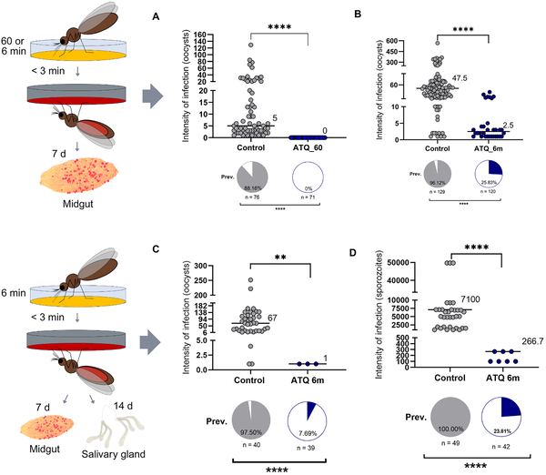
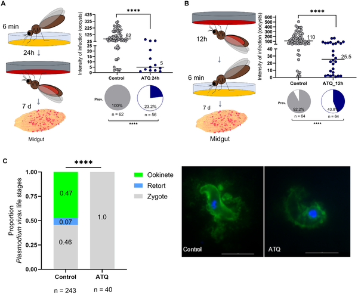
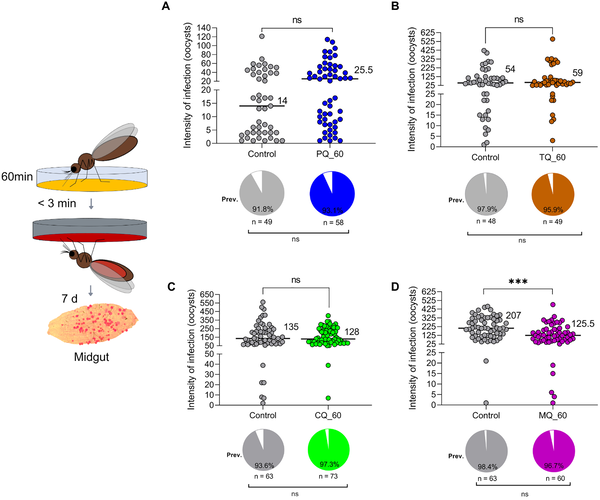

What if mosquitoes could be stopped from spreading malaria just by touching treated surfaces? Imagine bed nets or resting areas coated not with insecticides but with antimalarial drugs that prevent the parasite from developing inside the mosquito. This innovative approach could complement existing malaria control tools, especially in regions where mosquitoes have become resistant to traditional insecticides.

> **TL;DR**
> - Applying the antimalarial drug Atovaquone to surfaces that Anopheles darlingi mosquitoes contact can completely block the development of Plasmodium vivax parasites inside the mosquito.
> - This contact-dependent drug delivery method shows promise as a complementary malaria control strategy, particularly in areas challenged by insecticide resistance.

Malaria remains a significant global health challenge, with Plasmodium vivax being the most prevalent malaria parasite in the Amazon region. The primary mosquito vector there is Anopheles darlingi. Traditional malaria control relies heavily on insecticide-treated bed nets and indoor spraying, but the rise of insecticide resistance threatens these methods’ effectiveness. Scientists are therefore exploring novel strategies that target the parasite within the mosquito rather than just killing the insect. One promising idea is to use antimalarial drugs applied to surfaces mosquitoes naturally rest on, exploiting their behavior to deliver drugs that block parasite development.

In this study, researchers exposed female Anopheles darlingi mosquitoes to surfaces impregnated with various antimalarial compounds, including Atovaquone, Tafenoquine, Chloroquine, Mefloquine, Primaquine, and Nanchangmycin. The mosquitoes were allowed to rest on these treated surfaces for either 6 or 60 minutes before or after being fed blood infected with Plasmodium vivax via a direct membrane feeding assay. The team then measured the prevalence and intensity of parasite infection inside the mosquitoes by counting oocysts in the midgut and sporozoites in the salivary glands, which are critical stages for transmission to humans.

The results were striking: mosquitoes exposed to Atovaquone-coated surfaces for 60 minutes before infection showed complete elimination of P. vivax parasites. Even a shorter exposure of 6 minutes significantly reduced both the prevalence and intensity of infection. Moreover, Atovaquone exposure either before or after the infectious blood meal suppressed parasite development. Mefloquine also reduced parasite intensity but did not affect infection prevalence. Other tested antimalarials did not show significant effects. Immunofluorescence assays revealed that Atovaquone interfered with parasite development at an early stage inside the mosquito, preventing the parasites from maturing and continuing their lifecycle.

This study demonstrates a novel and practical approach to malaria control by delivering antimalarial drugs through mosquito contact with treated surfaces. By blocking parasite development inside the mosquito, this strategy could reduce malaria transmission without relying solely on insecticides, which face growing resistance issues. The method leverages natural mosquito behaviors, such as resting on bed nets or walls, to deliver the drugs effectively. If translated to real-world settings, this approach could complement existing vector control tools and help address persistent malaria transmission in the Amazon and other endemic regions.

While the laboratory results are promising, real-world validation is needed to confirm the effectiveness of this strategy in field conditions. Factors such as environmental stability of the drugs on treated surfaces, mosquito behavior variability, and potential development of parasite resistance to the drugs require further investigation. Additionally, the safety and cost-effectiveness of deploying antimalarial-treated materials on a large scale must be assessed before this approach can be widely implemented.

## Figures

*Exposing mosquitoes to Atovaquone greatly reduces malaria parasite development and infection rates.*

*Atovaquone exposure for 6 minutes before or after infection greatly lowers malaria parasite levels in mosquitoes.*

*Most antimalarials tested did not affect malaria parasite growth in mosquitoes, except mefloquine, which showed a significant impact.*

## Sources

- [Anti-malarial contact dependent blocking of transmission of Plasmodium vivax by Anopheles darlingi mosquito vector](https://journals.plos.org/plospathogens/article?id=10.1371/journal.ppat.1013531)
- DOI: [10.1371/journal.ppat.1013531](https://doi.org/10.1371/journal.ppat.1013531)
