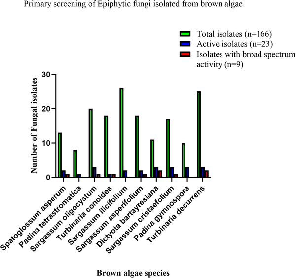

Antibiotic resistance is one of the greatest challenges facing modern medicine. As common bacteria evolve to survive existing drugs, infections become harder to treat, leading to longer illnesses and higher mortality. But what if the solution lies not in synthetic labs but on the surfaces of seaweeds swaying in the Indian Ocean? Recent research has uncovered that fungi living on brown algae along the Kenyan coast produce powerful antibacterial compounds capable of disabling some of the most dangerous drug-resistant bacteria.

> **TL;DR**
> - Fungi living on brown seaweeds from the Kenyan coast produce natural compounds that inhibit the growth of multidrug-resistant bacteria, including major hospital pathogens.
> - Microscopic imaging reveals these fungal extracts damage bacterial cell membranes, and chemical analysis identifies diverse bioactive metabolites, highlighting marine fungi as promising sources for new antibiotics.

Antimicrobial resistance (AMR) threatens global health by rendering many antibiotics ineffective, especially against a group of pathogens known as ESKAPE bacteria, which cause severe hospital infections worldwide. Traditional drug discovery pipelines have struggled to keep pace with this growing threat. Marine environments, particularly fungi living on algae, represent a largely untapped reservoir of novel bioactive compounds. Brown algae create unique chemical microhabitats that nurture diverse fungal communities, which in turn may produce metabolites to defend their niche — some of which could have potent antibacterial properties. The Kenyan coast, part of the Western Indian Ocean, is especially underexplored in this regard.

Researchers collected ten species of healthy brown algae from the intertidal zones of the Kenyan coast. After carefully washing to remove loosely attached organisms, they isolated fungi living on the algae surfaces by culturing samples on seawater-based media. These fungal isolates were identified using both traditional microscopy and molecular techniques targeting the ITS gene region, confirming their taxonomy. The team then tested fungal extracts against six multidrug-resistant ESKAPE bacteria using agar diffusion and minimum inhibitory concentration assays. The most active extracts underwent scanning electron microscopy (SEM) to observe effects on bacterial cells, and gas chromatography–mass spectrometry (GC-MS) to profile their chemical composition.

Out of 166 fungal isolates, nine showed broad and potent antibacterial activity against all tested ESKAPE pathogens, including notorious bacteria like MRSA and Pseudomonas aeruginosa. Extracts from species such as Alternaria, Curvularia, and Penicillium inhibited bacterial growth with zones of inhibition up to 30 mm and very low minimum inhibitory concentrations, indicating strong potency. SEM images revealed that treated bacteria exhibited membrane blebbing, collapse, and lysis, suggesting the fungal compounds disrupt bacterial cell membranes. Chemical analysis identified a variety of bioactive metabolites, supporting the idea that these fungi produce diverse antibacterial agents. Some fungal extracts showed selective or moderate activity, highlighting variability among species.

This study highlights the Kenyan coastal brown algae as a promising source of epiphytic fungi that produce novel antibacterial compounds effective against multidrug-resistant pathogens. Given the urgent need for new antibiotics, marine fungi from underexplored environments like the Western Indian Ocean could provide valuable leads for drug development. The demonstration of membrane-targeting activity and chemical diversity strengthens the case for further investigation and development of these natural products. Such discoveries could contribute to addressing the global health crisis posed by antibiotic resistance.

While these findings are encouraging, they represent early-stage research. The antibacterial activity was demonstrated in laboratory assays, and the specific compounds responsible require further isolation and characterization. Additionally, the safety, efficacy, and pharmacological properties of these fungal metabolites need thorough evaluation before any clinical application. Environmental factors influencing metabolite production and scalability of fungal cultivation also remain to be explored. Nonetheless, this work lays important groundwork for future antimicrobial discovery from marine fungi.

## Figures

*Testing fungi from brown algae for their ability to fight bacteria using agar plug method.*

## Sources

- [Antibacterial potential of epiphytic fungi obtained from brown algae of Kenyan coastal waters](https://journals.plos.org/plosone/article?id=10.1371/journal.pone.0346865)
- DOI: [10.1371/journal.pone.0346865](https://doi.org/10.1371/journal.pone.0346865)
