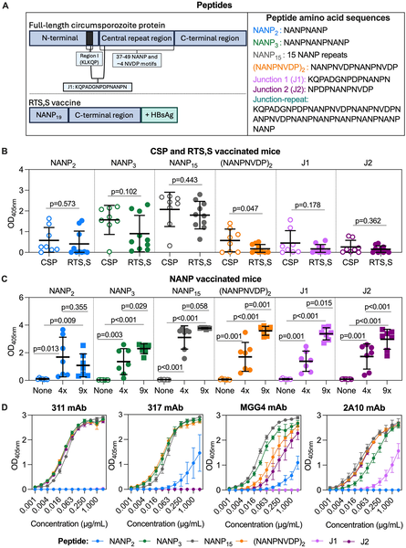
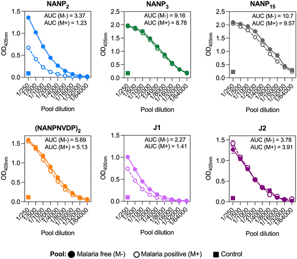

Malaria remains a major global health challenge, especially for young children in Africa who bear the brunt of this deadly disease. The RTS,S vaccine, recently approved for use in children, offers some protection but only modest and short-lived. Scientists have long sought to understand exactly how this vaccine works at the immune level to improve its effectiveness. A new study dives deep into the fine details of antibody responses generated by RTS,S, identifying precise targets on the malaria parasite that are linked with better protection in vaccinated children.

> **TL;DR**
> - Children vaccinated with RTS,S who developed strong antibody responses to two specific parts of the malaria parasite’s circumsporozoite protein (CSP) had a significantly lower risk of clinical malaria.
> - These antibody targets, previously underappreciated, provide important clues for designing improved malaria vaccines and offer measurable correlates of protection for future trials.

Malaria is caused by the parasite Plasmodium falciparum, which infects humans through mosquito bites. The RTS,S vaccine targets a protein called circumsporozoite protein (CSP) found on the surface of the parasite’s infectious sporozoite stage. CSP includes several regions: a central NANP-repeat region, a C-terminal domain, and an N-terminal region. RTS,S contains the central NANP repeats and the C-terminal domain but excludes the N-terminal region and a junction epitope that links these parts. While RTS,S has been shown to reduce malaria cases in young children, its protection is partial and fades over time. Understanding which parts of CSP the immune system targets most effectively could help improve vaccine design and efficacy.

Researchers first used mouse models to study antibody responses to different parts of CSP, including peptides mimicking the N-terminal region, central NANP repeats, and junction epitopes. They also tested human monoclonal antibodies isolated from vaccinated individuals to understand cross-reactivity between these regions. Next, they analyzed blood samples from 735 young African children aged 1 to 4 years who participated in a large phase IIb RTS,S vaccine trial. Using enzyme-linked immunosorbent assays (ELISAs), they measured IgG antibody levels against six synthetic peptides representing key CSP epitopes. They then performed statistical analyses to see if antibody specificity correlated with protection from clinical malaria during follow-up.

The study found that a subset of vaccinated children produced IgG antibodies specifically targeting a short NANP-repeat epitope (called NANP2) and a cross-reactive N-terminal epitope (called J1). Children with higher antibody levels to these epitopes had a significantly reduced risk of developing clinical malaria compared to those with lower levels. Importantly, these antibody responses were also associated with enhanced functional activities, such as Fc-mediated mechanisms that help clear the parasite. Mouse studies supported these findings by showing that antibodies induced by the central NANP repeats could cross-react with the N-terminal region. Together, these results highlight that fine specificity of antibody responses—not just overall antibody quantity—matters for protection.

This research provides new insights into how the RTS,S vaccine induces protective immunity by identifying specific antibody targets linked to reduced malaria risk. These findings offer promising correlates of protection that can be used to evaluate immune responses in future vaccine trials and guide the design of next-generation malaria vaccines. By focusing on these key epitopes, vaccine developers may improve efficacy and durability, ultimately helping to save young lives in malaria-endemic regions.

While the associations between antibody specificity and protection are compelling, this study is a post hoc analysis of one phase IIb trial cohort. Additional studies in other RTS,S and related vaccine trials are needed to confirm these findings and establish causality. The immune responses identified were present only in a minority of children, highlighting the complexity of malaria immunity. Moreover, the vaccine’s protection wanes over time, so understanding how to sustain these beneficial antibody responses remains a challenge. Nonetheless, these results represent an important step toward unraveling the immune mechanisms behind RTS,S and improving malaria vaccination strategies.

## Figures

*This figure shows how mouse and human antibodies recognize different parts of a malaria vaccine protein, highlighting immune responses to key regions.*

*Antibody levels to malaria vaccine parts were higher in children who stayed malaria-free compared to those who got malaria after vaccination.*

## Sources

- [Antibody fine specificity correlates with protection from malaria for the RTS,S vaccine in young African children: A post hoc analysis of a phase IIb randomised controlled trial](https://journals.plos.org/plosmedicine/article?id=10.1371/journal.pmed.1004877)
- DOI: [10.1371/journal.pmed.1004877](https://doi.org/10.1371/journal.pmed.1004877)
