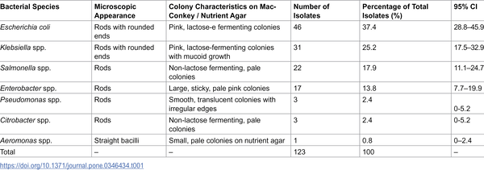
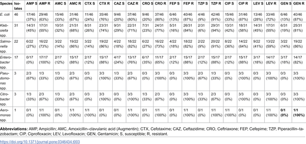

Did you know the meat you buy at the store might carry bacteria that are resistant to multiple antibiotics? This hidden risk could make some infections tougher to treat and highlights a growing challenge in food safety worldwide.

> **TL;DR**
> - Retail meat samples from Sindh, Pakistan, were found to contain a diverse range of Gram-negative bacteria, including Escherichia coli, Klebsiella, and Salmonella species.
> - Many of these bacteria showed resistance to multiple antibiotics, underscoring retail meat as a potential reservoir for antimicrobial-resistant pathogens that can impact human health.

Antimicrobial resistance (AMR) is a critical global health issue, responsible for millions of deaths annually. Gram-negative bacteria such as E. coli and Salmonella are common culprits in foodborne illnesses and are known for their ability to acquire resistance genes that limit treatment options. Retail meat can become contaminated with these bacteria during processing or handling, serving as a pathway for resistant bacteria to enter the human food chain. While surveillance programs in the US and Europe have documented this problem, data from regions like Pakistan have been limited. This study fills that gap by examining retail meat from Sindh province to better understand the prevalence and resistance patterns of Gram-negative bacteria in this context.

Researchers collected 123 samples from various retail meat products including locally produced and imported raw ground meat, raw beef burgers, frozen chicken portions, and swabs from chicken carcass surfaces. Samples were transported under cold conditions and cultured on selective media to isolate Gram-negative bacteria. Identification was performed using microscopy, biochemical tests, and API 20E confirmation. Antimicrobial susceptibility was tested using the disc diffusion method against ten commonly used antibiotics, following Clinical Laboratory Standards Institute guidelines. Quality control was ensured using standard reference bacterial strains.

Gram-negative bacteria were recovered from every sample. The most common species identified were Escherichia coli (37.4%), Klebsiella spp. (25.2%), and Salmonella spp. (17.9%). Other bacteria included Enterobacter, Pseudomonas, Citrobacter, and Aeromonas species. Antimicrobial susceptibility testing revealed high levels of resistance, particularly to antibiotics such as ampicillin, amoxicillin-clavulanate, and several cephalosporins (cefotaxime, ceftazidime, ceftriaxone). Notably, many isolates exhibited multidrug resistance, meaning they were resistant to multiple classes of antibiotics. Some antibiotics, like cefepime, gentamicin, and piperacillin-tazobactam, showed comparatively lower resistance rates in certain species. These results indicate that retail meat in this region harbors multidrug-resistant Gram-negative bacteria that could pose risks to consumers.

The presence of multidrug-resistant bacteria in retail meat has important public health implications. Consumers may be exposed to these bacteria through handling or consumption, potentially leading to infections that are harder to treat. Moreover, these bacteria can transfer resistance genes to other microbes in the human gut, amplifying the spread of antimicrobial resistance. The findings emphasize the need for improved hygiene practices in meat processing, strengthened surveillance of antimicrobial resistance in food products, and prudent use of antibiotics in food animal production. Adopting a One Health approach—which integrates human, animal, and environmental health perspectives—is essential to effectively address this complex issue.

While this study provides valuable regional data on antimicrobial resistance in retail meat, it is based on descriptive statistics without formal statistical comparisons between bacterial species or meat types. The sample size, though reasonable, is limited to one province in Pakistan and may not reflect conditions elsewhere. Additionally, the study focused on phenotypic resistance patterns and did not include molecular analyses to identify specific resistance genes. Therefore, while the results highlight a concerning presence of multidrug-resistant bacteria, further research is needed to understand the mechanisms of resistance, transmission dynamics, and effective interventions.

## Figures

*Table showing types and traits of Gram-negative bacteria found in retail meat samples.*

*Table showing how bacteria respond to antibiotics, with counts and percentages of those that are either susceptible or resistant.*

## Sources

- [Antimicrobial resistance in Gram-negative bacteria from retail meat: Prevalence and public health implications](https://journals.plos.org/plosone/article?id=10.1371/journal.pone.0346434)
- DOI: [10.1371/journal.pone.0346434](https://doi.org/10.1371/journal.pone.0346434)
