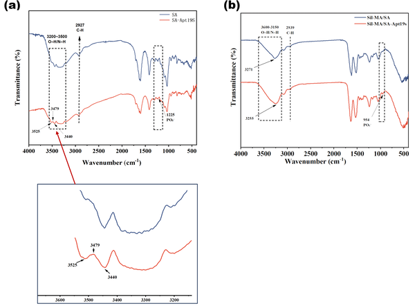
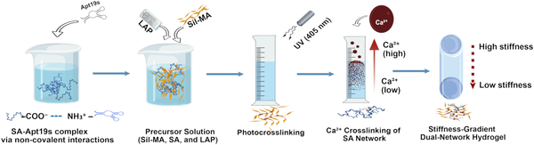
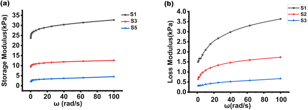

What if a single material could both capture your body’s own stem cells and instruct them to become bone tissue? This dual-function approach could revolutionize bone healing by eliminating the need for transplanted cells and enhancing natural regeneration. Recently, researchers designed an innovative hydrogel that does exactly this—combining mechanical cues and molecular targeting to enrich stem cells and promote bone formation.

> **TL;DR**
> - The team created a hydrogel with a gradient of stiffness and functionalized it with an aptamer that specifically binds bone marrow-derived mesenchymal stem cells (BMSCs), enriching these cells at the scaffold site.
> - This combined strategy significantly enhanced markers of bone cell differentiation and mineralization beyond what either stiffness or aptamer alone could achieve, offering a promising cell-free approach for bone tissue engineering.

Bone defects and injuries often require scaffolds that not only support cell growth but also actively recruit stem cells and guide their differentiation into bone-forming cells. Hydrogels are a popular choice for such scaffolds due to their tunable mechanical properties and biocompatibility. Previous work has shown that stiffer materials can encourage stem cells to become bone cells, while biochemical signals can improve cell attachment. However, combining these strategies into a single scaffold that both enriches stem cells and directs their fate remains challenging. Aptamers—short DNA sequences that bind specific cell types with high affinity—offer a way to selectively capture stem cells. By integrating an aptamer targeting BMSCs into a hydrogel with a stiffness gradient, the researchers aimed to create a scaffold that actively recruits stem cells and then instructs them to form bone tissue.

The researchers synthesized a dual-network hydrogel composed of methacrylated silk fibroin (SilMA) and sodium alginate (SA). They functionalized the alginate with Apt19s, a DNA aptamer known to bind rat bone marrow-derived mesenchymal stem cells with high specificity. Using photopolymerization and calcium ion crosslinking, they created hydrogels with a stiffness gradient ranging from approximately 4.5 kPa (soft) to 33 kPa (stiff), mimicking the mechanical environment that promotes osteogenesis. They characterized the chemical structure of the hydrogel and aptamer integration using FTIR and NMR spectroscopy and confirmed the mechanical properties with rheological measurements. In vitro experiments cultured BMSCs on these hydrogels to assess cell adhesion, proliferation, and osteogenic differentiation through assays measuring alkaline phosphatase activity, gene expression of osteogenic markers RUNX2 and osteocalcin, and mineral deposition.

The aptamer-functionalized hydrogel significantly enhanced BMSC adhesion and proliferation compared to controls without aptamer. Transwell assays showed over a threefold increase in stem cell enrichment at the scaffold. Importantly, the stiff regions of the hydrogel promoted osteogenic differentiation, as indicated by more than a twofold increase in alkaline phosphatase activity and upregulated expression of RUNX2 and osteocalcin genes. When combined with aptamer functionalization, these effects were synergistic—osteogenic markers increased by nearly 186% relative to controls, surpassing the effects of stiffness or aptamer alone. Mineralization assays confirmed more extensive bone-like matrix formation on the dual-cue hydrogels. These results demonstrate that the integrated “enrich-and-differentiate” system effectively recruits endogenous stem cells and guides them towards bone formation.

This study presents a promising strategy for bone tissue engineering that does not rely on transplanting stem cells but instead harnesses the body’s own cells by actively recruiting and instructing them within a single scaffold. The combination of a stiffness gradient and aptamer-mediated cell capture addresses two key challenges in regenerative medicine: sourcing sufficient stem cells at the injury site and directing their differentiation into the desired lineage. Such cell-free, bioactive materials could simplify clinical applications, reduce costs, and improve outcomes in bone repair and regeneration therapies.

While the in vitro results are compelling, further studies are needed to evaluate the hydrogel’s performance in vivo, including its long-term biocompatibility, degradation, and ability to support functional bone repair in animal models. Additionally, the aptamer used was specific to rat BMSCs, so adaptation for human clinical use would require identification or development of human-specific aptamers. The complexity of bone healing in the body involves multiple cell types and biochemical signals, so integrating this hydrogel approach with other regenerative strategies may be necessary for optimal outcomes.

## Figures

*FTIR spectra show successful formation and integration of SA-Apt19s complex into hydrogels, confirming aptamer presence in the material.*

*Diagram showing how a dual-network hydrogel is made by combining two different gel materials.*

*Graph showing how materials S1, S3, and S5 respond to stress, measuring their stiffness and flow behavior.*

## Sources

- [Aptamer-functionalized stiff hydrogel for enhanced BMSC enrichment and osteogenesis](https://journals.plos.org/plosone/article?id=10.1371/journal.pone.0353772)
- DOI: [10.1371/journal.pone.0353772](https://doi.org/10.1371/journal.pone.0353772)
