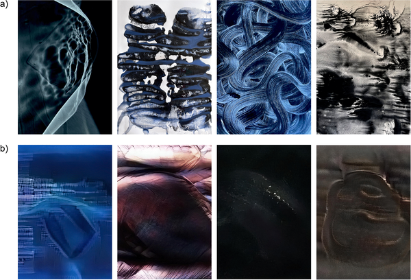

What hidden math shapes the art that moves us? Imagine if the abstract paintings that captivate us are not just random splashes of color and form, but follow subtle mathematical principles that influence how our eyes move and our brains respond. Recent research has used a branch of mathematics called topology to uncover these hidden visual structures in art, revealing a surprising link between the shapes within paintings and human perception.

> **TL;DR**
> - Researchers applied persistent homology, a topological method, to analyze abstract paintings and found distinct structural patterns that correlate with viewers’ eye movements and brain activity.
> - They discovered that many abstract artists intuitively follow a 'golden rule' related to a topological property, which may shape how we experience their work.

For decades, scientists have sought to understand why some artworks move us more than others. While color, composition, and subject matter have been studied extensively, directly linking the visual features of an image to the emotional and perceptual responses it evokes has remained elusive. Shapes and visual patterns are fundamental to both art and human vision, but traditional image analysis often misses the deeper structural properties that influence perception. This study introduces computational topology, specifically persistent homology, as a novel way to quantify the shapes and holes within images at multiple scales, offering a fresh lens on how abstract art communicates with viewers.

The researchers compared two sets of abstract images: one created by a skilled Polish artist and another generated by a neural network designed to produce random, pseudo-artistic images lacking intentional structure. Both sets were presented in gallery and laboratory settings. Eye-tracking recorded where participants looked, while EEG measured brain activity as they viewed the images. Using persistent homology, the team analyzed the topological features of each image—such as connected components and holes—across varying brightness thresholds. They then mapped these features onto gaze fixation heat maps to see how viewers’ attention related to the underlying shapes. Additionally, they examined how much each image violated a topological principle called Alexander duality, revealing a consistent pattern among genuine artworks.

The study found clear differences between the artist’s works and the pseudo-art images in both their topological signatures and how viewers engaged with them. The topological analysis distinguished the two sets of images effectively, capturing complex structural patterns beyond what traditional statistics could reveal. Eye-tracking data showed that viewers’ gaze clustered around topological features identified by persistent homology, linking visual attention to these hidden shapes. EEG recordings supported these findings by demonstrating distinct brain responses to the artist’s images. Intriguingly, the artworks tended to violate Alexander duality at a consistent rate, suggesting that abstract artists may intuitively follow a 'golden rule' in composing their visual structures.

This research bridges art, mathematics, and neuroscience, offering a new way to understand how abstract compositions resonate with human perception. By revealing that artists might unconsciously adhere to specific topological principles, it opens the door to deeper insights into the creative process and how visual information is processed by our brains. Beyond art analysis, these methods could enrich cognitive science by providing tools to study how complex visual patterns influence attention and emotion. The approach also highlights the power of interdisciplinary research in uncovering hidden dimensions of human experience.

While the findings are compelling, the study focuses on abstract art and may not generalize to all artistic styles or cultural contexts. The ‘golden rule’ observed is a statistical pattern rather than a strict law, and further research is needed to explore its universality and underlying causes. Additionally, the pseudo-art images, though carefully generated to lack intentional structure, represent just one type of non-artistic stimuli. Future studies could expand on these comparisons and investigate how topological features relate to subjective emotional responses in more diverse populations and settings.

## Figures

*Artistic (a) and pseudo-artistic (b) images with titles like 'Black holes of memory' and 'Vibrations of time' shown side by side.*

## Sources

- [Art’s hidden topology: A window into human perception](https://journals.plos.org/ploscompbiol/article?id=10.1371/journal.pcbi.1014156)
- DOI: [10.1371/journal.pcbi.1014156](https://doi.org/10.1371/journal.pcbi.1014156)
