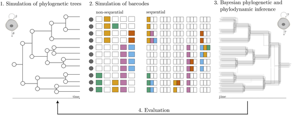
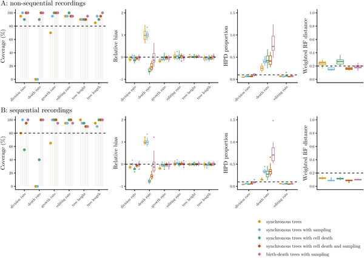
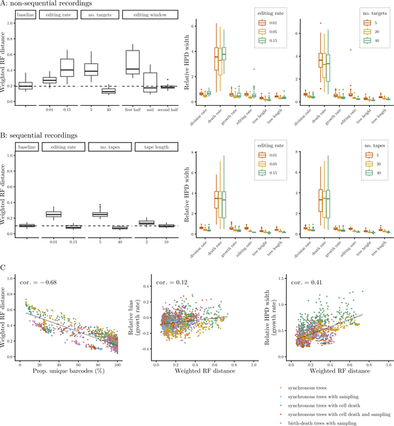
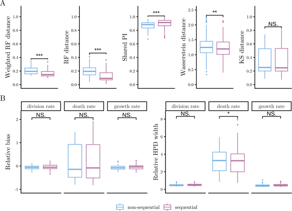

What if we could trace every cell’s family tree inside your body? Imagine being able to watch how cells divide, specialize, and sometimes die, all recorded in tiny genetic barcodes. Scientists are now using CRISPR technology to do just that—introducing heritable edits into DNA that act like timestamps and signatures of a cell’s history. But how accurately can we reconstruct these complex cellular family trees and understand the underlying dynamics of cell growth and differentiation? A new study tackles this question using simulations and advanced statistical methods to assess the power and limitations of CRISPR lineage recording.

> **TL;DR**
> - CRISPR lineage recording can effectively capture cell division histories, especially when edits occur sequentially, improving the accuracy of reconstructing cell family trees.
> - Bayesian phylodynamic models applied to these genetic barcodes can estimate rates of cell division, death, and differentiation, though some biases remain depending on model assumptions.

Multicellular organisms develop from a single fertilized egg through countless rounds of cell division, differentiation into specialized types, and cell death. Tracking these processes at the single-cell level is crucial for understanding development, tissue regeneration, and diseases like cancer. Genetic lineage tracing has emerged as a powerful approach, where CRISPR-Cas systems introduce heritable mutations into synthetic DNA sequences embedded in cells. These mutations accumulate over time, creating unique 'barcodes' that can be read out by sequencing individual cells. By comparing these barcodes, researchers can infer how cells are related and reconstruct their ancestral trees, revealing the history of cell populations.

In this study, researchers used computer simulations to generate realistic cell lineage trees reflecting different biological scenarios—from perfectly synchronized cell divisions resembling early embryonic development to more random, stochastic cell growth. Along these simulated trees, they modeled two types of CRISPR lineage recorders: non-sequential recorders, where target DNA sites mutate randomly and independently, and sequential recorders, where edits accumulate in a defined order along arrays of target sites. Using Bayesian statistical frameworks (TiDeTree for non-sequential and SciPhy for sequential data), they jointly inferred the time-scaled cell phylogenies and key population dynamics parameters such as division and death rates. They then compared the inferred results to the known simulated 'ground truth' to assess accuracy and bias.

The study found that sequential CRISPR recorders generally provide more accurate reconstructions of cell lineage trees than non-sequential ones, likely because the ordered nature of edits preserves more temporal information. Importantly, the data carried strong signals about cell division rates, allowing reliable estimation when appropriate models were used. However, when the statistical models assumed random, memoryless cell divisions but the simulated data featured synchronous divisions, biases appeared in inferred division and death rates. Additionally, by incorporating sparse endpoint measurements of cell types, the Bayesian approach could recover differentiation trajectories and estimate cell type-specific division, death, and transition rates in over 80% of simulations. This demonstrates the potential of combining lineage recording with phylodynamic modeling to unravel complex cell developmental processes.

This work provides a rigorous computational evaluation of how much information CRISPR lineage recording can reveal about cell ancestry and population dynamics. By comparing different recording strategies and statistical models, it highlights the strengths and current limitations of these approaches. The findings are valuable for developmental biology and biomedical research, offering guidance on experimental design and data analysis to better understand tissue formation, regeneration, and disease progression. Ultimately, improving our ability to read cellular family trees could deepen insights into how organisms grow and maintain themselves at the cellular level.

It is important to note that this study is based on simulations rather than experimental data, so real biological complexities may introduce additional challenges. The statistical models used assume certain idealized cell division processes that may not fully capture the diversity of cell behaviors in living organisms. Also, while sequential recorders improve phylogenetic accuracy, they do not necessarily enhance the inference of population dynamics beyond what non-sequential recorders provide. Future work is needed to refine models to better handle synchronous divisions and to integrate more complex differentiation pathways. Nonetheless, this study lays a solid foundation for interpreting CRISPR lineage tracing data with statistical rigor.

## Figures

*We traced cell family trees, recorded genetic edits, and used statistics to map cell growth and history accurately.*

*Fig 2 shows how well methods recover true parameters and tree accuracy in CRISPR lineage tests across different scenarios and simulations.*

*Fig 3 shows how different experiment setups affect the accuracy of CRISPR lineage tracking and growth rate estimates across 100 simulations.*

*Fig 4 compares methods for tracking cell changes using CRISPR, showing accuracy and bias in estimating cell growth and death rates across 100 simulations.*

## Sources

- [Assessing the inference of single-cell phylogenies and population dynamics from CRISPR lineage recordings](https://journals.plos.org/ploscompbiol/article?id=10.1371/journal.pcbi.1014370)
- DOI: [10.1371/journal.pcbi.1014370](https://doi.org/10.1371/journal.pcbi.1014370)
