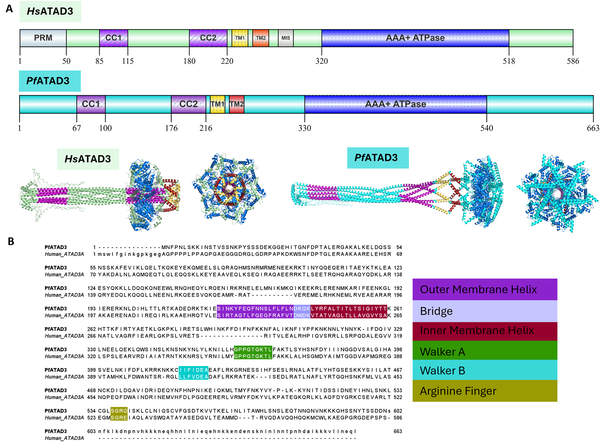
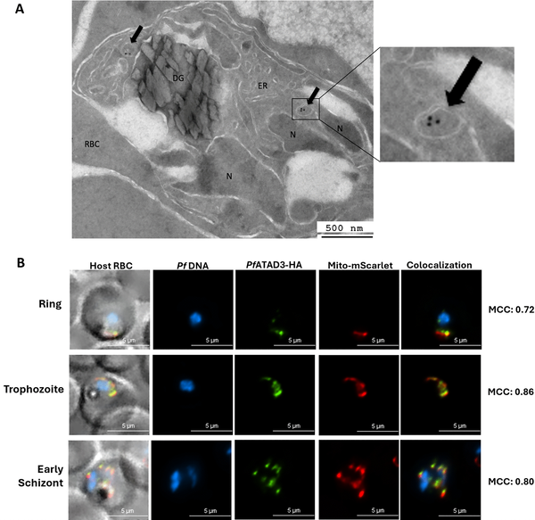
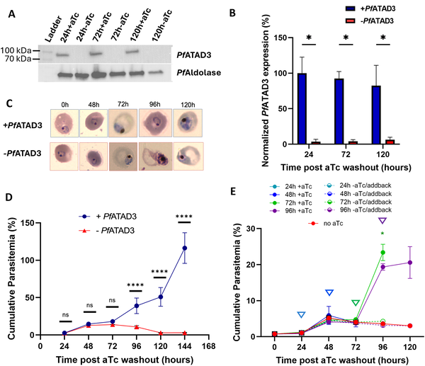
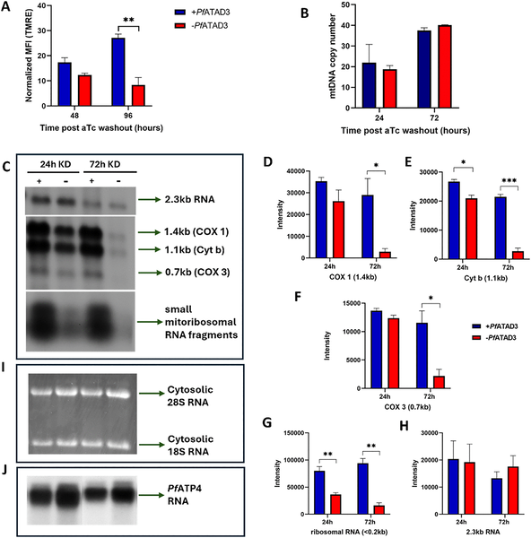

Malaria remains one of the world’s deadliest infectious diseases, claiming hundreds of thousands of lives each year. As the parasite behind the most severe form of malaria, Plasmodium falciparum, grows increasingly resistant to existing drugs, scientists are racing to uncover new vulnerabilities. A recent study has spotlighted a massive protein complex inside the parasite’s mitochondrion—a tiny but vital organelle—that is absolutely essential for the parasite’s survival. Understanding this complex could pave the way for innovative treatments that target the parasite’s energy machinery.

> **TL;DR**
> - The malaria parasite protein PfATAD3 forms a large mitochondrial complex critical for mitochondrial RNA stability, membrane potential, and protein import.
> - Knocking down PfATAD3 halts parasite growth and leads to death, highlighting it as a promising target for new antimalarial drugs.

Malaria, caused by Plasmodium parasites transmitted by mosquitoes, continues to pose a global health challenge, with rising infection rates and increasing resistance to frontline drugs. The parasite’s mitochondrion, an organelle responsible for energy production and other essential functions, has long been recognized as a valuable drug target. However, many mitochondrial proteins in P. falciparum remain poorly understood. One such protein, PF3D7_0707400—now identified as a homolog of the human mitochondrial protein ATAD3A—has been found to play a crucial role in maintaining mitochondrial integrity and parasite viability.

To explore the role of this protein, researchers used advanced molecular biology tools to tag PfATAD3 with fluorescent markers and conditional regulatory elements in live parasites. This allowed them to visualize the protein’s location within the mitochondrion and selectively reduce its expression. They combined immunofluorescence microscopy, electron microscopy, and biochemical assays to study the protein’s structure, interactions, and impact on mitochondrial function and parasite survival. Additionally, they compared the malaria protein’s sequence and predicted structure to the human ATAD3A to understand evolutionary conservation and divergence.

The study revealed that PfATAD3 is localized exclusively to the parasite’s mitochondrion and forms a massive megadalton protein complex. Reducing PfATAD3 levels caused a cascade of mitochondrial dysfunctions: mitochondrial RNA stability declined, membrane potential dropped significantly, and mitochondrial morphology became abnormal. These defects culminated in a complete growth arrest and eventual death of the parasites within two asexual replication cycles. Notably, PfATAD3 shares key functional domains with human ATAD3A but also exhibits distinct features, suggesting parasite-specific roles. This divergence offers a potential therapeutic window to target the parasite without harming human cells.

This research is the first to characterize an ATAD3 homolog in a unicellular parasite and highlights the protein’s essential role in multiple mitochondrial processes critical for P. falciparum survival. By illuminating how the parasite maintains its mitochondrial function, the study opens new avenues for antimalarial drug development. Targeting PfATAD3 or its associated complex could disrupt the parasite’s energy production and viability, offering a promising strategy to combat drug-resistant malaria strains and reduce the global disease burden.

While these findings are compelling, further research is needed to fully understand the molecular mechanisms by which PfATAD3 operates within the parasite mitochondrion and to determine how best to exploit this protein complex for therapeutic intervention. Additionally, translating these insights into safe and effective drugs will require careful consideration of potential off-target effects and the development of compounds that selectively inhibit the parasite protein without affecting human mitochondrial counterparts.

## Figures

*Comparison of a malaria protein and human ATAD3A shows shared key domains despite 29% sequence similarity.*

*Pf ATAD3 protein is found in the mitochondria of malaria parasites during their asexual growth stages, shown by microscopy techniques.*

*Pf ATAD3 protein is crucial for malaria parasite growth and survival, with its loss causing halted development and parasite death over time.*

*Reducing Pf ATAD3 in malaria parasites causes major mitochondrial problems, shown by changes in membrane potential, RNA levels, and gene copies.*

## Sources

- [ATAD3 megadalton complex in Plasmodium falciparum is essential for mitochondrial and cellular viability](https://journals.plos.org/plospathogens/article?id=10.1371/journal.ppat.1014317)
- DOI: [10.1371/journal.ppat.1014317](https://doi.org/10.1371/journal.ppat.1014317)
