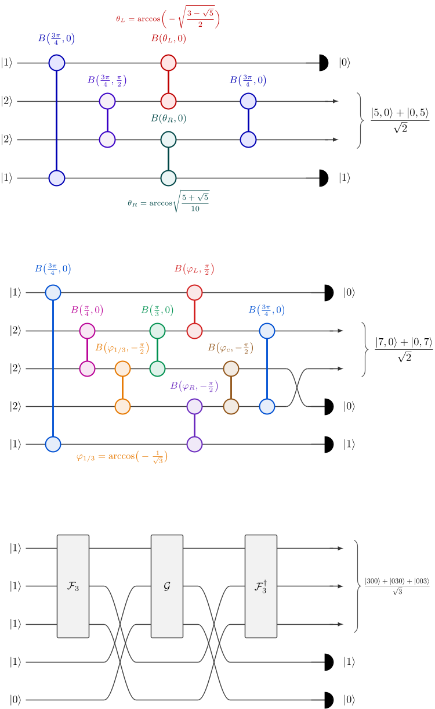
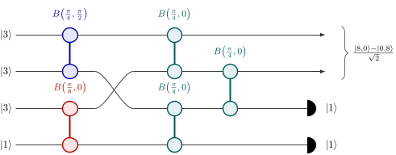
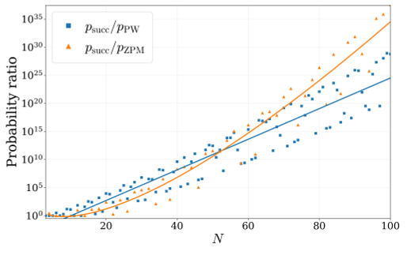
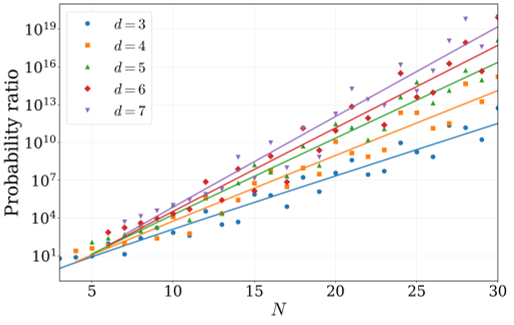

Quantum entanglement, a phenomenon where particles become mysteriously linked no matter the distance, is at the core of emerging quantum technologies. Photons—particles of light—are prime candidates for carrying quantum information, but creating large groups of entangled photons has been a major challenge. Now, a team of scientists has harnessed artificial intelligence to automatically design new photonic circuits that can produce complex entangled states of light more efficiently than ever before.

> **TL;DR**
> - AI-driven automated design has revealed a new family of scalable photonic circuits that generate path-entangled states, outperforming previous methods by exponential and super-exponential margins.
> - These new designs promise practical routes to experimentally accessible large multiphoton entanglement, crucial for advancing quantum communication, computation, and sensing technologies.

*Note: this summary is based on a preprint — research shared ahead of formal peer review.*

Entangled states of light, especially so-called NOON states, are essential resources for quantum technologies ranging from ultra-secure communication to enhanced measurement techniques. NOON states involve photons being in a superposition of all being in one path or all in another, enabling extreme sensitivity to phase changes. However, photons interact very weakly, making it difficult to deterministically create large NOON states. Current methods rely on probabilistic schemes that herald successful state creation by detecting auxiliary photons, but these approaches become exponentially less efficient as the number of photons increases. Improving the success probability and scalability of these heralded schemes is a critical bottleneck in photonic quantum technology development.

The researchers developed a fast, large-scale simulation framework using a universal multiport interferometer model and optimized it with stochastic gradient descent algorithms. By encoding input photon states and target entangled states, the AI searched through numerous circuit configurations to maximize both the fidelity to the desired state and the probability of successful heralding. This automated discovery process revealed a new general family of circuits, called the modular-comb family, which includes previously known schemes as special cases but significantly outperforms them. The team also extended their approach to multi-mode NOON states and other path-entangled states, uncovering additional improved schemes beyond the modular-comb family.

The modular-comb family of circuits discovered by AI achieves exponential and super-exponential improvements in success probability compared to the best-known previous methods. For example, a newly designed circuit for a nine-photon NOON state (NOON9) increases the success probability by nearly 1440% over earlier designs, while requiring fewer detectors and avoiding unreliable vacuum heralding conditions. The approach also generalizes to multi-mode NOON states, outperforming existing linear-optical schemes. Moreover, the AI uncovered other novel circuits that further improve success rates and reduce experimental complexity for various target states. Simulations indicate that these new circuits maintain high fidelity and heralding probabilities even with realistic detector inefficiencies, and the required input photon states and optical components are within reach of current or near-future experimental capabilities.

This work represents a significant theoretical advance in the automated design of photonic quantum circuits, demonstrating that AI can discover scalable and experimentally practical schemes for generating large multiphoton entangled states. By dramatically improving the efficiency of heralded NOON and related states, these designs could accelerate the realization of quantum-enhanced technologies such as secure quantum communication networks, precision sensing, and photonic quantum computing. The modular-comb family and other AI-discovered circuits provide a new foundation for experimental efforts aiming to harness complex entanglement at scales previously considered out of reach.

While the proposed circuits show promising theoretical performance and experimental feasibility, they have not yet been demonstrated in laboratory settings. Challenges remain in reliably producing the required input photon states and integrating the circuits with high-efficiency photon-number-resolving detectors. Additionally, the automated discovery process may not have found globally optimal solutions for all photon numbers and target states. Future work will need to experimentally validate these designs and explore further optimization, including integrating these heralded states into complete quantum information protocols rather than focusing solely on state generation.

## Figures

*Diagrams showing step-by-step methods to create special two- and three-part quantum states called NOON states. — Figure from Marcello Armezzani et al., [CC BY 4.0](http://creativecommons.org/licenses/by/4.0/), caption edited.*

*Optimized NOON8 circuit uses fewer inputs and detectors, boosting success rate by 500% to create a special quantum state. — Figure from Marcello Armezzani et al., [CC BY 4.0](http://creativecommons.org/licenses/by/4.0/), caption edited.*

*Success rates of modular-comb, PW, and ZPM methods compared as N increases, showing optimized values and fitted trends. — Figure from Marcello Armezzani et al., [CC BY 4.0](http://creativecommons.org/licenses/by/4.0/), caption edited.*

*Success probability ratio of modular comb vs Zhang–Chan schemes grows with N for d=3 to 7, showing optimized and fitted results. — Figure from Marcello Armezzani et al., [CC BY 4.0](http://creativecommons.org/licenses/by/4.0/), caption edited.*

## Sources

- [Automated discovery of high-probability heralded schemes for path-entangled states](https://arxiv.org/abs/2607.25501)
- DOI: [10.48550/arxiv.2607.25501](https://doi.org/10.48550/arxiv.2607.25501)

*This article reuses and adapts text and figures from the original research by Marcello Armezzani et al., available via arXiv Quantum Physics, under the [CC BY 4.0](http://creativecommons.org/licenses/by/4.0/) license.*
