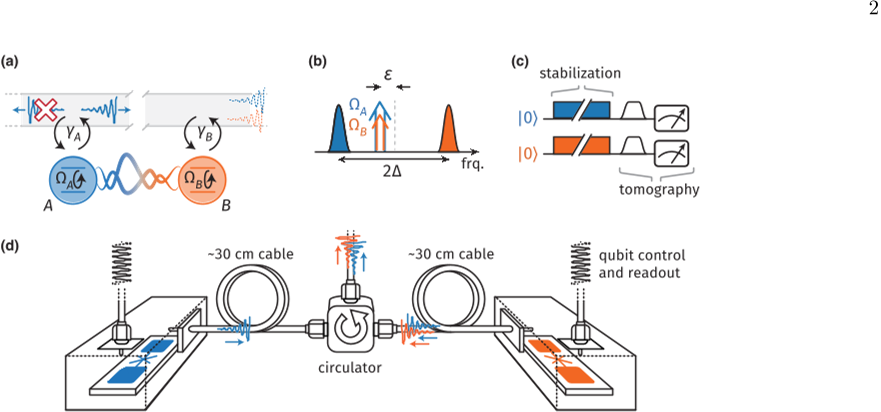
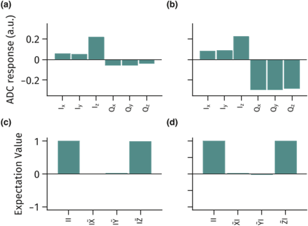

Imagine two quantum particles separated by nearly a meter, yet mysteriously linked so that the state of one instantly influences the other. This phenomenon, known as quantum entanglement, is fundamental to the promise of quantum computing and secure quantum communication. But entanglement is fragile—it tends to fade quickly, especially when particles are far apart. What if we could keep this quantum link alive indefinitely, without constantly resetting it? Recent experiments have shown exactly that: a way to autonomously stabilize entanglement between remote quantum devices, opening new doors for robust quantum networks.

> **TL;DR**
> - Scientists have experimentally demonstrated a method to maintain steady, long-lived entanglement between two superconducting qubits separated by a low-loss, unidirectional microwave link.
> - By carefully engineering the interaction and drive conditions, they overcame symmetry mismatches and losses to achieve a stable entangled state with concurrence up to about 0.5, limited mainly by local losses.

*Note: this summary is based on a preprint — research shared ahead of formal peer review.*

Quantum entanglement is a uniquely quantum correlation that can exist between particles even when separated by large distances. It underpins many quantum technologies, including quantum computing and quantum communication. Traditionally, entanglement between distant qubits is generated in steps: first locally creating entanglement, then distributing it across a network. However, these entangled states degrade over time due to decoherence, requiring repeated regeneration. Achieving a steady-state, or continuously maintained, remote entanglement would eliminate delays and overhead associated with this regeneration, making quantum networks more practical and scalable. This goal has been theoretically proposed but challenging to realize experimentally due to the need for precise control over interactions and losses in the system.

The researchers used two superconducting transmon qubits housed in separate low-loss enclosures and connected them via approximately 60 centimeters of coaxial cable combined with a microwave circulator to create a unidirectional waveguide link. This setup forms a cascaded quantum network where the emission from the first qubit influences the second but not vice versa. They applied continuous microwave drives to both qubits at carefully chosen frequencies and amplitudes, implementing a coherent quantum absorber (CQA) scheme designed to autonomously stabilize an entangled steady state. To characterize the entanglement, they performed full two-qubit quantum state tomography, reconstructing the quantum state despite challenges posed by the qubits’ short lifetimes and measurement limitations. They also developed a modified protocol based on an alternate symmetry resembling two-mode squeezing to overcome imperfections and symmetry mismatches in the original scheme.

The experiment confirmed that continuous driving and engineered dissipation can stabilize entanglement between physically separated qubits without the need for repeated preparation cycles. Initial attempts using the original CQA protocol showed entanglement limited by symmetry imperfections and losses. However, by tuning drive parameters and adopting a synthetic squeezing symmetry, the team significantly improved entanglement robustness, achieving a concurrence close to 0.5. This value reflects the degree of entanglement and, in this context, is mainly limited by local qubit and waveguide losses rather than fundamental protocol constraints. The results demonstrate that steady-state, on-demand delivery of remote entanglement is feasible in modular quantum processors connected by low-loss quantum networks.

This work represents a critical advance toward scalable quantum computing architectures where modular quantum processors are linked via quantum networks. Autonomous stabilization of remote entanglement removes the need for complex, time-consuming entanglement regeneration protocols, enabling faster and more reliable quantum operations across distributed devices. The approach also paves the way for protecting quantum information in a distributed manner, which is essential for quantum communication and error correction schemes. While demonstrated here with superconducting qubits and microwave links, the principles could extend to other quantum platforms and network types, contributing broadly to the development of practical quantum technologies.

Despite the promising results, the demonstrated entanglement fidelity is still limited by local losses and imperfections in the experimental setup, such as asymmetries in qubit coupling and finite coherence times. The concurrence achieved, while significant, is not maximal, and further improvements in hardware and control precision will be necessary to reach the high fidelities required for fault-tolerant quantum computing. Additionally, the current system operates over relatively short distances and with specific microwave components; scaling to larger networks and different physical media will pose new challenges. Finally, the work is currently reported on the arXiv preprint server and awaits peer review, so the findings should be considered preliminary but credible given the detailed experimental data and analysis.

## Figures

*Two qubits linked by a special waveguide are driven to create and measure a stable entangled state using superconducting devices and precise microwave control. — Figure from Abdullah Irfan et al., [CC BY 4.0](http://creativecommons.org/licenses/by/4.0/), caption edited.*

*Fig. 8 shows measurements of key states for two qubits, revealing their average and expected values in different measurement directions. — Figure from Abdullah Irfan et al., [CC BY 4.0](http://creativecommons.org/licenses/by/4.0/), caption edited.*

## Sources

- [Autonomous stabilization of remote entanglement in a cascaded quantum network](https://arxiv.org/abs/2509.11872)
- DOI: [10.1103/z6zz-vw5q](https://doi.org/10.1103/z6zz-vw5q)

*This article reuses and adapts text and figures from the original research by Abdullah Irfan et al., available via arXiv Quantum Physics, under the [CC BY 4.0](http://creativecommons.org/licenses/by/4.0/) license.*
