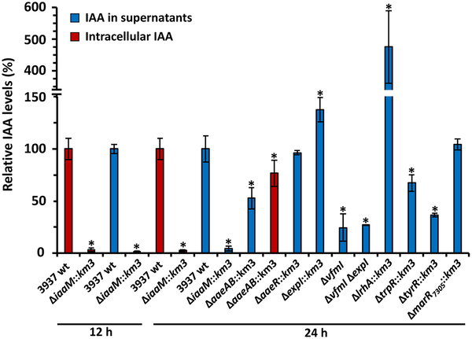
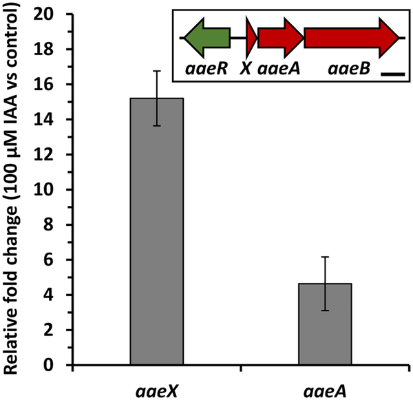

Did you know that a hormone best known for helping plants grow also plays a surprising role in how bacteria infect crops? Scientists have uncovered how the plant hormone auxin, produced by the bacterial pathogen Dickeya dadantii, acts as a signal to boost the bacterium’s virulence and ability to survive within plants. This discovery opens new possibilities for protecting important food crops from disease.

> **TL;DR**
> - Dickeya dadantii produces the plant hormone auxin (indole-3-acetic acid, IAA), which regulates its own gene expression and virulence during infection.
> - The bacterium uses an auxin-responsive efflux pump to export IAA, helping it resist plant defenses and promote disease, with complex regulatory networks controlling auxin production.

Plants and bacteria interact through a complex chemical language involving many signaling molecules. Auxin, or indole-3-acetic acid (IAA), is a key plant hormone that controls growth and development. Interestingly, many plant-associated bacteria also produce IAA, but how this bacterial auxin influences infection and bacterial survival has remained unclear. Dickeya dadantii is a global plant pathogen causing soft rot in important crops like potatoes and maize. Understanding how it uses auxin could reveal new ways to combat crop diseases.

Researchers created a mutant strain of Dickeya dadantii that cannot produce IAA by disabling the iaaM gene, which encodes a key enzyme in auxin biosynthesis. They measured auxin levels using gas chromatography–mass spectrometry and compared gene expression profiles of the wild-type and mutant bacteria through RNA sequencing. They also investigated the role of an efflux pump, AaeXAB, suspected to export auxin, and analyzed regulatory networks controlling auxin production using genetic and biochemical approaches.

The mutant strain deficient in auxin production showed drastically reduced levels of IAA inside and outside the cells. This deficiency caused significant changes in gene expression, including reduced activation of the AaeXAB efflux pump genes. This pump exports auxin and helps the bacteria resist plant defense hormones, contributing to virulence. The study revealed that auxin production and secretion are tightly regulated by multiple quorum-sensing systems and transcription factors. Moreover, similar efflux pumps are widespread among plant-associated bacteria, suggesting a common strategy for adapting to plant environments.

This work highlights auxin as a crucial bacterial signal that promotes Dickeya dadantii’s adaptation to plant hosts and its ability to cause disease. By controlling auxin biosynthesis and export, the bacteria can fine-tune their virulence and resist plant defenses. Targeting these auxin-related pathways offers promising new avenues for developing anti-virulence strategies to protect crops from soft rot and other bacterial diseases, which is vital for global food security.

While the study provides strong evidence linking bacterial auxin production to virulence and adaptation, the complex regulatory networks involved require further exploration to fully understand their dynamics during natural plant infections. Additionally, the broader ecological roles of bacterial auxin production in diverse plant-associated bacteria remain to be elucidated. Translating these findings into practical crop protection strategies will need additional research and field testing.

## Figures

*Different Dickeya dadantii strains produce varying levels of the plant hormone IAA after 12 and 24 hours in nutrient media with tryptophan.*

*IAA treatment changes aaeX and aaeA gene activity in D. dadantii bacteria after 30 minutes, shown by RNA level measurements.*

## Sources

- [Auxin biosynthesis and signaling drive virulence and plant adaptation in Dickeya dadantii](https://journals.plos.org/plospathogens/article?id=10.1371/journal.ppat.1014429)
- DOI: [10.1371/journal.ppat.1014429](https://doi.org/10.1371/journal.ppat.1014429)
