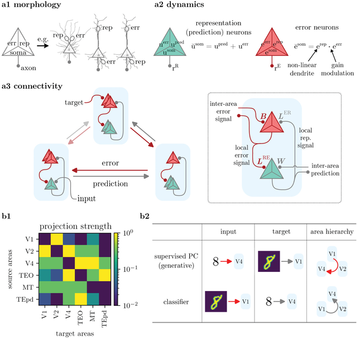
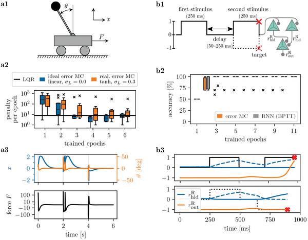
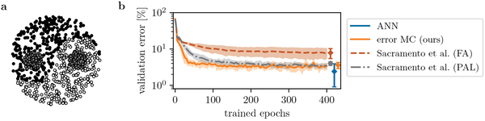
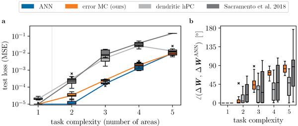

Could your brain be running a version of the AI algorithm that powers deep learning? Recent advances in artificial intelligence rely heavily on an algorithm called error backpropagation, which efficiently trains neural networks by sending error signals backward through layers. But how does the brain learn from mistakes? A new study proposes a biologically plausible cortical microcircuit model that mimics backpropagation using specialized error neurons and realistic brain connectivity patterns, offering fresh insights into how our brains might solve complex learning tasks.

> **TL;DR**
> - The brain may implement a form of error backpropagation through distinct populations of cortical neurons that encode errors and predictions, connected in a way inspired by primate visual cortex wiring.
> - This new model scales to many brain areas, works continuously without separate learning phases, and makes testable predictions that distinguish it from previous theories.

For decades, neuroscientists have sought to understand how the brain learns complex functions. Artificial neural networks trained by error backpropagation have revolutionized AI, but the brain’s architecture is far more complex, with feedback loops and diverse cell types. Previous theories like predictive coding suggested the brain learns by comparing expected and actual inputs, but often relied on abstract assumptions that are hard to map onto real neurons. The challenge has been to find a biologically realistic mechanism that can propagate neuron-specific error signals across multiple brain areas to guide learning.

The researchers developed a multi-area cortical microcircuit model grounded in primate visual cortex connectivity. They modeled two distinct populations of pyramidal neurons in each cortical area: representation neurons that encode predictions, and error neurons that encode mismatches between expected and actual signals. Each neuron was modeled with three compartments to reflect real dendritic structures, allowing integration of inputs from different sources. Inter-area connections were based on experimentally measured projection densities, allowing a 'loose hierarchy' rather than strict feedforward layers. The model operates continuously without separate forward and backward passes, and learning occurs through a local Hebbian-like rule dependent on presynaptic firing and postsynaptic voltage differences.

Simulations showed that this biologically plausible microcircuit model approximates the computations of error backpropagation, enabling efficient learning across multiple cortical areas. The model successfully learned a variety of tasks, including controlling a cart-pole system, performing memory tasks, and classifying complex patterns like Yin-Yang shapes. It outperformed or matched previous biologically inspired models and standard artificial neural networks, especially as network size increased. Importantly, the model does not require strict hierarchical connectivity or phase-separated learning, addressing key limitations of prior theories.

This work bridges a critical gap between neuroscience and AI by proposing a realistic brain circuit that could implement the powerful backpropagation algorithm. It offers a concrete mechanism for neuron-specific error signaling and credit assignment in the cortex, which has long been a mystery. The model’s grounding in primate brain data and its scalability make it a promising framework for understanding how the brain learns complex tasks. Moreover, it generates experimentally testable predictions about the roles of different neuron types and connectivity patterns, potentially guiding future neurophysiological studies.

While the model is grounded in biological data and captures many realistic features, it remains a computational abstraction. The precise cellular and synaptic mechanisms in living brains may be more complex, and some assumptions about neuron compartmentalization and connectivity require further experimental validation. Additionally, the model currently focuses on cortical pyramidal neurons and does not incorporate the full diversity of brain cell types or neuromodulatory influences. Future work will need to test the model’s predictions in vivo and explore how it integrates with other brain systems involved in learning.

## Figures

*Our neuron model uses three parts to process signals, showing how brain areas connect and communicate for prediction and error detection.*

*Error neuron microcircuits learn to control a cart pole and perform memory tasks, matching or exceeding traditional methods in accuracy and stability.*

*Error neuron microcircuits learn to classify complex Yin-Yang patterns, outperforming similar models and matching standard neural networks.*

*Our error neuron microcircuit learns complex tasks as well as standard AI models, even as the network size grows.*

## Sources

- [‘Backpropagation and the brain’ realized in cortical error neuron microcircuits](https://journals.plos.org/ploscompbiol/article?id=10.1371/journal.pcbi.1014164)
- DOI: [10.1371/journal.pcbi.1014164](https://doi.org/10.1371/journal.pcbi.1014164)
