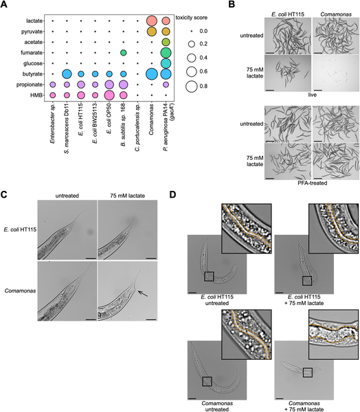
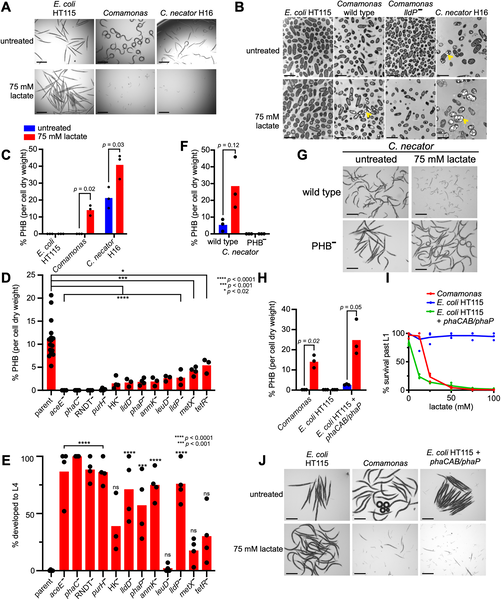

Did you know that some bacteria produce a natural bioplastic that can actually be lethal to tiny worms? Scientists have discovered that the bioplastic polyhydroxybutyrate (PHB), made by certain bacteria, disrupts the digestive system of the microscopic nematode Caenorhabditis elegans, leading to the worm’s death. This surprising interaction reveals new insights into how bacterial metabolism can influence animal hosts in unexpected ways.

> **TL;DR**
> - Bacteria that produce the bioplastic PHB kill C. elegans by causing physical damage and disruption in the worm’s digestive tract.
> - Mutations in a worm gene involved in DNA degradation can partially protect C. elegans from this bacterial toxicity.

Bacteria are more than just simple microbes; they shape ecosystems and influence the health of animals by providing nutrients or producing chemical compounds. One way bacteria manage excess carbon is by making energy-storage polymers like polyhydroxybutyrate (PHB), a biodegradable bioplastic. While PHB’s role inside bacteria is well known, its effects on animals that interact with these bacteria have remained unclear. The tiny nematode Caenorhabditis elegans, a widely used model organism, feeds on bacteria and can be affected by their metabolic products. Understanding how bacterial bioplastics impact C. elegans helps us learn about host-microbe interactions and the potential ecological consequences of bioplastic production.

Researchers fed C. elegans different bacterial diets supplemented with metabolites such as lactate and pyruvate, which bacteria can convert into PHB. They screened thousands of bacterial mutants to identify genes required for PHB production and tested how these affected worm survival. Using electron microscopy and chemical analysis, they confirmed PHB production in bacteria. They also engineered normally non-PHB-producing E. coli to make PHB and observed the effects on worms. Finally, they performed genetic screens in C. elegans to find worm mutations that alter sensitivity to PHB-producing bacteria.

The study found that bacteria producing PHB, such as Comamonas and Cupriavidus necator, kill C. elegans by causing deformation of the worm’s pharynx (the feeding organ), intestinal swelling, disruption of the gut barrier, and defects in defecation. Worms fed bacteria lacking the PHB biosynthesis pathway survived and developed normally. Engineered E. coli that produced PHB also caused lethality, proving that PHB production alone is sufficient to kill the worms. Interestingly, mutations in the worm gene nuc-1, which encodes a DNA-degrading enzyme DNase II, partially rescued worms from death, suggesting a role for host DNA degradation pathways in responding to bacterial PHB toxicity.

This discovery reveals a previously unknown way that bacterial metabolism—specifically bioplastic production—can negatively affect animal hosts. It highlights the complex and sometimes harmful consequences of bacterial compounds on host physiology. Since PHB is widely produced by bacteria in natural environments and used industrially as a biodegradable plastic, understanding its biological effects is important for microbiome research and environmental impact assessments. Moreover, the genetic insights from C. elegans may inform how animals detect and respond to bacterial metabolites.

While the findings are robust in the model nematode C. elegans, it remains to be seen how broadly applicable these effects are to other animals or ecological contexts. The exact molecular mechanisms by which PHB disrupts the worm’s digestive system and how nuc-1 mutations confer protection require further investigation. Additionally, the study used relatively high metabolite concentrations to induce PHB production, which may not always reflect natural conditions. Thus, caution is needed when extrapolating these results beyond the laboratory setting.

## Figures

*C. elegans worms show different toxic effects and body changes when fed various bacteria, seen in size, shape, and gut images.*

*Bacteria produce PHB, a compound that helps kill C. elegans worms, shown by images and chemical tests under different conditions.*

## Sources

- [Bacteria producing the bioplastic polyhydroxybutyrate kill the nematode Caenorhabditis elegans](https://journals.plos.org/plosbiology/article?id=10.1371/journal.pbio.3003748)
- DOI: [10.1371/journal.pbio.3003748](https://doi.org/10.1371/journal.pbio.3003748)
